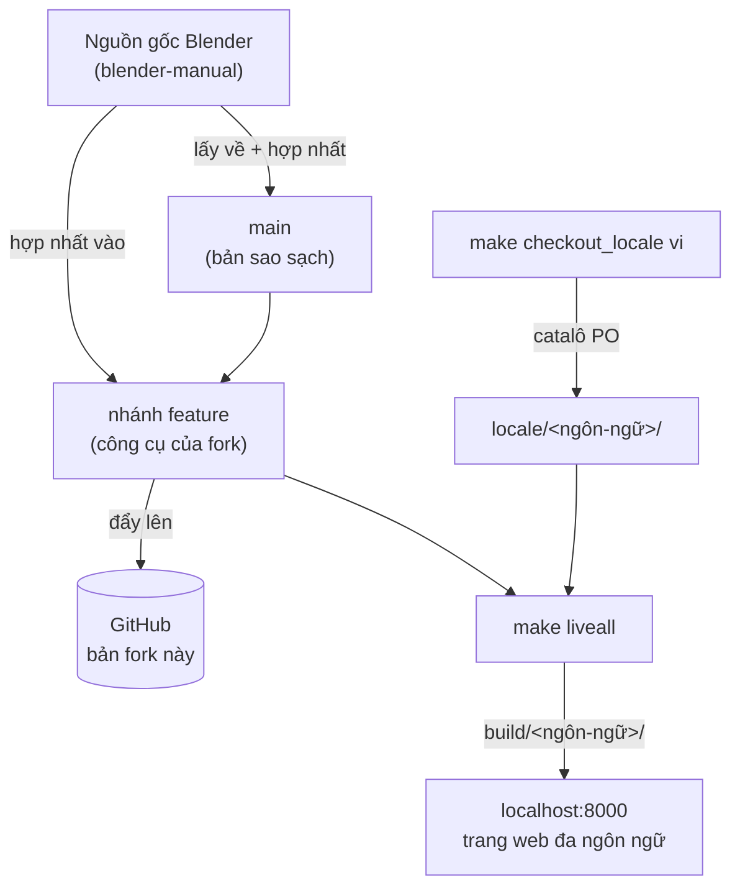
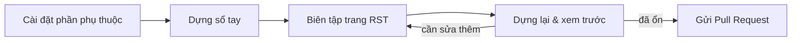

**Language / Ngôn ngữ:** [English](README.md) · Tiếng Việt

<!-- FORK-NOTICE (bản fork phái sinh — xem FORK.md) -->
> **Đây là một bản fork đa ngôn ngữ của Sổ tay Blender (Blender Manual).** Bản
> fork này phản ánh trung thực nội dung của Blender và bổ sung công cụ để dựng,
> tìm kiếm và đọc sổ tay ở nhiều ngôn ngữ cùng lúc. Xem **[FORK.md](FORK.md)**
> để biết danh sách tính năng, hướng dẫn dựng tài liệu, và cách cập nhật những
> thay đổi mới nhất từ Blender.
> Nguồn gốc (upstream): <https://projects.blender.org/blender/blender-manual>
<!-- /FORK-NOTICE -->

# Sổ Tay Blender (Blender Manual)

Chào mừng bạn đến với dự án sổ tay người dùng Blender! Chúng tôi luôn tìm kiếm
người đóng góp. Dù bạn là một người viết lách dày dạn, một chuyên gia Blender,
hay chỉ mới bắt đầu, sự giúp đỡ của bạn đều rất quý giá.

Sổ tay Blender được viết bằng `reStructuredText` (RST) và được dựng bằng
[Sphinx](http://www.sphinx-doc.org/en/stable/). Bạn có thể xem phiên bản mới
nhất của sổ tay [tại đây](https://docs.blender.org/manual/en/dev/).

Nếu bạn muốn đóng góp, hãy làm theo các hướng dẫn bên dưới.

### 🗺️ Bản fork này hoạt động thế nào

Xem **[FORK.md](FORK.md)** để biết đầy đủ danh sách tính năng và quy trình đồng
bộ với Blender.

## ✍️ Cách Dựng & Biên Tập Tài Liệu

Trước khi thực hiện thay đổi, vui lòng xem qua các hướng dẫn về văn phong để bảo
đảm tính nhất quán:

- [Hướng dẫn Văn phong (Writing Style Guide)](https://docs.blender.org/manual/en/dev/contribute/manual/guides/writing_guide.html)
- [Hướng dẫn Đánh dấu (Markup Style Guide)](https://docs.blender.org/manual/en/dev/contribute/manual/guides/markup_guide.html)

Khi đã quen với các hướng dẫn này, hãy làm theo các bước sau để cài đặt, biên
tập, và gửi thay đổi của bạn:

1. **[Cài đặt phần phụ thuộc](https://docs.blender.org/manual/en/dev/contribute/manual/getting_started/local_editing/install/index.html)** — Thiết lập môi trường làm tài liệu.
2. **[Dựng sổ tay](https://docs.blender.org/manual/en/dev/contribute/manual/getting_started/local_editing/build.html)** — Biên dịch sổ tay để xem thay đổi tại máy mình.
3. **[Biên tập sổ tay](https://docs.blender.org/manual/en/dev/contribute/manual/getting_started/local_editing/editing.html)** — Thực hiện các thay đổi của bạn.
4. **[Dựng lại](https://docs.blender.org/manual/en/dev/contribute/manual/getting_started/local_editing/build.html)** — Kiểm tra xem thay đổi của bạn hiển thị đúng chưa.
5. **[Gửi Pull Request](https://docs.blender.org/manual/en/dev/contribute/manual/getting_started/local_editing/pull_requests.html)** — Chia sẻ đóng góp của bạn với cộng đồng.

💡 _Mới làm quen với Git?_  
Nếu bạn chưa quen với Git hay pull request, bạn có thể gửi tập tin đã chỉnh sửa
dưới dạng một [issue](https://projects.blender.org/blender/blender-manual/issues/new),
và một thành viên trong nhóm sẽ hỗ trợ bạn.

> 📌 **Lưu ý cho bản fork này:** Để dựng và đọc sổ tay bằng tiếng Việt (hoặc các
> ngôn ngữ khác) ngay tại máy bạn — gồm tìm kiếm đa ngôn ngữ, dựng trực tiếp
> (live), và quy trình dịch thuật — hãy đọc **[FORK.md](FORK.md)**. Tóm tắt
> nhanh: lấy bản dịch bằng `make checkout_locale vi`, rồi chạy
> `make liveall BF_LANGS="en vi"`.

## 🔗 Liên Kết Hữu Ích

- **Tài liệu sổ tay:** [Hướng dẫn Đóng góp](https://docs.blender.org/manual/en/4.4/contribute/manual/index.html)
- **Tập tin nguồn:** [Kho chứa Sổ tay](https://projects.blender.org/blender/blender-manual)
- **Diễn đàn Lập trình viên:** [Mục Tài liệu](https://devtalk.blender.org/c/documentation/12)
- **Trò chuyện:** [#docs trên chat.blender.org](https://matrix.to/#/#docs:blender.org)
- **Quản trị viên:** @blendify

_Các Quản trị viên Tài liệu phụ trách dự án, hạ tầng, và điều phối người đóng
góp. Cứ thoải mái liên hệ với họ!_

## 📖 Tham Gia Nhóm Tài Liệu

Sổ tay Blender được duy trì bởi một nhóm những người đóng góp và quản trị viên.
Nếu bạn muốn trở thành người đóng góp, hãy ghé thăm
[diễn đàn lập trình viên](https://devtalk.blender.org/c/documentation/12) để bắt
đầu.

Không cần kinh nghiệm gì cả — chỉ cần bạn sẵn lòng giúp đỡ!

# 🌍 Dịch Sổ Tay Blender

Chúng tôi dùng gói quốc tế hóa (i18n) của Sphinx để hỗ trợ dịch thuật. Để đóng
góp bản dịch, hãy xem [Dự án Dịch thuật Sổ tay Blender](https://projects.blender.org/blender/blender-manual-translations).

## ❓ Cần Trợ Giúp

Nếu bạn có thắc mắc hay cần hỗ trợ:

- Tham gia **[phòng trò chuyện](https://matrix.to/#/#docs:blender.org)** để được giúp đỡ trực tiếp.
- Đăng bài trên **[diễn đàn lập trình viên](https://devtalk.blender.org/c/documentation/12)** để thảo luận chi tiết.

---

Cảm ơn bạn đã chung tay làm cho tài liệu của Blender tốt hơn cho tất cả mọi người! 🚀
