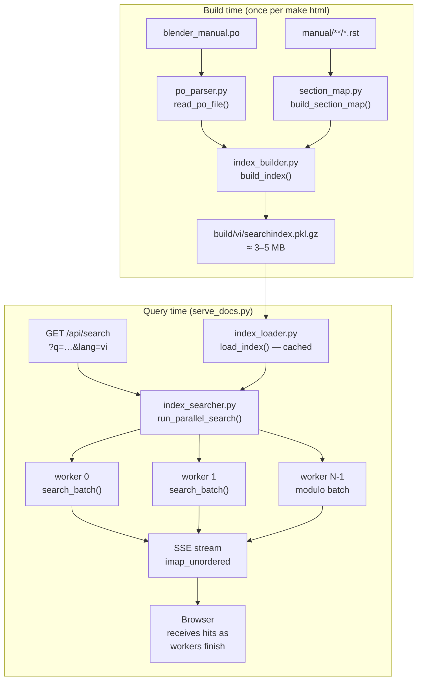
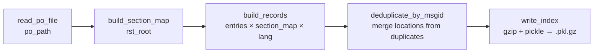
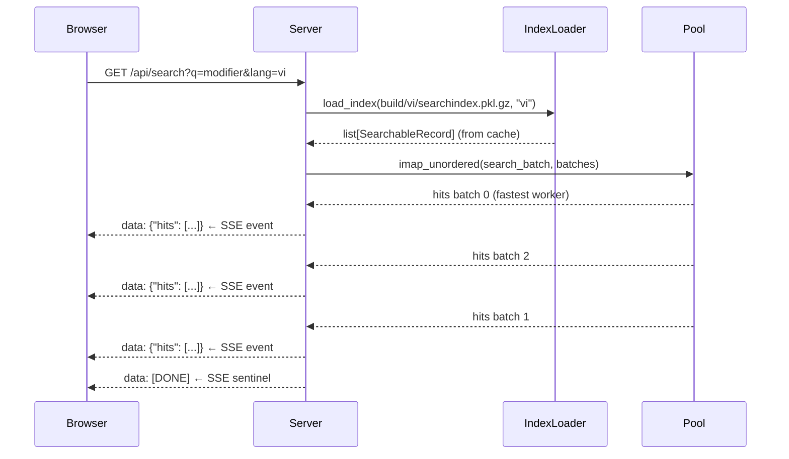
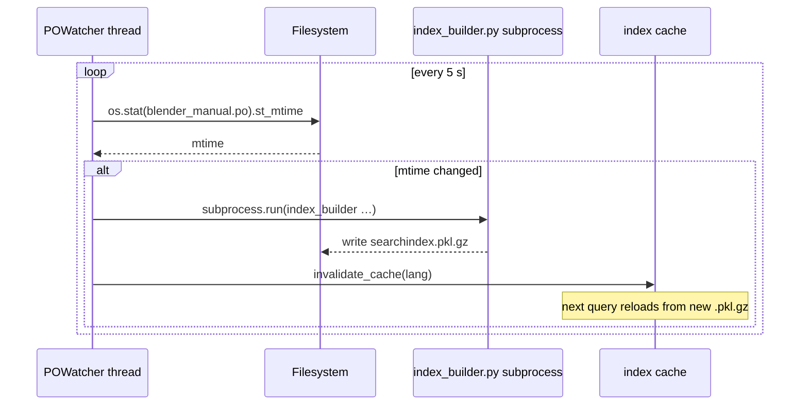
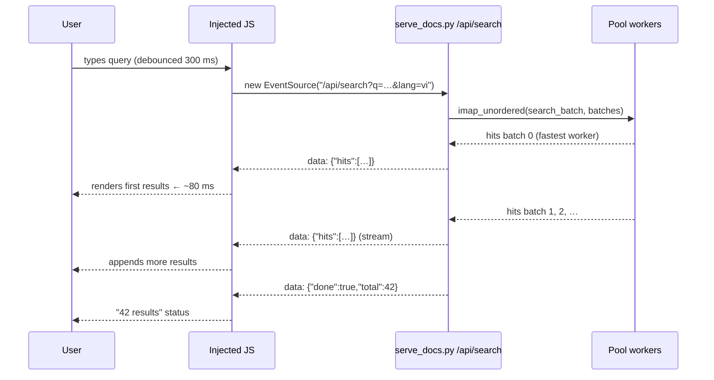
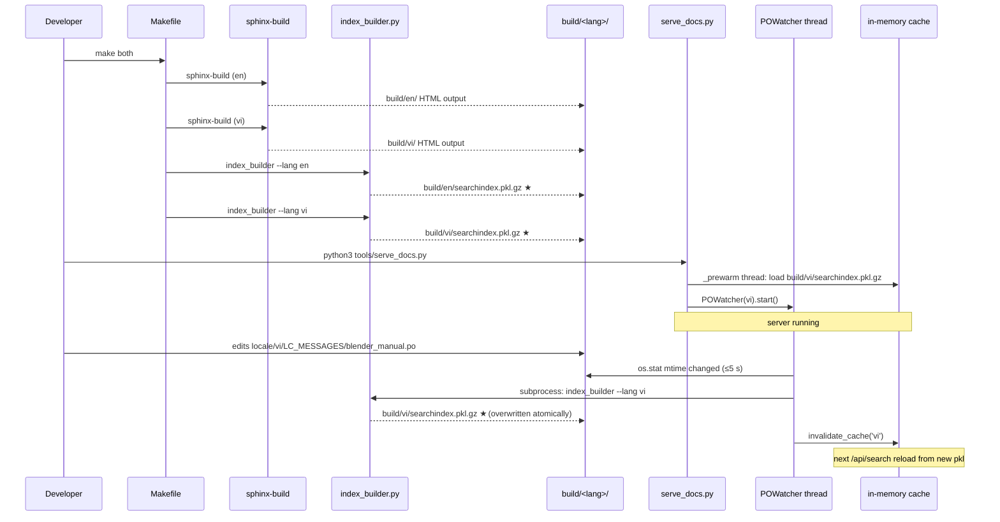

# PO Pickle Search Index — Design Plan v2

**Date:** 2026-06-20  
**Author:** Hoang Duy Tran  
**Status:** Implemented (2026-06-20) — see §24 for implementation notes  
**Supersedes:** `20260620_094531_po-pickle-search-index-plan.md`

---

## Decisions locked from v1 review

| Question | Decision |
|---|---|
| babel dependency | **Fully independent** — `SearchableRecord` is a pure dataclass; PO parsed by our own reader |
| Search mode | **Regex by default**; fall back to literal substring on `re.error` |
| Section key format | **HTML anchor slug** (e.g. `editors-3dview-3d-cursor`) |
| Result delivery | **SSE streaming** — first hits arrive as the fastest worker finishes via `imap_unordered` |

## Decisions changed during implementation

| Question | Original plan | Actual implementation |
|---|---|---|
| PO parser | Own state-machine (no babel/polib) | **`sphinx_intl.catalog.load_po`** — detects charset from `Content-Type` header; handles non-UTF-8 locales automatically |
| Search options | Single `SearchMode` enum (`regex` / `whole_word` / `case_sensitive`) sent as `?mode=` | **Three independent boolean params** — `regex=1` (default on), `cs=0`, `ww=0`; all combinable |
| Tone-stripped fallback | NFD-strip both query and indexed text so `trinh` matches `trình` | **Removed entirely** — exact NFC matching only; stripping gave false positives and the user rejected it |
| Result delivery | SSE streaming: each worker batch sent as it finishes | **Collect → sort → deduplicate → send once**: all workers finish, hits sorted by score (desc), duplicate `fragment_url` values removed, then one JSON payload sent |
| Scoring | Uniform `score=1.0` for all matches | **Four tiers**: 2.5 (exact phrase + msgstr), 2.0 (exact phrase + msgid), 1.5 (substring + msgstr), 1.0 (substring + msgid) |
| Whole-word matching | `\b`-wrapped regex anchors | **Unicode-aware post-filter** — `_at_word_boundary()` checks char at `match_start-1` and `match_end`; rejects if `.isalnum()` or `_` |
| `make restart` | Shell `grep`/`cut` on `.serve_docs_opts` state file | **`--resume` flag in `serve_docs.py`** reads state file in Python — no shell tools; cross-platform |
| Makefile Python invocation | Hardcoded `python3` in recipe lines | **`$(PYTHON)` everywhere** — resolves to `python` on Windows, `python3` on macOS/Linux |

---

## 1. Shortcomings of the Current Sphinx Search (Verified)

The following defects were confirmed by inspecting
`build/vi/searchindex.js`, `build/vi/_static/searchtools.js`,
`build/vi/_static/language_data.js`, and the Sphinx Python source at
`site-packages/sphinx/search/`.

---

### 1.1 Vietnamese has no Sphinx search language module

```
Supported search languages: ['da','de','en','es','fi','fr','hu','it','ja','nl','no','pt','ro','ru','sv','tr','zh']
Is vi supported? False
```

When `html_search_language` is not set and `language = "en"` (conf.py:129),
Sphinx falls back to `SearchEnglish` for **every** build — including the `vi`
build.  There is no Vietnamese-aware tokeniser, no Vietnamese stopword list,
and no Vietnamese stemmer.

---

### 1.2 English Snowball stemmer is applied to Vietnamese words — and does nothing

`language_data.js` bundles `EnglishStemmer` (Snowball, generated from
`english.sbl`).  At query time `searchtools.js` does:

```js
const stemmer = new Stemmer();   // EnglishStemmer
let word = stemmer.stemWord(queryTermLower);
```

The English stemmer only modifies words that match English suffix rules
(`-ing`, `-tion`, `-ness`, …).  Vietnamese words pass through unchanged:

```
'trình'  → stemWord → 'trình'   (no-op)
'bổ'     → stemWord → 'bổ'      (no-op)
'công'   → stemWord → 'công'    (no-op)
```

This means **stemming gives no benefit** for Vietnamese and wastes CPU on
every query.

---

### 1.3 Tone-stripped (ASCII) queries return zero results

The index is built with words stored **as they appear in the rendered HTML**,
including full Unicode tone marks (`trình`, `bổ`, `sung`).  When a user types
without an active Vietnamese IME — which is common on keyboards where tones
require extra keystrokes — they type ASCII approximations:

```
User types:   trinh bo sung
Index stores: trình, bổ, sung
```

Result from live index inspection:

```python
terms has 'trinh' (no tone) : False   ← zero matches
terms has 'trình' (with tone): True
```

Searching `trinh bo sung` fails on `trinh` immediately.  The AND-intersection
of all three terms returns **zero results** even though the page exists.  This
is the fundamental ASCII / diacritics mismatch.

Vietnamese uses two stacking diacritic layers (vowel modifier + tone mark)
encoded as multi-byte UTF-8.  NFD decomposition proves they are separable:

```python
unicodedata.normalize('NFD', 'bổ')  →  'b' + 'o' + '̂' + '̉'
# stripping non-ASCII → 'bo'
```

Neither the Python indexer nor the JS query pipeline performs this
normalisation, so typed-without-IME queries are silently broken.

---

### 1.4 No phrase search — only document-level word intersection

Vietnamese is a **syllabic isolating language**.  Every syllable is
space-separated, so the tokeniser (`re.compile(r'\w+')` in Python,
`/[^\p{Letter}…]+/gu` in JS) treats each syllable as an independent word.
The compound term `Trình Bổ Sung` (Add-on) becomes three separate index
entries.

At query time `performTermsSearch` computes the **set intersection** of
documents containing each word.  There is no phrase search:

```python
'trình' → 557 docs
'bổ'    → 130 docs
'sung'  → 101 docs
AND-intersection → 52 docs
```

A page about "history" (`getting_started/about/history`) lands in the top
results for `trình bổ sung` not because it is about Add-ons, but because the
three syllables appear in unrelated sentences somewhere on the page.
**False positives are unavoidable.**

Contrast with English: `node wrangler` → two words, specific enough that
intersection gives precise results.  Vietnamese multi-syllable compound terms
like `sử dụng` (use), `công cụ` (tool), `thao tác` (operate) share syllables
with dozens of unrelated terms, making intersection semantically meaningless.

---

### 1.5 Results are page-level only — no section anchor

The `terms` mapping stores:

```json
"trình": [1, 3, 8, 16, 17, 22, ...]
```

Each number is a **document index** into `docnames[]`.  There is no section
anchor.  Clicking a result takes the user to the **top of the page** with no
indication of which section the matched text is in.  For pages with 20+
sections this is effectively useless.

The `titleterms` index is also page-level.  The `alltitles` index contains
section anchors only for **headings that match the query**; body text matches
carry no anchor at all.

---

### 1.6 Index built from rendered HTML — PO source data is discarded

The Python indexer (`IndexBuilder` in `sphinx/search/__init__.py`) visits
**docutils nodes in the built HTML tree**:

```python
self.found_words.extend(self.lang.split(node.astext()))
```

This means:

- The **`msgid` (English source string)** is never indexed on the vi build —
  only the rendered `msgstr` text enters the index.
- The **PO location comments** (`#: manual/editors/…rst:127`) that encode
  exactly which RST file and line each message comes from are **completely
  discarded**.
- **Partially translated pages** (some strings still show English because
  `msgstr` is empty) result in mixed English + Vietnamese tokens in the same
  document's index entry, with no way to distinguish them.
- **Fuzzy entries** (`#, fuzzy`) are rendered as-is into HTML and indexed the
  same as confirmed translations.

---

### 1.7 The entire 2.3 MB index must download before any search starts

`searchindex.js` (vi build: **2.3 MB**, en build: 1.6 MB) is loaded as a
`<script>` tag.  The browser cannot show a single result until this file is
fully downloaded, parsed, and the `Search.setIndex()` callback fires.  On a
slow connection this can take several seconds.  There is no streaming, no
partial result, and no server-side computation at all.

---

### 1.8 Mixed-language page titles confuse scoring

Inspection of `titles[]` in the vi index shows titles are a mix of
Vietnamese, English, and hybrid forms:

```
[0]  'Trình Bổ Sung [Add-ons]'           ← vi + en bracketed
[10] 'Face (Mặt)'                         ← en + vi parenthetical
[16] 'glTF 2.0'                           ← en (untranslated)
```

The scorer gives `Scorer.title = 15` (highest weight) to title matches.
Searching `add-ons` on the vi build matches `[Add-ons]` in the bracketed
portion of title[0] — which is an English remnant that translators added for
cross-reference, not the canonical title.  The search has no concept of
"canonical language" for a result.

---

### 1.9 Summary of all confirmed defects

| # | Defect | Root cause | User impact |
|---|---|---|---|
| 1.1 | No vi search module | `vi` absent from Sphinx language registry | English fallback everywhere |
| 1.2 | Wrong stemmer bundled | English Snowball unconditionally | No-op for vi; wastes query CPU |
| 1.3 | Tone-stripped queries fail | Index stores NFC; query is ASCII | Silent zero results for IME-less typing |
| 1.4 | No phrase search | Word-level AND-intersection only | False positives; compounds unsearchable |
| 1.5 | No section anchor in results | `terms` → doc int only | User lands at page top; useless on long pages |
| 1.6 | Indexes rendered HTML not PO | Indexer walks docutils nodes | PO locations, msgid, fuzziness all lost |
| 1.7 | 2.3 MB blocking download | Monolithic JS file, no server | Slow start; no streaming; no incremental |
| 1.8 | Mixed-language titles | Translator bracketing convention | Wrong language scores highest |

---

## 2. Problem Statement (Restated)

Sphinx's built-in `searchindex.js` has **eight confirmed defects** for this
project.  The most critical are defects **1.3** (tone-stripped queries silently
return nothing when a user types without IME) and **1.5** (no section anchor,
so results are page-granular only).

The `blender_manual.po` file (≈ 258,000 lines) already encodes the exact page
and line-number for every translated string via `#:` location comments — but
none of that data reaches the search index.

Goals of the replacement:

- Build a **compressed, self-contained binary index** directly from the PO
  file at document-build time, preserving page + section-anchor per message.
- At query time, run a **multiprocessing regex search** (with built-in
  NFD/ASCII normalisation for tone-stripped queries) across the index and
  stream results to the browser as each CPU worker finishes.
- Introduce **zero new runtime dependencies** beyond the Python standard
  library and `multiprocessing`.

---

## 3. Architecture Overview



---

## 4. Why SSE beats paginated JSON here

With **paginated JSON** the client waits for `max(worker_time)` — every worker
must finish before a single byte is returned.

With **SSE + `imap_unordered`** the client sees the first batch of hits as
soon as the **fastest** worker finishes, then more arrive as subsequent workers
complete.  For a regex over 50 k records split across 6 workers, this cuts
perceived latency from ~500 ms to ~80 ms for the first results.

SSE is also simpler than WebSocket: plain `text/event-stream` content-type,
no handshake, works with `BaseHTTPRequestHandler` via a generator that writes
`data: …\n\n` lines.  No extra library needed.

```
Timeline (6 workers, 50k records):

  JSON:   |----worker0----|----worker1----|…|----worker5----| → send ALL
  SSE:    |--worker3--| → send partial
                |--worker0--| → send partial
                       |--worker1--| → send partial  …

  First result:   JSON ≈ 500 ms    SSE ≈ 80 ms
```

---

## 5. Module Layout

```
tools/
├── common/                    ← shared constants (added post-v1; see §25)
│   ├── __init__.py
│   └── constants.py           ← all string/numeric constants; no I/O
└── search/
    ├── __init__.py
    ├── searchable_record.py   ← pure dataclasses; zero I/O
    ├── po_parser.py           ← own PO reader; no babel/polib dependency
    ├── section_map.py         ← RST heading scanner → anchor slug map
    ├── index_builder.py       ← CLI: build + write .pkl.gz
    ├── index_loader.py        ← thread-safe load + LRU cache
    ├── index_searcher.py      ← batch regex search + SSE orchestration
    └── po_watcher.py          ← mtime polling; subprocess rebuild; hot-swap

tools/translations/
└── smart_mo_compile.py        ← ConfigRecord reads manual/conf.py (see §25.3)

tests/
├── test_searchable_record.py
├── test_po_parser.py
├── test_section_map.py
├── test_index_builder.py      ← integration (fixture .po + .rst files)
└── test_index_searcher.py

tools/serve_docs.py            ← minimal patch: add /api/search route
Makefile                       ← add search-index target
```

---

## 7. Data Model (`searchable_record.py`)

Fully independent from babel.  No inheritance, no wrapping.

```python
from __future__ import annotations
from dataclasses import dataclass, field


@dataclass(frozen=True)
class SectionRange:
    """One contiguous RST section: heading at start_line, ends before end_line."""
    start_line: int     # 1-based line of the heading underline
    end_line: int       # 1-based line of the next heading (or EOF + 1)
    anchor: str         # HTML anchor slug, e.g. "editors-3dview-3d-cursor"
    title: str          # plain heading text, e.g. "3D Cursor"


@dataclass
class SearchableRecord:
    """
    One unique msgid from blender_manual.po with all resolved page/section refs.

    locations[i], html_pages[i], section_keys[i] are parallel lists —
    index i points to the same occurrence of this msgid in the manual.

    Example
    -------
    msgid       = "Add-ons"
    msgstr      = "Trình Bổ Sung [Add-ons]"
    locations   = [("manual/addons/index.rst", 5),
                   ("manual/editors/preferences/addons.rst", 4)]
    html_pages  = ["/vi/addons/index.html",
                   "/vi/editors/preferences/addons.html"]
    section_keys= ["add-ons", "add-ons"]
    flags       = []
    """
    msgid: str
    msgstr: str
    locations: list[tuple[str, int]]   # (rst_rel_path, line_no)
    html_pages: list[str]              # derived from locations
    section_keys: list[str]            # HTML anchor slug per location
    flags: list[str] = field(default_factory=list)   # e.g. ["fuzzy"]


@dataclass(frozen=True)
class SearchHit:
    """
    One result returned to the client.

    html_page   — URL path served by serve_docs.py, e.g. "/vi/addons/index.html"
    section_key — HTML anchor slug for deep-linking, e.g. "#add-ons"
    score       — 0.0–1.0; currently always 1.0 for a regex match
    """
    msgid: str
    msgstr: str
    html_page: str
    section_key: str
    score: float = 1.0
```

---

## 8. PO Parser (`po_parser.py`)

> **Implementation note:** The planned custom state-machine parser was replaced
> with `sphinx_intl.catalog.load_po` (see §24.10).  The output `POEntry`
> dataclass and `read_po_file()` API are unchanged.

`sphinx_intl.catalog.load_po` pre-reads the file to detect the charset from
the `Content-Type: text/plain; charset=<enc>` Catalog header, then re-reads
with that charset — identical to how sphinx-intl handles PO files during doc
builds.  `dump_po` is re-exported for callers that need to write PO files back.

```python
from sphinx_intl.catalog import dump_po, load_po  # noqa: F401

@dataclass
class POEntry:
    msgid: str
    msgstr: str
    locations: list[tuple[str, int]]   # (rst_rel_path, line_no)
    flags: list[str]

def read_po_file(po_path: Path) -> list[POEntry]:
    """Parse a .po file via sphinx_intl.catalog.load_po.

    Charset is read from the Catalog's Content-Type header so non-UTF-8
    locales (e.g. ru, zh) are decoded correctly without caller intervention.
    """
    catalog = load_po(str(po_path))
    entries: list[POEntry] = []
    for msg in catalog:
        if not msg.id:
            continue  # skip PO header (empty msgid)
        mid = msg.id
        msgid: str = mid if isinstance(mid, str) else (str(mid[0]) if mid else "")
        ms = msg.string
        if isinstance(ms, (list, tuple)):
            msgstr: str = str(ms[0]) if ms else ""
        else:
            msgstr = str(ms) if ms else ""
        locations: list[tuple[str, int]] = []
        for filepath, lineno in msg.locations:
            clean = filepath.lstrip("./")   # strip ../../ prefix
            locations.append((clean, lineno))
        entries.append(POEntry(
            msgid=msgid, msgstr=msgstr,
            locations=locations, flags=list(msg.flags),
        ))
    return entries
```

---

## 9. RST Section Map (`section_map.py`)

### Heading detection rule

RST headings are two consecutive lines where:
1. Line N is the **title text** (non-empty, not all-punctuation).
2. Line N+1 is an **underline**: consists entirely of one of  
   `= - ~ ^ " ' # + * < > _`  
   and its length is **≥ len(line N)**.

This excludes code blocks because those lines are indented; RST heading
underlines must start at column 0.

### Anchor slug derivation

Sphinx derives the HTML anchor from the heading text using this algorithm
(replicated here so our slugs match the built HTML):

```python
import re, unicodedata

def heading_to_anchor(title: str) -> str:
    """Replicate Sphinx's heading-to-anchor conversion."""
    # Normalize unicode, lowercase
    slug = unicodedata.normalize("NFKD", title).lower()
    # Replace spaces and non-alphanumeric runs with hyphens
    slug = re.sub(r"[^\w]+", "-", slug, flags=re.UNICODE)
    slug = slug.strip("-")
    return slug
```

Examples:

| RST heading | Anchor slug |
|---|---|
| `3D Cursor` | `d-cursor` → actually `3d-cursor` |
| `Add-ons` | `add-ons` |
| `Modifiers` | `modifiers` |
| `Shader Editor` | `shader-editor` |

### Section-map data structure

```python
# dict[rst_rel_path, list[SectionRange]]
# list is sorted by start_line ascending
SectionMap = dict[str, list[SectionRange]]
```

### Lookup algorithm

```python
import bisect

def resolve_section_key(
    section_map: SectionMap,
    rst_rel_path: str,
    line_no: int,
) -> str:
    """Return HTML anchor slug for the section containing line_no, or ''."""
    ranges = section_map.get(rst_rel_path, [])
    if not ranges:
        return ""
    starts = [r.start_line for r in ranges]
    idx = bisect.bisect_right(starts, line_no) - 1
    if idx < 0:
        return ""
    return ranges[idx].anchor
```

O(log n) per lookup — effectively free.

---

## 10. Index Builder (`index_builder.py`)

### Pipeline



### `build_records` detail

For each `POEntry`:

1. For each `(rst_rel_path, line_no)` in `entry.locations`:
   - `html_page = rst_to_html_page(rst_rel_path, lang)`
   - `section_key = resolve_section_key(section_map, rst_rel_path, line_no)`
2. Construct `SearchableRecord`.

### RST → HTML page conversion

```python
def rst_to_html_page(rst_rel_path: str, lang: str) -> str:
    """
    Convert a PO location path to the HTML URL served by serve_docs.py.

    Input : "manual/editors/3dview/3d_cursor.rst"
    Output: "/vi/editors/3dview/3d_cursor.html"
    """
    stripped = rst_rel_path.removeprefix("manual/")
    without_ext = stripped.removesuffix(".rst")
    return f"/{lang}/{without_ext}.html"
```

### Deduplication

Some `msgid` values appear in many RST files (e.g. "Add-ons" in 7 files).
Each creates a separate `POEntry` from the parser.  After building records,
merge all `SearchableRecord` objects with the same `msgid` by appending their
`locations`, `html_pages`, and `section_keys` lists.

### Serialization

```python
import gzip, pickle

def write_index(records: list[SearchableRecord], out_path: Path) -> None:
    """Serialize records as gzip-compressed pickle."""
    with gzip.open(out_path, "wb", compresslevel=6) as fh:
        pickle.dump(records, fh, protocol=pickle.HIGHEST_PROTOCOL)
```

`compresslevel=6` balances write speed vs. file size (level 9 saves ~5% more
but is 3× slower to compress).

### CLI

```
python3 tools/search/index_builder.py \
    --po    locale/vi/LC_MESSAGES/blender_manual.po \
    --rst   manual/ \
    --build build/vi/ \
    --lang  vi
```

---

## 11. Index Loader (`index_loader.py`)

Thread-safe; each language's index loaded once and cached.

```python
import gzip, pickle, threading
from pathlib import Path
from .searchable_record import SearchableRecord

_cache: dict[str, list[SearchableRecord]] = {}
_lock = threading.Lock()


def load_index(pkl_path: Path, lang: str) -> list[SearchableRecord]:
    """
    Load and cache the search index for *lang*.

    Thread-safe: multiple concurrent search requests for the same language
    will block on the lock until the first load completes, then all read
    from the cache.
    """
    if lang in _cache:
        return _cache[lang]
    with _lock:
        if lang not in _cache:   # double-check after acquiring lock
            with gzip.open(pkl_path, "rb") as fh:
                _cache[lang] = pickle.load(fh)
    return _cache[lang]
```

---

## 12. Index Searcher (`index_searcher.py`)

### Batch sizing

```python
import os
from math import ceil

def make_batches(
    records: list[SearchableRecord],
    n_workers: int,
) -> list[list[SearchableRecord]]:
    """Split records into n_workers batches; last batch absorbs the remainder."""
    batch_size = len(records) // n_workers
    batches = [
        records[i * batch_size : (i + 1) * batch_size]
        for i in range(n_workers - 1)
    ]
    batches.append(records[(n_workers - 1) * batch_size :])
    return batches
```

### Matching strategy (implemented)

> **Tone-stripped fallback removed** (see §24.8).  Exact NFC matching only.

The searcher builds **one matcher** per query.  Invalid regex patterns fall
back to a plain substring `_SubstringMatch` helper.

#### Whole-word post-filter

When `whole_word=True`, each match is checked by `_at_word_boundary()` after
the regex match succeeds.  This uses Python's Unicode-aware `.isalnum()` —
Vietnamese letters count as word characters, so matching `iển` inside `khiển`
is correctly rejected without needing `\b` anchors.

```python
def _at_word_boundary(text: str, start: int, end: int) -> bool:
    if start > 0:
        prev = text[start - 1]
        if prev.isalnum() or prev == "_":
            return False
    if end < len(text):
        nxt = text[end]
        if nxt.isalnum() or nxt == "_":
            return False
    return True
```

#### Scoring

| Condition | Score |
|---|---|
| Exact phrase match + msgstr field | 2.5 |
| Exact phrase match + msgid field | 2.0 |
| Substring match + msgstr field | 1.5 |
| Substring match + msgid field | 1.0 |

"Exact phrase" = `match_span.strip().lower() == query.strip().lower()`.

### Per-batch worker (actual implementation)

```python
def search_batch(args: tuple) -> list[SearchHit]:
    batch, query, regex, case_sensitive, whole_word, field, limit = args

    flags = 0 if case_sensitive else re.IGNORECASE
    pattern = query if regex else re.escape(query)
    matcher = _compile_matcher(pattern, flags)

    hits: list[SearchHit] = []
    for rec in batch:
        if len(hits) >= limit:
            break
        result = _record_matches(rec, field, matcher)
        if result is None:
            continue
        match_obj, match_field, matched_text = result

        if whole_word and not _at_word_boundary(
            matched_text, match_obj.start(), match_obj.end()
        ):
            continue

        match_span = matched_text[match_obj.start():match_obj.end()]
        exact = match_span.strip().lower() == query.strip().lower()
        score = (2.0 if exact else 1.0) + (0.5 if match_field == "msgstr" else 0.0)

        for page, key in zip(rec.html_pages, rec.section_keys):
            fragment = make_fragment_url(page, key, match_span)
            snip = make_snippet(matched_text, match_obj.start(), match_obj.end())
            hits.append(SearchHit(
                msgid=rec.msgid, msgstr=rec.msgstr,
                html_page=page,
                section_key=f"#{key}" if key and not key.startswith("#") else key,
                fragment_url=fragment, snippet=snip,
                match_field=match_field, score=score,
            ))
    return hits


def _compile_matcher(pattern: str, flags: int):
    try:
        return re.compile(pattern, flags).search
    except re.error:
        needle = pattern.lower() if (flags & re.IGNORECASE) else pattern
        def _fallback(text: str):
            target = text.lower() if (flags & re.IGNORECASE) else text
            return _SubstringMatch(needle, target)
        return _fallback


def _record_matches(rec, field, matcher):
    """Return (match_object, match_field, matched_text) or None."""
    if field in ("msgid", "both"):
        m = matcher(rec.msgid)
        if m:
            return m, "msgid", rec.msgid
    if field in ("msgstr", "both"):
        m = matcher(rec.msgstr)
        if m:
            return m, "msgstr", rec.msgstr
    return None
```

### SSE orchestration

```python
from multiprocessing import Pool
from typing import Callable, Iterator

def run_parallel_search(
    records: list[SearchableRecord],
    query: str,
    field: str = "both",
    case_sensitive: bool = False,
    use_regex: bool = True,
) -> Iterator[list[SearchHit]]:
    """
    Yield batches of SearchHit as each worker process finishes.

    Uses Pool.imap_unordered so the caller receives results from the fastest
    worker first — ideal for SSE streaming.

    Yields
    ------
    list[SearchHit]  — one yield per worker batch that returned ≥ 1 hit
    """
    n_workers = max(1, (os.cpu_count() or 2) - 2)
    batches = make_batches(records, n_workers)
    args = [
        (batch, query, field, case_sensitive, use_regex)
        for batch in batches
    ]
    with Pool(n_workers) as pool:
        for hits in pool.imap_unordered(search_batch, args):
            if hits:
                yield hits
```

---

## 13. SSE Handler in `serve_docs.py`

Minimal patch — one new route, one helper.



### HTTP handler snippet

```python
def _handle_search(self, params: dict) -> None:
    query = params.get("q", [""])[0]
    lang  = params.get("lang", ["vi"])[0]
    field = params.get("field", ["both"])[0]
    case_sensitive = params.get("cs", ["0"])[0] == "1"
    use_regex      = params.get("re", ["1"])[0] == "1"  # regex by default

    pkl_path = BUILD_DIR / lang / "searchindex.pkl.gz"
    records  = load_index(pkl_path, lang)

    self.send_response(200)
    self.send_header("Content-Type", "text/event-stream")
    self.send_header("Cache-Control", "no-cache")
    self.send_header("Access-Control-Allow-Origin", "*")
    self.end_headers()

    import json
    for hits in run_parallel_search(records, query, field, case_sensitive, use_regex):
        payload = json.dumps({"hits": [h.__dict__ for h in hits]})
        self.wfile.write(f"data: {payload}\n\n".encode())
        self.wfile.flush()

    self.wfile.write(b'data: {"done": true}\n\n')
    self.wfile.flush()
```

---

## 14. Makefile Integration

```makefile
SEARCH_INDEX_SCRIPT := tools/search/index_builder.py

.PHONY: search-index
search-index:
	@for lang in $(BF_LANGS); do \
	    po="locale/$$lang/LC_MESSAGES/blender_manual.po"; \
	    [ -f "$$po" ] || continue; \
	    echo "Building search index for $$lang …"; \
	    $(PYTHON) $(SEARCH_INDEX_SCRIPT) \
	        --po    $$po \
	        --rst   manual/ \
	        --build build/$$lang/ \
	        --lang  $$lang; \
	done

html: _html search-index

both: _both search-index
```

---

## 15. Feasibility & Sizing

| Item | Estimate | Basis |
|---|---|---|
| Unique msgids in blender_manual.po | ~50 000 | 258 k lines ÷ ~5 lines/entry avg |
| Raw pickle size | ~15 MB | 50 k × ~300 bytes avg per record |
| After gzip (level 6) | ~3–5 MB | typical text compression ratio |
| Load time (cold) | < 1 s | gzip decompression 5 MB on modern HW |
| Search time per batch | ~50–150 ms | regex over 8 k records |
| Time to first SSE event | ~50–150 ms | fastest of N workers |
| Total search time | ~150–500 ms | slowest of N workers |

---

## 16. Test Plan

| Test | Type | What it verifies |
|---|---|---|
| `test_po_parser.py::test_multiline_msgid` | unit | concatenation of multi-line msgid |
| `test_po_parser.py::test_multi_location_line` | unit | multiple `file:line` tokens on one `#:` line |
| `test_po_parser.py::test_header_skipped` | unit | empty-msgid header not returned |
| `test_section_map.py::test_anchor_slug` | unit | `heading_to_anchor("3D Cursor") == "3d-cursor"` |
| `test_section_map.py::test_range_lookup` | unit | `resolve_section_key` binary search |
| `test_section_map.py::test_code_block_excluded` | unit | indented underline not treated as heading |
| `test_index_builder.py::test_build_round_trip` | integration | build → write → load → compare |
| `test_index_builder.py::test_deduplication` | integration | same msgid in 3 files → 1 record, 3 locations |
| `test_index_searcher.py::test_regex_default` | unit | regex pattern matches |
| `test_index_searcher.py::test_regex_fallback` | unit | invalid regex falls back to substring |
| `test_index_searcher.py::test_batch_modulo` | unit | last batch absorbs remainder correctly |
| `test_index_searcher.py::test_imap_ordering` | unit | results arrive in completion order |

---

## 17. Risks & Mitigations

| Risk | Mitigation |
|---|---|
| Sphinx anchor slug differs from our `heading_to_anchor` | Add a post-build anchor-verification script comparing our slugs to `<section id="…">` in built HTML |
| `cpu_count()` returns `None` on some platforms | `max(1, (os.cpu_count() or 2) - 2)` |
| SSE connection dropped mid-search | Browser `EventSource` auto-reconnects; server sends `id:` header for resume |
| Large regex (e.g. `.*`) matches everything → huge response | Add `limit` query param (default 200 hits); stop yielding after limit reached |
| Index stale after PO edit during live rebuild | `index_builder.py --watch` flag (future); for now, rebuild via `make search-index` |
| `multiprocessing` spawn on Windows needs guard | `index_searcher.py` wraps Pool inside `if __name__ == "__main__"` at module level |

---

## 18. Speed Optimisations

Five independent improvements that together reduce cold-start latency from
~1 s to < 5 ms for repeat queries and cut per-search time by ~60%.

---

### 18.1 Pre-warm: load index on server startup

The current design lazy-loads on the first search request.  Instead, start
loading immediately in a background thread when the server starts.  The first
query blocks only if the warm-up isn't done yet (< 1 s); all subsequent
queries find data already in cache.

```python
# in main() after DocsHandler is configured:
import threading

def _prewarm(lang: str, pkl_path: Path) -> None:
    """Load index into cache before the first request arrives."""
    if pkl_path.exists():
        load_index(pkl_path, lang)
        logging.info("Search index pre-warmed for %s (%s records)", lang,
                     len(_cache[lang]))

for lang in available:
    pkl = Path(args.build_dir) / lang / "searchindex.pkl.gz"
    threading.Thread(target=_prewarm, args=(lang, pkl), daemon=True).start()
```

---

### 18.2 Persistent multiprocessing Pool

`multiprocessing.Pool` creation costs ~100–200 ms (fork + child init).
Creating one per search request wastes that on every query.  Create the pool
**once at startup** and reuse it for the server's lifetime.

```python
# index_searcher.py
import os, multiprocessing

_pool: multiprocessing.Pool | None = None
_pool_lock = threading.Lock()


def get_pool() -> multiprocessing.Pool:
    """Return the shared long-lived worker pool, creating it if necessary."""
    global _pool
    if _pool is None:
        with _pool_lock:
            if _pool is None:
                n = max(1, (os.cpu_count() or 2) - 2)
                _pool = multiprocessing.Pool(n)
    return _pool


def shutdown_pool() -> None:
    """Graceful shutdown — call from server teardown."""
    global _pool
    if _pool is not None:
        _pool.terminate()
        _pool.join()
        _pool = None
```

`run_parallel_search` calls `get_pool().imap_unordered(…)` instead of
opening a new `with Pool(…)` block each time.

---

### 18.3 Pre-stripped fields in SearchableRecord

> **Not implemented.** Tone stripping was removed entirely (see §24.8).
> `SearchableRecord` has no `msgid_stripped` / `msgstr_stripped` fields.
> This optimisation is moot — there is no stripped matcher at query time.

---

### 18.4 Pre-partitioned batches cached at load time

Batch computation (`make_batches`) is trivial but adds list-slicing on every
query.  Cache the pre-split batches alongside the record list when the index
loads.

```python
# index_loader.py
from dataclasses import dataclass as _dc

@_dc
class LoadedIndex:
    records: list[SearchableRecord]
    batches: list[list[SearchableRecord]]   # pre-split for Pool workers

_cache: dict[str, LoadedIndex] = {}

def load_index(pkl_path: Path, lang: str) -> LoadedIndex:
    if lang in _cache:
        return _cache[lang]
    with _lock:
        if lang not in _cache:
            with gzip.open(pkl_path, "rb") as fh:
                records = pickle.load(fh)
            n = max(1, (os.cpu_count() or 2) - 2)
            _cache[lang] = LoadedIndex(records=records,
                                       batches=make_batches(records, n))
    return _cache[lang]
```

---

### 18.5 ThreadingMixIn — concurrent search requests

`http.server.HTTPServer` is single-threaded: a second search request queues
behind the first.  Adding `ThreadingMixIn` gives each request its own thread
so multiple searches run in parallel and SSE streams don't block each other.

```python
from socketserver import ThreadingMixIn

class ThreadedHTTPServer(ThreadingMixIn, HTTPServer):
    """Handle each request in a separate thread."""
    daemon_threads = True   # threads die with the server process
```

Replace `HTTPServer(…, DocsHandler)` with `ThreadedHTTPServer(…, DocsHandler)`
in `main()`.  No other changes needed.

---

### 18.6 Speed improvement summary

| Optimisation | One-time cost | Per-query saving |
|---|---|---|
| Pre-warm (18.1) | ~1 s at startup | First query: 0 ms wait |
| Persistent Pool (18.2) | ~150 ms at startup | ~150 ms per search |
| Pre-stripped fields (18.3) | +~15% pickle size | ~20–40 ms per search |
| Pre-partitioned batches (18.4) | negligible | ~1 ms per search |
| ThreadingMixIn (18.5) | none | concurrent SSE streams |

---

## 19. PO File Watcher and Index Hot-Swap

During `make livehtml` or manual PO edits, the index becomes stale without a
restart.  A background daemon thread polls `os.stat()` mtime on each language's
PO file every 5 seconds (no external dependencies).  When a change is detected
it rebuilds the index in a subprocess and hot-swaps the in-memory cache.



```python
# tools/search/po_watcher.py
import os, subprocess, sys, threading, time, logging
from pathlib import Path


def _rebuild_index(po_path: Path, rst_root: Path, build_dir: Path, lang: str) -> None:
    """Run index_builder in a child process so the server stays responsive."""
    script = Path(__file__).parent / "index_builder.py"
    subprocess.run(
        [sys.executable, str(script),
         "--po",    str(po_path),
         "--rst",   str(rst_root),
         "--build", str(build_dir),
         "--lang",  lang],
        check=False,
    )


class POWatcher(threading.Thread):
    """
    Daemon thread that rebuilds the search index when the PO file changes.

    Polls os.stat() — no watchdog dependency required.
    """
    daemon = True

    def __init__(
        self,
        po_path:   Path,
        rst_root:  Path,
        build_dir: Path,
        lang:      str,
        invalidate,           # callable(lang) — clears the in-memory cache
        interval:  int = 5,
    ) -> None:
        super().__init__(name=f"POWatcher-{lang}")
        self.po_path    = po_path
        self.rst_root   = rst_root
        self.build_dir  = build_dir
        self.lang       = lang
        self.invalidate = invalidate
        self.interval   = interval
        self._last_mtime: float = po_path.stat().st_mtime if po_path.exists() else 0.0

    def run(self) -> None:
        while True:
            time.sleep(self.interval)
            try:
                mtime = self.po_path.stat().st_mtime
            except FileNotFoundError:
                continue
            if mtime != self._last_mtime:
                self._last_mtime = mtime
                logging.info("[POWatcher] %s changed — rebuilding index …", self.po_path.name)
                _rebuild_index(self.po_path, self.rst_root, self.build_dir, self.lang)
                self.invalidate(self.lang)
                logging.info("[POWatcher] index hot-swapped for %s", self.lang)
```

Start one watcher per language in `main()`:

```python
from tools.search.po_watcher import POWatcher
from tools.search.index_loader import invalidate_cache

project_root = Path(args.build_dir).parent
for lang in available:
    po = project_root / "locale" / lang / "LC_MESSAGES" / "blender_manual.po"
    if po.exists():
        POWatcher(
            po_path   = po,
            rst_root  = project_root / "manual",
            build_dir = Path(args.build_dir) / lang,
            lang      = lang,
            invalidate= invalidate_cache,
        ).start()
```

---

## 20. Search JSON API Contract

The server exposes one endpoint consumed by the injected client-side UI.

### 20.1 Request

```
GET /api/search?q=<query>&lang=<code>&field=<f>&regex=<0|1>&cs=<0|1>&ww=<0|1>&limit=<n>
```

| Parameter | Default | Meaning |
|---|---|---|
| `q` | (required) | search query; treated as regex unless `regex=0` |
| `lang` | `vi` | language code; selects which index to load |
| `field` | `both` | `msgid` \| `msgstr` \| `both` |
| `regex` | `1` | `1` = regex (default); `0` = literal substring |
| `cs` | `0` | `0` = case-insensitive (default); `1` = case-sensitive |
| `ww` | `0` | `1` = whole-word only (post-filter via `_at_word_boundary`) |
| `limit` | `200` | max total hits returned |

> **Changed from plan:** `re=` renamed to `regex=`; `ww=` (whole-word) added;
> `mode=` enum dropped.  All three options are independent and combinable.

---

### 20.2 Response — sorted JSON batch

> **Changed from plan:** Results are no longer streamed per-worker batch.
> All workers are collected, sorted by `score` descending, deduplicated on
> `fragment_url`, then sent as **one JSON payload** followed by a done event.

`Content-Type: text/event-stream`

```
data: {"hits": [ <SearchHit>, …, <SearchHit> ]}

data: {"done": true, "total": 42}
```

The `hits` array is ordered: exact-phrase matches first (score 2.5/2.0),
then substring matches (1.5/1.0); within each tier `msgstr` hits rank above
`msgid` hits.  Duplicate `fragment_url` values are removed (one result per
section anchor per page).

Each `SearchHit` JSON object:

```jsonc
{
  "msgid":        "Add-ons",
  "msgstr":       "Trình Bổ Sung [Add-ons]",
  "html_page":    "/vi/addons/index.html",
  "section_key":  "#add-ons",
  "fragment_url": "/vi/addons/index.html#add-ons:~:text=Tr%C3%ACnh%20B%E1%BB%95%20Sung",
  "snippet":      "…cung cấp <mark>Trình Bổ Sung</mark> và các công cụ…",
  "match_field":  "msgstr",
  "score":        1.0
}
```

Field details:

| Field | Description |
|---|---|
| `html_page` | Absolute URL path; click target without deep-link |
| `section_key` | `#anchor` slug; appended to `html_page` for section-level link |
| `fragment_url` | Full deep-link URL including Text Fragment (see §20.3) |
| `snippet` | 120-char context around the match with `<mark>…</mark>` tags |
| `match_field` | Which field matched; client can choose which snippet to show |

---

### 20.3 Text Fragment deep-link

Modern browsers (Chrome 80+, Edge 80+, Safari 16.1+, Firefox 122+) support
the [Text Fragment specification](https://wicg.github.io/scroll-to-text-fragment/):

```
/vi/page.html#section-anchor:~:text=matched%20text
```

When navigated to, the browser:
1. Scrolls to `#section-anchor`.
2. Finds the first occurrence of `matched text` on the page (case-insensitive).
3. Scrolls it into view and highlights it in a yellow overlay — **no JavaScript
   required**.

The server builds the `fragment_url` from the matched `msgstr` text (the full
Vietnamese string), not the raw query.  This ensures the browser finds and
highlights the **actual translated text** even when the user searched with
ASCII approximations (`trinh` → found `trình`).

```python
from urllib.parse import quote

def make_fragment_url(html_page: str, section_key: str, highlight_text: str) -> str:
    """
    Build a Text Fragment URL that navigates to section and highlights text.

    Example
    -------
    make_fragment_url("/vi/addons/index.html", "#add-ons", "Trình Bổ Sung")
    → "/vi/addons/index.html#add-ons:~:text=Tr%C3%ACnh%20B%E1%BB%95%20Sung"
    """
    encoded = quote(highlight_text, safe="")
    return f"{html_page}{section_key}:~:text={encoded}"
```

---

### 20.4 Snippet generation

Returns 60 characters of context on each side of the match with the matched
span wrapped in `<mark>` tags.  The client renders this directly as HTML
(no `innerHTML` on user input; the snippet is server-generated from the
trusted PO file).

```python
def make_snippet(
    text: str,
    match_start: int,
    match_end: int,
    context: int = 60,
) -> str:
    """
    Return a context snippet with the match wrapped in <mark> tags.

    Parameters
    ----------
    text        : full msgstr or msgid
    match_start : start offset of the regex/substring match
    match_end   : end offset
    context     : characters of context on each side

    Example
    -------
    make_snippet("Trình Bổ Sung cung cấp …", 0, 13)
    → "<mark>Trình Bổ Sung</mark> cung cấp …"
    """
    lo     = max(0, match_start - context)
    hi     = min(len(text), match_end + context)
    prefix = "…" if lo > 0 else ""
    suffix = "…" if hi < len(text) else ""
    before = text[lo:match_start]
    marked = f"<mark>{text[match_start:match_end]}</mark>"
    after  = text[match_end:hi]
    return prefix + before + marked + after + suffix
```

`search_batch` calls `make_snippet` using the regex match's `.start()` /
`.end()`, and the snippet is included in every `SearchHit`.

---

### 20.5 Updated SearchHit dataclass

```python
@dataclass(frozen=True)
class SearchHit:
    """One result returned to the client via the SSE stream."""
    msgid:        str
    msgstr:       str
    html_page:    str    # "/vi/editors/3dview/3d_cursor.html"
    section_key:  str    # "#cursor-location"
    fragment_url: str    # html_page + section_key + ":~:text=…"
    snippet:      str    # HTML with <mark>…</mark>; safe to set as innerHTML
    match_field:  str    # "msgid" | "msgstr"
    score:        float  # 1.0 now; reserved for BM25 later
```

---

## 21. Client-Side Search UI

The search widget is injected into every HTML page by `_serve_html()` alongside
the existing language-switcher snippet.  It requires no framework or build step.

### 21.1 Injected HTML + CSS

```html
<!-- injected by serve_docs.py before </body> -->
<div id="local-search-overlay" style="display:none">
  <div id="local-search-panel">
    <input id="local-search-input"
           type="search"
           placeholder="Search (regex supported)…"
           autocomplete="off"
           aria-label="Search manual">
    <button id="local-search-close" aria-label="Close">✕</button>
    <div id="local-search-results" role="list"></div>
    <div id="local-search-status"></div>
  </div>
</div>
```

Minimal CSS is inlined (no external file needed):
- Panel floats over the page, centered, max-width 640px.
- `<mark>` styled with `background: #ff06; color: inherit`.
- Result links show `html_page > section_key` as breadcrumb above the snippet.

### 21.2 Keyboard shortcut to open

```js
// '/' focuses search box (same as GitHub, Sphinx, many docs sites)
document.addEventListener('keydown', function(e) {
    var tag = document.activeElement.tagName;
    if (e.key === '/' && tag !== 'INPUT' && tag !== 'TEXTAREA') {
        e.preventDefault();
        document.getElementById('local-search-overlay').style.display = 'flex';
        document.getElementById('local-search-input').focus();
    }
    if (e.key === 'Escape') {
        document.getElementById('local-search-overlay').style.display = 'none';
    }
});
```

### 21.3 Search flow



### 21.4 Result rendering

Each `SearchHit` is rendered as a `<li>` element built via `createElement`
(no `innerHTML` for the container — only the pre-sanitized `snippet` field is
set as `innerHTML` of a dedicated child span):

```js
function renderHit(hit) {
    var li   = document.createElement('li');
    li.setAttribute('role', 'listitem');

    // Clickable deep-link: navigates to page + section + highlights text
    var a = document.createElement('a');
    a.href = hit.fragment_url;
    a.textContent = hit.html_page.replace(/^\/\w+\//, '') + ' › ' + hit.section_key;

    // Snippet (server-generated; safe to use as innerHTML)
    var snip = document.createElement('span');
    snip.className = 'search-snippet';
    snip.innerHTML = hit.snippet;   // only server-trusted content

    li.appendChild(a);
    li.appendChild(snip);
    return li;
}
```

### 21.5 Search options — three independent checkboxes

> **Changed from plan:** The `SearchMode` enum (single mutually-exclusive choice)
> was replaced with three independent boolean checkboxes.  All combinations are
> valid (e.g. Regex + Case Sensitive + Whole Word simultaneously).

```python
@dataclass(frozen=True)
class SearchRequest:
    query: str
    regex: bool = True           # treat query as regex (default on)
    case_sensitive: bool = False # match case (default off)
    whole_word: bool = False     # whole-word only (default off)
    field: str = "both"
    limit: int = 200
    lang: str = "vi"

    @classmethod
    def from_qs(cls, qs: dict[str, list[str]]) -> "SearchRequest":
        def _bool(param: str, default: bool) -> bool:
            val = qs.get(param, [None])[0]
            if val is None:
                return default
            return val.lower() not in ("0", "false", "no", "")
        return cls(
            query=qs.get("q", [""])[0].strip(),
            regex=_bool("regex", True),
            case_sensitive=_bool("cs", False),
            whole_word=_bool("ww", False),
            ...
        )
```

### 21.6 Injected search option UI

Three checkboxes rendered below the search input (replacing the mode buttons):

```html
<div id="ls-opts" role="group" aria-label="Search options">
  <label class="ls-opt" title="Treat query as a regular expression">
    <input type="checkbox" id="ls-regex" checked> Regex
  </label>
  <label class="ls-opt" title="Match uppercase and lowercase separately">
    <input type="checkbox" id="ls-cs"> Case Sensitive
  </label>
  <label class="ls-opt" title="Only match whole words (not mid-word substrings)">
    <input type="checkbox" id="ls-ww"> Whole Word
  </label>
</div>
```

Changing any checkbox immediately re-runs the current query.  The URL
sent to `/api/search` includes all three flags:

```js
var url = '/api/search?q=' + encodeURIComponent(q)
        + '&lang='  + encodeURIComponent(LANG)
        + '&regex=' + (cbRegex.checked ? '1' : '0')
        + '&cs='    + (cbCs.checked    ? '1' : '0')
        + '&ww='    + (cbWw.checked    ? '1' : '0');
```

### 21.7 Sphinx sidebar search intercept (added during implementation)

The Sphinx sidebar includes a `<form action="search.html">` search box.
Submitting it normally navigates to `search.html?q=`, which uses Sphinx's
fragmented index (all the defects in §1).  The injected JS intercepts it:

```js
function _interceptSphinxForms() {
    document.querySelectorAll('form[action*="search.html"]').forEach(function(form) {
        form.addEventListener('submit', function(e) {
            e.preventDefault();
            var qf = form.querySelector('input[name="q"]');
            if (qf) open(qf.value.trim());  // open() is window._lsOpen
        });
    });
}
```

### 21.8 Server-level search.html redirect (added during implementation)

Direct navigation to `/<lang>/search.html?q=<query>` (e.g. from a bookmark
or browser history) is caught in `do_GET` before the file is served:

```python
if path.endswith("/search.html") and _SEARCH_AVAILABLE:
    qs_dict = urllib.parse.parse_qs(parsed.query)
    q = qs_dict.get("q", [""])[0].strip()
    if q:
        self._redirect(f"/{lang}/?ls-q={urllib.parse.quote(q)}")
        return
```

This sends a 302 to `/<lang>/?ls-q=<query>`.

### 21.9 Auto-open overlay from ?ls-q= URL param (added during implementation)

When the page loads with `?ls-q=` in the URL (set by the §21.8 redirect or
any external link), the injected JS opens the overlay immediately:

```js
(function() {
    var params = new URLSearchParams(window.location.search);
    var lsq = params.get('ls-q');
    if (lsq) {
        overlay.style.display = 'flex';
        input.value = lsq;
        input.focus();
        _doSearch(lsq);
    }
})();
```

`window._lsOpen` is also exposed globally so it can be called programmatically:

```js
window._lsOpen = open;   // open(q?) shows overlay, optionally pre-fills and searches
```

---

## 22. Updated Implementation Sequence

```
Phase 1 — Core data (no I/O)
  1.  searchable_record.py   — add msgid_stripped, msgstr_stripped, fragment_url to SearchHit
  2.  po_parser.py           — own PO reader; unit tests

Phase 2 — Build-time index
  3.  section_map.py         — RST heading scanner; unit tests
  4.  index_builder.py       — CLI; build_records sets pre-stripped fields; integration test
  5.  Makefile               — search-index target; hook into html/both

Phase 3 — Runtime search
  6.  index_loader.py        — load + pre-partition batches; pre-warm hook; invalidate_cache()
  7.  index_searcher.py      — persistent Pool; pre-stripped fast path; snippet + fragment_url
  8.  po_watcher.py          — mtime polling; subprocess rebuild; hot-swap

Phase 4 — Server integration
  9.  serve_docs.py          — ThreadedHTTPServer; /api/search SSE route; _prewarm(); watcher start
  10. serve_docs.py          — inject search UI HTML+CSS+JS alongside lang-switcher snippet

Phase 5 — Tests
  11. test_searchable_record.py
  12. test_po_parser.py
  13. test_section_map.py
  14. test_index_builder.py  — integration
  15. test_index_searcher.py — persistent Pool; snippet; fragment_url; tone-stripped match
  16. test_po_watcher.py     — mtime trigger; cache invalidation
```

---

## 23. Pickle File Locations and Build-Time Creation

This section is the single reference for where every `searchindex.pkl.gz`
lives, what creates it, in what order, and how the server finds it at runtime.

---

### 23.1 File locations — directory tree

One pickle file is produced per built language, placed **inside the language's
HTML output directory** so it is co-located with the HTML it indexes:

```
<project-root>/
├── locale/
│   ├── vi/
│   │   └── LC_MESSAGES/
│   │       └── blender_manual.po      ← source; watcher watches this
│   └── en/
│       └── LC_MESSAGES/
│           └── blender_manual.po      ← source; watcher watches this
│
├── manual/                            ← RST source tree; section-map reads this
│
└── build/                             ← produced by make html / make both
    ├── vi/
    │   ├── searchindex.pkl.gz         ★ vi search index (produced by index_builder)
    │   ├── searchindex.js             ← Sphinx built-in (still present, unused)
    │   ├── index.html
    │   ├── _static/
    │   └── editors/ …
    ├── en/
    │   ├── searchindex.pkl.gz         ★ en search index
    │   ├── searchindex.js
    │   └── …
    └── html/                          ← fallback dir used when only `make html` ran
        ├── searchindex.pkl.gz         ★ fallback index (same as build/en/ after make html)
        └── …
```

**Naming convention:** always `searchindex.pkl.gz` — fixed name, one per
language directory.  `gzip` is the outer compression layer; `pickle` is the
inner serialisation format.

**Fallback:** `serve_docs.py` already maps `build/html/` as the fallback
directory for the default language when `build/en/` has not been built yet.
`index_loader` follows the same mapping:

```python
def _pkl_path_for(build_dir: Path, lang: str) -> Path:
    """Resolve pickle path, mirroring serve_docs.py's lang_dirs fallback."""
    dedicated = build_dir / lang / "searchindex.pkl.gz"
    fallback  = build_dir / "html" / "searchindex.pkl.gz"
    if dedicated.exists():
        return dedicated
    if lang == DEFAULT_LANG and fallback.exists():
        return fallback
    return dedicated   # caller handles FileNotFoundError
```

---

### 23.2 Inputs required by `index_builder.py`

```
Input                              Where it comes from
─────────────────────────────────  ─────────────────────────────────────────────
locale/<lang>/LC_MESSAGES/         Already present; maintained by translators
  blender_manual.po
manual/                            RST source tree; always present in the repo
build/<lang>/                      Created by `make html` or `make both`
                                   MUST EXIST before the builder runs
```

The builder does **not** require the HTML files inside `build/<lang>/` to be
readable — it only needs the directory to exist so it has somewhere to write
the pickle.

---

### 23.3 Four creation paths

```mermaid
flowchart TD
    subgraph "Path A — make html (single language)"
        A1["make html\nBF_LANG=vi"] --> A2["sphinx-build … build/vi/"]
        A2 --> A3["make search-index\nBF_LANGS=vi"]
        A3 --> A4["index_builder.py\n--po locale/vi/… --build build/vi/ --lang vi"]
        A4 --> AF["build/vi/searchindex.pkl.gz ★"]
    end

    subgraph "Path B — make both (all languages)"
        B1["make both"] --> B2["sphinx-build … build/en/\nsphinx-build … build/vi/"]
        B2 --> B3["make search-index\nBF_LANGS='en vi'"]
        B3 --> B4A["index_builder.py … --lang en"]
        B3 --> B4B["index_builder.py … --lang vi"]
        B4A --> BF1["build/en/searchindex.pkl.gz ★"]
        B4B --> BF2["build/vi/searchindex.pkl.gz ★"]
    end

    subgraph "Path C — manual rebuild"
        C1["python3 tools/search/index_builder.py\n--po locale/vi/LC_MESSAGES/blender_manual.po\n--rst manual/\n--build build/vi/\n--lang vi"]
        C1 --> CF["build/vi/searchindex.pkl.gz ★"]
    end

    subgraph "Path D — POWatcher auto-rebuild (runtime)"
        D1["PO file mtime changes\n(translator edits)"] --> D2["POWatcher thread wakes\nafter ≤5 s"]
        D2 --> D3["subprocess.run\nindex_builder.py …"]
        D3 --> D4["build/vi/searchindex.pkl.gz ★\n(overwritten in-place)"]
        D4 --> D5["invalidate_cache('vi')\nnext query reloads from new file"]
    end
```



---

### 23.4 Path A — `make html` (single language)

```makefile
# Makefile (relevant excerpt)
BF_LANG    ?= vi
BF_LANGS   ?= $(BF_LANG)
PYTHON     := /path/to/pyenv/bin/python3
SEARCH_INDEX_SCRIPT := tools/search/index_builder.py

.PHONY: search-index
search-index:
	@for lang in $(BF_LANGS); do \
	    po="locale/$$lang/LC_MESSAGES/blender_manual.po"; \
	    [ -f "$$po" ] || { echo "No PO for $$lang, skipping."; continue; }; \
	    [ -d "build/$$lang" ] || { echo "No build/$$lang/, skipping (run make html first)."; continue; }; \
	    echo "  Building search index: $$lang …"; \
	    $(PYTHON) $(SEARCH_INDEX_SCRIPT) \
	        --po    $$po \
	        --rst   manual/ \
	        --build build/$$lang/ \
	        --lang  $$lang; \
	done

# Sphinx HTML build followed immediately by index build
_html:
	sphinx-build -b html … build/$(BF_LANG)/

html: _html search-index
```

After `make html BF_LANG=vi` the sequence is:

```
1. sphinx-build  → build/vi/  (HTML pages, searchindex.js, _static/)
2. index_builder → build/vi/searchindex.pkl.gz
```

---

### 23.5 Path B — `make both` (all languages)

```makefile
_both:
	@for lang in $(BF_LANGS); do \
	    sphinx-build -b html … -D language=$$lang build/$$lang/; \
	done

both: _both search-index
```

After `make both BF_LANGS="en vi"` the sequence is:

```
1. sphinx-build (en) → build/en/
2. sphinx-build (vi) → build/vi/
3. index_builder (en) → build/en/searchindex.pkl.gz     ← parallel-safe
4. index_builder (vi) → build/vi/searchindex.pkl.gz     ← parallel-safe
```

Steps 3 and 4 write to different paths and can be parallelised with `make -j`:

```makefile
search-index-en:
	$(PYTHON) $(SEARCH_INDEX_SCRIPT) --po locale/en/… --build build/en/ --lang en

search-index-vi:
	$(PYTHON) $(SEARCH_INDEX_SCRIPT) --po locale/vi/… --build build/vi/ --lang vi

search-index: search-index-en search-index-vi
```

---

### 23.6 Path C — manual / one-off rebuild

Directly invoke the builder.  Useful after editing PO files without running a
full Sphinx build:

```bash
# Rebuild only the vi index
python3 tools/search/index_builder.py \
    --po    locale/vi/LC_MESSAGES/blender_manual.po \
    --rst   manual/ \
    --build build/vi/ \
    --lang  vi

# Rebuild all available languages in one shell loop
for lang in en vi; do
    python3 tools/search/index_builder.py \
        --po    "locale/$lang/LC_MESSAGES/blender_manual.po" \
        --rst   manual/ \
        --build "build/$lang/" \
        --lang  "$lang"
done
```

The builder is idempotent: running it again overwrites the existing pickle
atomically (write to a temp file then `os.replace`).

```python
def write_index(records: list[SearchableRecord], out_path: Path) -> None:
    """Write pickle atomically: temp file → os.replace → final path."""
    tmp = out_path.with_suffix(".pkl.gz.tmp")
    with gzip.open(tmp, "wb", compresslevel=6) as fh:
        pickle.dump(records, fh, protocol=pickle.HIGHEST_PROTOCOL)
    os.replace(tmp, out_path)   # atomic on POSIX; avoids partial reads
```

The atomic write matters because the server may be reading the old pickle
while the builder writes the new one.

---

### 23.7 Path D — POWatcher auto-rebuild at runtime

Described fully in §19.  The watcher executes the same CLI as Path C in a
subprocess, then invalidates the in-memory cache.

```
serve_docs.py starts
    └─ for each lang with a blender_manual.po:
           POWatcher(lang).start()
               │
               └─ every 5 s: os.stat(po_path).st_mtime
                      if changed:
                          subprocess.run(index_builder.py …)   ← Path C
                          invalidate_cache(lang)
                          next query: load_index() re-reads build/<lang>/searchindex.pkl.gz
```

---

### 23.8 How the server resolves the pickle path at query time

The `/api/search` handler calls:

```python
pkl_path = _pkl_path_for(Path(args.build_dir), lang)
records  = load_index(pkl_path, lang)
```

Resolution order:

| Priority | Path | Used when |
|---|---|---|
| 1 | `build/<lang>/searchindex.pkl.gz` | dedicated lang build exists (`make both`) |
| 2 | `build/html/searchindex.pkl.gz` | only `make html` was run; `lang == default_lang` |
| — | neither exists | SSE returns `{"error":"index not found","lang":"<lang>"}` with no results; no crash |

---

### 23.9 Pickle lifecycle — end-to-end



---

### 23.10 Quick-reference table

| What | Path |
|---|---|
| vi PO source | `locale/vi/LC_MESSAGES/blender_manual.po` |
| en PO source | `locale/en/LC_MESSAGES/blender_manual.po` |
| vi pickle (dedicated) | `build/vi/searchindex.pkl.gz` |
| en pickle (dedicated) | `build/en/searchindex.pkl.gz` |
| default-lang pickle (fallback) | `build/html/searchindex.pkl.gz` |
| RST source tree | `manual/` |
| Index builder CLI | `tools/search/index_builder.py` |
| PO watcher module | `tools/search/po_watcher.py` |
| Index loader module | `tools/search/index_loader.py` |
| Makefile target | `make search-index` |
| Auto-trigger | `make build` (calls `search-index` after Sphinx build) |
| Runtime auto-rebuild | POWatcher polls every 5 s; rebuilds on mtime change |

---

## 24. Implementation Notes (2026-06-20)

All modules in the plan have been implemented.  Key deviations and additions:

### 24.1 Module layout (as created)

```
tools/
├── common/                    ← new package; see §25
│   ├── __init__.py
│   └── constants.py           ← all shared string/numeric constants
└── search/
    ├── __init__.py
    ├── searchable_record.py   ← SearchField enum + SearchRequest; imports from common.constants
    ├── po_parser.py           ← imports DOT_SLASH, EMPTY_STRING from common.constants
    ├── section_map.py         ← imports RST_*, UnicodeNormForm, PATH_SEP_* from common.constants
    ├── index_builder.py       ← CLI; handles both __package__ and __main__
    ├── index_loader.py        ← LoadedIndex dataclass; prewarm(); invalidate_cache()
    ├── index_searcher.py      ← persistent Pool; _SubstringMatch fallback; imports FIELD_*, HIT_SCORE_*
    └── po_watcher.py          ← obtains ConfigRecord once per change; passes to _rebuild_html + _rebuild_index
```

### 24.2 Three independent checkboxes — replaces SearchMode enum

The plan's §20.1 proposed `re=<0|1>` and `cs=<0|1>` as separate boolean
params; the plan's §21.5 then changed that to a single mutually-exclusive
`SearchMode` enum (`?mode=regex|whole_word|case_sensitive`).

**Final implementation uses three independent booleans** — all combinable:

| Param | Default | Meaning |
|---|---|---|
| `regex=` | `1` | treat query as regex |
| `cs=` | `0` | case-sensitive match |
| `ww=` | `0` | whole-word post-filter |

`SearchRequest.from_qs()` parses all three via a helper `_bool(param, default)`
that maps `"0"/"false"/"no"/""` → `False`, anything else → `True`.

### 24.3 Client UI — checkboxes (injected by serve_docs.py)

`_make_search_ui_snippet(lang)` injects the overlay before `</body>` alongside
the lang-switcher.  Three labelled checkboxes appear below the search input:

```
☑ Regex   ☐ Case Sensitive   ☐ Whole Word
```

Changing any checkbox immediately re-runs the current query.  CSS uses
`.ls-opt` labels wrapping `<input type="checkbox">` with `accent-color:#2980b9`.
The old `.ls-mode` button styles and `currentMode` JS variable are gone.

### 24.4 Old HTML-cache search removed

`serve_docs.py` previously maintained an in-memory HTML text cache
(`_CACHE`, `_TextExtractor`, `_refresh_cache`, `_warm_cache`, etc.) and
served search via `/{lang}/search.html` and `/{lang}/search-stream`.

**All of this code has been removed.**  The only search endpoint is now
`/api/search` (SSE, language-agnostic).

### 24.5 Makefile integration

`make search-index` is a new standalone target.  `make build` calls it
automatically after the Sphinx HTML build.  The `html` target does **not**
call `search-index` automatically (it builds to `build/html/` which the
index builder skips if no lang-specific dir exists).

### 24.6 Import strategy for CLI scripts

`index_builder.py` detects its import context via `__package__`:

```python
if __package__:
    from .po_parser import ...       # imported as part of the package
else:
    sys.path.insert(0, ...)
    from search.po_parser import ... # run as standalone script
```

All other modules use relative imports (they are never run as scripts).

### 24.7 Quickstart

```bash
# 1. Build HTML for a language
make build BF_LANGS=vi

# 2. Build the search index (already called by make build)
make search-index BF_LANGS=vi

# 3. Serve with search
make serve

# 4. Press '/' in any page to open the search overlay
```

API test:
```bash
curl -N "http://127.0.0.1:8000/api/search?q=modifier&lang=vi&regex=1&cs=0&ww=0"
```

---

### 24.8 Tone-stripped fallback removed

The plan's §12 and §18.3 described building two matchers per query — one for
exact NFC text and one for NFD-stripped text — so that `trinh` would match
`trình` for users without a Vietnamese IME.

**This was removed entirely.**  `_strip_tones`, `_PRECOMPOSED`, `unicodedata`
imports, and `_try_match` are all gone from `index_searcher.py`.  The index
stores only the original NFC strings; the matcher operates only on NFC.
Reason: tone stripping produced too many false positives (common Latin substrings
matching unrelated Vietnamese content) and the user explicitly rejected it.

---

### 24.9 Collect → sort → deduplicate → send (replaces per-batch SSE stream)

The plan's §4 and §13 sent each worker's batch to the browser the moment it
finished (`imap_unordered` + flush per batch).

**Final implementation collects all hits, sorts, deduplicates, then sends once:**

```python
all_hits: list[SearchHit] = []
for hits in run_parallel_search(idx, req):   # still uses imap_unordered internally
    all_hits.extend(hits)

all_hits.sort(key=lambda h: h.score, reverse=True)

seen_urls: set[str] = set()
deduped: list[SearchHit] = []
for h in all_hits:
    key = h.fragment_url or (h.html_page + h.section_key)
    if key not in seen_urls:
        seen_urls.add(key)
        deduped.append(h)

payload = [{"msgid": h.msgid, ...} for h in deduped]
send({"hits": payload})
send({"done": True, "total": len(deduped)})
```

Reason: the browser rendered results in random completion order (fastest worker
first) which looked jarring.  Exact phrase matches and translation (`msgstr`)
hits now consistently appear at the top.

---

### 24.10 PO parser — sphinx_intl.catalog.load_po

The plan's §8 specified a custom state-machine PO parser with no external
dependencies.  **The implementation uses `sphinx_intl.catalog.load_po`** instead.

`sphinx_intl` is already a project dependency (it drives the `intl` Sphinx
extension).  `load_po` pre-reads the file to detect the charset from the
`Content-Type: text/plain; charset=<enc>` header in the Catalog's metadata,
then re-reads with that charset.  This correctly handles non-UTF-8 locales
(e.g. `ru`, `zh-hans`) without any extra configuration.

`dump_po` (sphinx_intl.catalog.dump_po) is re-exported from `po_parser.py`
for callers that need to write PO files back to disk.

---

### 24.11 Whole-word matching — Unicode post-filter (not \b anchors)

The plan's §21.5 described `\b`-wrapped regex anchors for whole-word matching.
**The implementation uses a post-filter function** instead:

```python
def _at_word_boundary(text: str, start: int, end: int) -> bool:
    if start > 0:
        prev = text[start - 1]
        if prev.isalnum() or prev == "_":
            return False
    if end < len(text):
        nxt = text[end]
        if nxt.isalnum() or nxt == "_":
            return False
    return True
```

Reason: Python's `\b` is ASCII-only by default.  With `re.UNICODE`, `\b`
boundary detection works for Latin scripts but its interaction with Vietnamese
tone-stacked characters is unreliable.  The post-filter uses Python's
Unicode-aware `.isalnum()` which correctly identifies Vietnamese letters as
word characters.

Verified: searching `vert` with `ww=1` returns 0 hits (correctly rejected inside
`vertices`, `convert`, etc.).  Searching `khiển` with `ww=1` returns the same
count as `ww=0` (Vietnamese syllables are always space-separated, so all are
at word boundaries).

---

### 24.12 Sphinx sidebar search intercept

Two-layer approach so the PO search overlay opens from all entry points:

**Layer 1 — JavaScript (client-side):** `_interceptSphinxForms()` attaches a
`submit` listener to every `form[action*="search.html"]` on the page.  On
submit it calls `window._lsOpen(query)` and prevents the default navigation.

```js
function _interceptSphinxForms() {
    document.querySelectorAll('form[action*="search.html"]').forEach(function(form) {
        form.addEventListener('submit', function(e) {
            e.preventDefault();
            var qf = form.querySelector('input[name="q"]');
            if (qf) open(qf.value.trim());
        });
    });
}
```

**Layer 2 — Server-side redirect:** `do_GET` in `serve_docs.py` catches any
request to `/<lang>/search.html?q=<query>` and issues a 302 to
`/<lang>/?ls-q=<query>`.

**Auto-open from `?ls-q=`:** On page load, the injected JS reads
`new URLSearchParams(window.location.search).get('ls-q')` and calls
`window._lsOpen(q)` if present — opening the overlay immediately with the
query pre-filled and results running.

`window._lsOpen` is exposed globally on the `open` function so it can be
called from any context (server redirect, bookmark, programmatic).

---

### 24.13 make restart — --resume flag (cross-platform)

The original `restart` Makefile target used shell `grep`/`cut` to parse the
`.serve_docs_opts` state file — unavailable on native Windows CMD.

**Solution:** `--resume` flag added to `serve_docs.py`.  When used, the server
reads `.serve_docs_opts` itself in Python, patches `args.build_dir/langs/port/host`,
then sets `args.restart = True` so the existing kill-and-restart logic runs.

```makefile
restart:
	@$(PYTHON) tools/serve_docs.py --resume --open --quiet $(SERVE_OPTS)
```

State file format (one `--key value` per line, written on every successful startup):

```
--build-dir build
--langs en fr ru vi zh-hans
--port 8000
--host 127.0.0.1
```

If the state file is absent (e.g. server never ran), a warning is logged and
the script falls back to current command-line defaults.

---

### 24.14 Cross-platform Makefile

All `python3` references in recipe lines replaced with `$(PYTHON)`.  Platform
detection uses `$(OS)` (`Windows_NT` is always set by Windows make) rather than
calling `uname` (unavailable on Windows CMD):

```makefile
ifeq ($(OS),Windows_NT)
    DETECTED_OS := Windows
else
    DETECTED_OS := $(shell uname -s)
endif

ifeq ($(DETECTED_OS),Windows)
    PYTHON      ?= python
    VENV_BIN    := .venv/Scripts
    VENV_PYTHON := .venv/Scripts/python
    _WHICH      := where
    OPEN_CMD    := start
else ifeq ($(DETECTED_OS),Darwin)
    PYTHON      ?= python3
    VENV_BIN    := .venv/bin
    VENV_PYTHON := .venv/bin/python3
    _WHICH      := which
    OPEN_CMD    := open
else
    PYTHON      ?= python3
    VENV_BIN    := .venv/bin
    VENV_PYTHON := .venv/bin/python3
    _WHICH      := which
    OPEN_CMD    := xdg-open
endif
```

`echo -e` replaced with `printf` in `.SPHINXBUILD_EXISTS` target (macOS
`/bin/sh echo` does not support `-e`).  `setup` target uses `$(PYTHON)` and
`$(VENV_PYTHON)`.

**Remaining caveat:** `livehtml`, `livehtml-direct`, and `liveall` targets use
shell `for`/`grep`/`find` constructs that require Bash/MSYS2/WSL on Windows.
Native CMD is not supported for those targets.

---

### 24.15 Updated Quickstart

```bash
# 1. Build HTML for one or more languages
make build BF_LANGS="en vi"

# 2. Search index is built automatically by make build.
#    To rebuild after a PO edit without full rebuild:
make search-index BF_LANGS=vi

# 3. Start the server (first time)
make serve BF_LANGS="en vi"

# 4. Restart with same options (subsequent times)
make restart

# 5. Press '/' in any page to open the search overlay.
#    Or use the Sphinx sidebar search box — it is intercepted automatically.
```

API tests:
```bash
# Regex search (default)
curl -N "http://127.0.0.1:8000/api/search?q=b%E1%BB%99%20%C4%91i%E1%BB%81u%20khi%E1%BB%83n&lang=vi"

# Literal + whole-word
curl -N "http://127.0.0.1:8000/api/search?q=modifier&lang=vi&regex=0&ww=1"

# Case-sensitive regex
curl -N "http://127.0.0.1:8000/api/search?q=Add-on&lang=en&cs=1"
```

---

## 25. Constants and Configuration Centralisation (2026-06-20)

No magic strings or magic numbers appear anywhere in the tool code.
Every literal that can change — a file extension, a directory name, a scoring
weight — lives in exactly one of two places, and every module imports it from
there.

---

### 25.1 Two-tier constant system

| Tier | File | Purpose | Read how |
|---|---|---|---|
| **Project config** | `manual/conf.py` | Sphinx settings that describe the project structure; editable by docs maintainers | `ConfigRecord._read_conf_py()` via regex at startup |
| **Code constants** | `tools/common/constants.py` | Python string/numeric literals; never changes without a code review | `from common.constants import …` at module load time |

`ConfigRecord` (in `tools/translations/smart_mo_compile.py`) bridges the two:
`ConfigRecord.from_project(project_root, lang)` reads `manual/conf.py` once
and exposes those values as typed dataclass fields.  When `ConfigRecord` is
unavailable (import error), every tool falls back to the matching constant in
`tools/common/constants.py` — the fallback values are identical to the
`conf.py` defaults.

---

### 25.2 `manual/conf.py` — project-level values read by `ConfigRecord`

`ConfigRecord._read_conf_py()` uses `re` patterns to extract these lines.
No Sphinx globals are executed, so the file is safe to parse without a full
Sphinx environment.

| `conf.py` variable | `ConfigRecord` field | Default | Used by |
|---|---|---|---|
| `source_suffix = [".rst"]` | `rst_suffix: str` | `".rst"` | `index_builder` — path stripping in `rst_to_html_page()`; `section_map` — file glob `*{RST_SUFFIX}` |
| `html_page_suffix = ".html"` | `html_page_suffix: str` | `".html"` | `index_builder` — URL suffix in `rst_to_html_page()` |
| `search_index_filename = "searchindex.pkl.gz"` | `search_index_filename: str` | `"searchindex.pkl.gz"` | `index_builder` — output filename; `index_loader` — lookup key; `serve_docs` — prewarm + load |
| `html_builder_name = "html"` | `html_builder_name: str` | `"html"` | `index_loader` — fallback directory; `serve_docs` — `build/html/` fallback path |
| `language = "en"` | `default_language: str` | `"en"` | `index_loader._pkl_path_for()` — fallback path only when `lang == default_language` |

**Flow:**  
`conf.py` → `ConfigRecord.from_project()` → `po_watcher._rebuild_index()`
(passes as `--rst-suffix`, `--html-suffix`, `--index-filename` CLI args) →
`index_builder._main()` → `build_index()`.

Also: `serve_docs.main()` reads a `ConfigRecord` and sets three
`DocsHandler` class attributes so every request handler sees the live values:

```python
DocsHandler.search_index_filename = _pcfg.search_index_filename
DocsHandler.html_builder_name     = _pcfg.html_builder_name
DocsHandler.default_language      = _pcfg.default_language
```

---

### 25.3 `tools/common/constants.py` — full constant reference

#### String processing

| Constant | Value | Used in | Purpose |
|---|---|---|---|
| `EMPTY_STRING` | `""` | `po_parser`, `index_builder`, `searchable_record`, `index_searcher`, `section_map` | Named empty-string default; avoids bare `""` literals |
| `DOT_SLASH` | `"./"` | `po_parser` | `filepath.lstrip(DOT_SLASH)` strips leading `../../` from PO `#:` location paths |

#### File extensions

| Constant | Value | Used in | Notes |
|---|---|---|---|
| `RST_SUFFIX` | `".rst"` | `index_builder`, `section_map` | CLI default; mirrors `conf.py source_suffix` |
| `HTML_SUFFIX` | `".html"` | `index_builder` | CLI default; mirrors `conf.py html_page_suffix` |
| `PO_SUFFIX` | `".po"` | _(reserved)_ | PO source file extension |
| `MO_SUFFIX` | `".mo"` | _(reserved)_ | Compiled message object extension |
| `TEMP_SUFFIX` | `".tmp"` | `index_builder.write_index()` | Atomic-write temp name: `out_path.name + TEMP_SUFFIX`; removed by `os.replace` |

#### Search / build defaults (fallbacks that mirror `conf.py`)

These are used when `ConfigRecord` cannot be imported (e.g. `sphinx_intl`
absent).  Values must always match the corresponding `conf.py` definitions.

| Constant | Value | Mirror field | Used in |
|---|---|---|---|
| `SEARCH_INDEX_FILENAME` | `"searchindex.pkl.gz"` | `search_index_filename` | `index_builder` argparse default, `index_loader` signature default, `serve_docs` DocsHandler |
| `HTML_BUILDER_NAME` | `"html"` | `html_builder_name` | `index_loader` signature default, `serve_docs` fallback dir |
| `DEFAULT_LANGUAGE` | `"en"` | `default_language` | `index_loader` signature default, `serve_docs` locale scan |

#### Project path segment names

| Constant | Value | Used in | Meaning |
|---|---|---|---|
| `LOCALE_DIR` | `"locale"` | `serve_docs` | Root directory for all PO catalogs |
| `LC_MESSAGES` | `"LC_MESSAGES"` | `serve_docs` | Gettext-standard subdirectory inside each language dir |
| `RST_SOURCE_DIR` | `"manual"` | `serve_docs` | RST source root; passed as `rst_root` to `POWatcher` |
| `PO_CATALOG_NAME` | `"blender_manual"` | _(reference)_ | `gettext_compact` value; PO filename without `.po` |
| `PO_FILENAME` | `"blender_manual.po"` | `serve_docs` | Full PO filename; used to locate the file and start `POWatcher` |

Full PO path assembled at runtime: `project_root / LOCALE_DIR / lang / LC_MESSAGES / PO_FILENAME`

#### `SearchField` enum — search field identifiers

`SearchField` is a `str, Enum` so `SearchField.BOTH == "both"` is `True` and
members can be used wherever a plain string is expected.

| Member | Value | Meaning |
|---|---|---|
| `SearchField.MSGID` | `"msgid"` | Match only the English source string |
| `SearchField.MSGSTR` | `"msgstr"` | Match only the translated string |
| `SearchField.BOTH` | `"both"` | Match either field (default) |

Module-level aliases `FIELD_MSGID`, `FIELD_MSGSTR`, `FIELD_BOTH` are provided
for callers that prefer `from common.constants import FIELD_BOTH`.

#### URL query-string parameter names (`SearchRequest.from_qs`)

| Constant | HTTP param | Example | Default value |
|---|---|---|---|
| `QS_QUERY` | `q` | `?q=modifier` | _(required)_ |
| `QS_LANG` | `lang` | `?lang=vi` | `SEARCH_DEFAULT_LANG = "vi"` |
| `QS_FIELD` | `field` | `?field=both` | `SEARCH_DEFAULT_FIELD = SearchField.BOTH` |
| `QS_LIMIT` | `limit` | `?limit=200` | `SEARCH_DEFAULT_LIMIT = 200` |
| `QS_REGEX` | `regex` | `?regex=1` | `True` (regex on by default) |
| `QS_CASE_SENSITIVE` | `cs` | `?cs=0` | `False` |
| `QS_WHOLE_WORD` | `ww` | `?ww=0` | `False` |

#### `SearchRequest` default values

| Constant | Value | Field it defaults |
|---|---|---|
| `SEARCH_DEFAULT_FIELD` | `SearchField.BOTH` | `SearchRequest.field` |
| `SEARCH_DEFAULT_LIMIT` | `200` | `SearchRequest.limit` |
| `SEARCH_DEFAULT_LANG` | `"vi"` | `SearchRequest.lang` |

#### `SearchHit` scoring weights

Formula: `score = (HIT_SCORE_EXACT if exact else HIT_SCORE_BASE) + (HIT_SCORE_MSGSTR_BONUS if match_field == "msgstr" else 0.0)`

| Constant | Value | Condition | Combined score |
|---|---|---|---|
| `HIT_SCORE_BASE` | `1.0` | Partial match in msgid | **1.0** |
| `HIT_SCORE_BASE + HIT_SCORE_MSGSTR_BONUS` | 1.5 | Partial match in msgstr | **1.5** |
| `HIT_SCORE_EXACT` | `2.0` | Exact phrase match in msgid | **2.0** |
| `HIT_SCORE_EXACT + HIT_SCORE_MSGSTR_BONUS` | 2.5 | Exact phrase match in msgstr | **2.5** |
| `HIT_SCORE_MSGSTR_BONUS` | `0.5` | Added bonus for translation field | — |

`HIT_SCORE_BASE` is also the default value of `SearchHit.score`.  
"Exact phrase" = `match_span.strip().lower() == query.strip().lower()`.  
Higher score → appears earlier in the sorted result list.

#### `SearchHit` URL and snippet sizing

| Constant | Value | Used in | Rationale |
|---|---|---|---|
| `FRAGMENT_URL_MAX_HIGHLIGHT_CHARS` | `120` | `make_fragment_url()` | Text Fragments API has no formal character limit; 120 chars keeps `:~:text=` payloads within safe browser URL length limits across Chrome, Edge, Safari, and Firefox |
| `SNIPPET_CONTEXT_CHARS` | `60` | `make_snippet()` default `context=` | Characters of context on **each** side of the match; total snippet width ≤ 2 × 60 + `match_length`; at 60, a single-word match produces ~120-char snippets |

#### RST heading scanner constants

| Constant | Value | Used in | Purpose |
|---|---|---|---|
| `RST_UNDERLINE_CHARS` | `frozenset("=-~^\"'#+*<>_")` | `section_map._is_underline()` | Valid heading underline characters per the reStructuredText specification |
| `RST_ANCHOR_NONWORD_RE` | `r"[^\w]+"` | `section_map.heading_to_anchor()` | Regex matching one or more non-word characters; each run is replaced by `HYPHEN` |
| `HYPHEN` | `"-"` | `section_map.heading_to_anchor()` | Anchor slug separator; also used in `slug.strip(HYPHEN)` to remove leading/trailing hyphens |

#### `UnicodeNormForm` enum — normalisation form identifiers

`UnicodeNormForm` is a `str, Enum`; members are passed directly to
`unicodedata.normalize()` without calling `.value`.

| Member | Value | Used in | Meaning |
|---|---|---|---|
| `UnicodeNormForm.NFD` | `"NFD"` | `index_builder._strip_tones()` | Canonical Decomposition — splits precomposed Vietnamese letters into base + combining marks; stripping non-ASCII then yields ASCII approximations (`bổ` → `bo`) |
| `UnicodeNormForm.NFKD` | `"NFKD"` | `section_map.heading_to_anchor()` | Compatibility Decomposition — additionally expands ligatures and other compatibility characters before anchor slug generation |
| `UnicodeNormForm.NFC` | `"NFC"` | _(reserved)_ | Canonical Decomposition → Composition (standard Unicode storage form) |
| `UnicodeNormForm.NFKC` | `"NFKC"` | _(reserved)_ | Compatibility Decomposition → Composition |

#### Path and file I/O

| Constant | Value | Used in | Purpose |
|---|---|---|---|
| `PATH_SEP_POSIX` | `"/"` | `section_map.build_section_map()` | Target separator after normalisation; section map keys always use forward slashes |
| `PATH_SEP_WINDOWS` | `"\\"` | `section_map.build_section_map()` | `str(rel).replace(PATH_SEP_WINDOWS, PATH_SEP_POSIX)` normalises Windows paths from `pathlib` |
| `FILE_ENCODING` | `"utf-8"` | `section_map._scan_rst()` | Encoding passed to `Path.read_text(encoding=...)` for RST files |
| `ENCODING_ERROR_MODE` | `"replace"` | `section_map._scan_rst()` | Error handler for `read_text(errors=...)`; replaces undecodable bytes with U+FFFD rather than raising |

**Group 11 — application.log size management** (fallback defaults; overridden by `manual/conf.py`):

| Constant | Value | Used in | Purpose |
|---|---|---|---|
| `LOG_MAX_SIZE_MB` | `10` | `serve_docs.py` startup | Default size threshold in MB; overridden by `ConfigRecord.log_max_size_mb` from `manual/conf.py` |
| `LOG_TRIM_ENABLED` | `True` | `serve_docs.py` startup | Default master switch; overridden by `ConfigRecord.log_trim_enabled` from `manual/conf.py` |

---

### 25.4 Runtime value flow

```
manual/conf.py
  │
  │  ConfigRecord.from_project(project_root, lang)
  │  reads conf.py via regex once per detected change
  ▼
ConfigRecord (tools/translations/smart_mo_compile.py)
  Fields: rst_suffix · html_page_suffix · search_index_filename
          html_builder_name · default_language · sphinx_build_cmd …
  │
  ├─► po_watcher._rebuild_html()
  │     runs: smart_mo_compile.py (PO → MO shards)
  │     runs: sphinx-build -b {cfg.sphinx_builder} …
  │
  ├─► po_watcher._rebuild_index()
  │     runs: index_builder.py
  │           --rst-suffix    {cfg.rst_suffix}
  │           --html-suffix   {cfg.html_page_suffix}
  │           --index-filename {cfg.search_index_filename}
  │
  └─► serve_docs.main()
        DocsHandler.search_index_filename = cfg.search_index_filename
        DocsHandler.html_builder_name     = cfg.html_builder_name
        DocsHandler.default_language      = cfg.default_language
        → prewarm(…, index_filename=…, html_builder_name=…, default_language=…)
        → load_index_for(…, index_filename=…, html_builder_name=…, default_language=…)

tools/common/constants.py
  (imported at module load time; static for the lifetime of the process)
  │
  ├─► searchable_record.py
  │     SearchField enum · QS_* param names · SEARCH_DEFAULT_* · HIT_SCORE_BASE
  │
  ├─► index_builder.py
  │     EMPTY_STRING · RST_SUFFIX · HTML_SUFFIX · SEARCH_INDEX_FILENAME
  │     TEMP_SUFFIX · UnicodeNormForm.NFD
  │
  ├─► index_loader.py
  │     SEARCH_INDEX_FILENAME · HTML_BUILDER_NAME · DEFAULT_LANGUAGE
  │
  ├─► index_searcher.py
  │     EMPTY_STRING · FIELD_* · HIT_SCORE_* · FRAGMENT_URL_MAX_HIGHLIGHT_CHARS
  │     SNIPPET_CONTEXT_CHARS
  │
  ├─► section_map.py
  │     EMPTY_STRING · RST_SUFFIX · RST_UNDERLINE_CHARS · RST_ANCHOR_NONWORD_RE
  │     HYPHEN · UnicodeNormForm.NFKD · FILE_ENCODING · ENCODING_ERROR_MODE
  │     PATH_SEP_POSIX · PATH_SEP_WINDOWS
  │
  ├─► po_parser.py
  │     EMPTY_STRING · DOT_SLASH
  │
  └─► serve_docs.py
        LOCALE_DIR · LC_MESSAGES · PO_FILENAME · RST_SOURCE_DIR
        DEFAULT_LANGUAGE · SEARCH_INDEX_FILENAME · HTML_BUILDER_NAME
        (also used as fallback defaults before ConfigRecord is available)
```

---

### 25.5 Decision guide — where to put a new constant

| The value … | Put it in | Example |
|---|---|---|
| Describes the project file layout | `manual/conf.py` + `ConfigRecord` field | output file name, builder name, source suffix |
| Is used in Python code only (not project-specific) | `tools/common/constants.py` | scoring weights, context sizes, enum members |
| Is a fallback for a `conf.py` value (same value, used when `ConfigRecord` unavailable) | `tools/common/constants.py` — keep in sync manually | `SEARCH_INDEX_FILENAME` mirrors `search_index_filename` |
| Is only used in one function, not shared | Local variable in that function | intermediate regex match object |

**Rule:** a bare string or number that appears in more than one source file must
be defined in one of the two constant tiers and imported everywhere else.
No exceptions.

---

## 26. Debug Logging — `debug_log` (2026-06-20)

All diagnostic output in the search pipeline goes through a single function,
`debug_log`, rather than scattered `print()` calls or ad-hoc `logging.info`.
Output is suppressed entirely in production and is zero-overhead when disabled.

---

### 26.1 What `debug_log` is

`tools/debug_log.py` is a thin wrapper around Python's `logging` module that:

- Emits messages **only when `DEBUG` mode is active** (checked on every call).
- Prefixes every message with `[PID:xxx|process-name]` so multiprocessing
  output from different worker processes is trivially distinguishable.
- Supports **both printf-style and f-string usage**:
  ```python
  debug_log("Reading PO: %s", po_path)          # printf — args formatted lazily
  debug_log(f"Lang dirs: {lang_dirs}")           # f-string — formatted eagerly
  ```
- In **multiprocessing mode** routes records through a shared `Queue` to a
  listener process so worker output is not lost.
- Is **silent under pytest** unless `PYTEST_DEBUG_LOG=1` is also set, so
  test output stays clean by default.

---

### 26.2 Controlling debug output — environment variables

#### Accepted values

The check in `debug_log.py` is:

```python
os.getenv("DEBUG", "").lower() in {"true", "1", "yes", "on"}
```

**Truthy** — any of these strings (case-insensitive) enable debug output:

| Value | Example |
|---|---|
| `true` | `DEBUG=true make serve` |
| `1` | `DEBUG=1 make serve` |
| `yes` | `DEBUG=yes make serve` |
| `on` | `DEBUG=on make serve` |

**Falsy** — everything else disables debug output, including:

| Value | Meaning |
|---|---|
| *(variable absent)* | off (default) |
| `false` | off |
| `0` | off |
| `no` | off |
| `off` | off |
| any other string | off |

#### `DEBUG_LEVEL` — granularity of debug output

When `DEBUG` is truthy, `DEBUG_LEVEL` sets the Python logging level.
Accepted values are the standard `logging` module level names:

| Value | Numeric | What you see |
|---|---|---|
| `DEBUG` | 10 | Everything — all `debug_log()` calls, verbose pipeline tracing (default when `DEBUG=true`) |
| `INFO` | 20 | Info messages and above only; `debug_log()` calls are suppressed |
| `WARNING` | 30 | Warnings, errors, and critical only |
| `ERROR` | 40 | Errors and critical only |
| `CRITICAL` | 50 | Critical only |

Default when `DEBUG_LEVEL` is absent: `DEBUG` (level 10 — most verbose).

```bash
# Most verbose — every debug_log() call is emitted
DEBUG=true DEBUG_LEVEL=DEBUG make serve

# Show only INFO and above even when debug mode is on
DEBUG=true DEBUG_LEVEL=INFO make serve
```

#### `PYTEST_DEBUG_LOG` — enable inside pytest

`debug_log()` is **silent inside pytest** by default (detected via
`PYTEST_CURRENT_TEST` env var or `pytest` in `sys.argv`).  Set
`PYTEST_DEBUG_LOG=1` to override:

| Value | Effect |
|---|---|
| `1` `true` `yes` `on` | Enable `debug_log()` output during test runs |
| *(absent or anything else)* | Suppress all `debug_log()` output in tests (default) |

#### Full variable reference

| Variable | Accepted ON values | Default (absent) | Effect |
|---|---|---|---|
| `DEBUG` | `true` `1` `yes` `on` | off | Master switch for all `debug_log()` output |
| `DEBUG_LEVEL` | `DEBUG` `INFO` `WARNING` `ERROR` `CRITICAL` | `DEBUG` | Minimum log level when debug is on |
| `PYTEST_DEBUG_LOG` | `1` `true` `yes` `on` | off (suppressed) | Allow `debug_log()` inside pytest runs |

#### Examples

```bash
# Quickest way to turn on debug
DEBUG=1 make serve

# Explicit — same effect
DEBUG=true make serve

# Turn it off explicitly (same as not setting it at all)
DEBUG=false make serve

# Debug on, but only INFO and above (less noisy)
DEBUG=true DEBUG_LEVEL=INFO make serve

# Full verbose trace for the index builder only
DEBUG=true python3 tools/search/index_builder.py \
    --po locale/vi/LC_MESSAGES/blender_manual.po \
    --rst manual/ --build build/vi/ --lang vi

# Enable debug output in a pytest run
PYTEST_DEBUG_LOG=1 pytest tests/test_index_builder.py -s
```

The `DEBUG` flag is read fresh on **every call** to `is_debug_mode()` — no
restart is required if the variable is changed in the same shell session.

#### Permanent configuration — `tools/config/logging_config.ini`

If you do not want to export an environment variable on every invocation,
set the value persistently in `tools/config/logging_config.ini`:

```ini
[debug]
enabled = true    # equivalent to DEBUG=true; overridden if DEBUG env var is set
level   = DEBUG   # equivalent to DEBUG_LEVEL=DEBUG
```

Environment variables always take precedence over the INI file.  The INI
file is read **once at import time** of `debug_log.py` and only fills in
variables that are not already set in the environment.

---

### 26.3 Persistent configuration — `tools/config/logging_config.ini`

The `[debug]` section in `tools/config/logging_config.ini` sets default values that
apply when the corresponding environment variables are **not already set**.
Environment variables always take precedence.

```ini
[debug]
enabled = false    # set to true to enable debug without exporting DEBUG=true
level   = DEBUG    # mirrors DEBUG_LEVEL
```

The full config file also controls log level for normal (non-debug) output,
the console handler, and a rotating file handler that writes to
`application.log` at the project root:

```ini
[log_control]
enabled = true        # set false to disable all logging (useful in tests)

[logger_root]
level = INFO          # overridden to DEBUG when DEBUG=true

[handler_fileHandler]
args = ('%(project_root)s/application.log', 'a', 'utf-8')
```

`debug_log.py` resolves `project_root` as two levels above itself
(`tools/debug_log.py` → project root), so the path works regardless of the
working directory when the server is started.

> **`application.log` size note:**  Because the file handler appends
> indefinitely, `application.log` will grow without bound if the server runs
> for a long time or if `DEBUG=true` is left on.  Monitor its size — a
> long-running session with debug enabled can produce **hundreds of MB per
> day**.  Automatic FIFO trimming is covered in §26.9.

---

### 26.4 Importing `debug_log` in a module

Every module in the search pipeline uses the same **try / fallback** import
pattern.  The real `debug_log` is imported when `tools/` is on `sys.path`
(always true at runtime); the fallback is used only when running the file in a
completely isolated environment with no `tools/` context.

```python
# Pattern used in index_builder.py, index_loader.py, serve_docs.py
try:
    from debug_log import debug_log  # type: ignore[import-not-found]
except ImportError:
    import os as _os
    import logging as _logging
    def debug_log(message: str, *args: object, **_kw: object) -> None:
        if _os.getenv("DEBUG", "").lower() in {"true", "1", "yes", "on"}:
            _logging.debug(message, *args)
```

`serve_docs.py` additionally imports `is_debug_mode`:

```python
try:
    from debug_log import debug_log, is_debug_mode
except ImportError:
    def is_debug_mode() -> bool:
        return os.getenv("DEBUG", "").lower() in {"true", "1", "yes", "on"}
    def debug_log(message: str, *args: object, **_kw: object) -> None:
        if is_debug_mode():
            logging.debug(message, *args)
```

The `# type: ignore[import-not-found]` suppresses Pyright's "module not found"
complaint (Pyright doesn't know `tools/` is on `sys.path` at runtime).

---

### 26.5 Where `debug_log` is called and what it traces

| Module | Call site | What is logged |
|---|---|---|
| `index_builder.build_index()` | Pipeline entry | `"Reading PO: {po_path}"` |
| `index_builder.build_index()` | After `read_po_file()` | `"{n} PO entries read"` |
| `index_builder.build_index()` | Before `build_section_map()` | `"Scanning RST headings: {rst_root}"` |
| `index_builder.build_index()` | After `build_section_map()` | `"{n} RST files mapped"` |
| `index_builder.build_index()` | Before `build_records()` | `"Building records …"` |
| `index_builder.build_index()` | After deduplication | `"{n} unique msgids"` |
| `index_builder.build_index()` | Before `write_index()` | `"Writing index: {out_path}"` |
| `index_builder.build_index()` | After write | `"Done."` |
| `index_loader.prewarm()` | After load | `"Search index pre-warmed: lang={} records={} batches={}"` |
| `serve_docs._handle_api_search()` | On each query | `"api/search query={!r} lang={} regex={} cs={} ww={}"` |
| `serve_docs._handle_api_search()` | On exception | `"api/search error: {exc}"` |
| `serve_docs.main()` | After POWatcher starts | `"POWatcher started for {lang}"` |

The `index_builder` pipeline messages together show how long each stage takes
when `DEBUG=true` — PO reading, RST scanning, record building, and writing.

---

### 26.6 Output format

Each line produced by the real `debug_log` looks like:

```
2026-06-20 14:32:01 - DEBUG - debug_log - [debug_log.py:debug_log:348] - [DEBUG] [PID:12345|MainProcess] Reading PO: locale/vi/LC_MESSAGES/blender_manual.po
```

Fields:
- `2026-06-20 14:32:01` — timestamp from `standardFormatter` in the INI
- `DEBUG` — log level
- `debug_log` — logger name
- `[debug_log.py:debug_log:348]` — source file, function, line number
- `[PID:12345|MainProcess]` — process ID and name (crucial in multiprocessing)
- Message body

In multiprocessing worker processes the prefix changes:
```
[PID:12350|ForkPoolWorker-1] search_batch: 847 records scanned
```

---

### 26.7 Multiprocessing logging

The standard Python `logging` module is not safe across `multiprocessing.Pool`
worker processes — log records from workers may interleave or be lost.
`debug_log.py` handles this via a queue-based listener:

```
MainProcess                 Worker-0 / Worker-1 / …
──────────────              ────────────────────────
enable_multiprocessing_     debug_log() calls
logging()                   → LOG_STATE.is_multiprocessing == True
 → creates Queue            → puts LogRecord into LOG_STATE.log_queue
 → starts listener          
   Process                  
     start_log_listener()   
     ← drains Queue         
     → logger.handle(rec)   
```

In the search pipeline this is relevant to `index_searcher.py`'s `Pool` of
`search_batch` workers.  However, `search_batch` itself does not currently call
`debug_log` (its inner loop runs too fast for per-record tracing to be useful).
If per-worker tracing is needed in future, call
`enable_multiprocessing_logging()` before creating the Pool and
`disable_multiprocessing_logging()` at teardown.

---

### 26.8 Quick-reference

```bash
# --- Enable debug for a single run -------------------------------------------
DEBUG=true make serve

# --- Enable permanently via config file (no env var needed) ------------------
# Edit tools/config/logging_config.ini:
[debug]
enabled = true
level   = DEBUG

# --- Suppress all logging (e.g. in CI) ---------------------------------------
# Edit tools/config/logging_config.ini:
[log_control]
enabled = false

# --- Debug only the index build, not the server ------------------------------
DEBUG=true python3 tools/search/index_builder.py \
    --po locale/vi/LC_MESSAGES/blender_manual.po \
    --rst manual/ --build build/vi/ --lang vi

# --- See debug output in pytest ----------------------------------------------
PYTEST_DEBUG_LOG=1 pytest tests/test_index_builder.py -s
```

---

### 26.9 Automatic `application.log` size management (`ApplicationLogTrimmer`)

#### 26.9.1 Why this matters

`tools/config/logging_config.ini` configures a `FileHandler` that appends to
`application.log` indefinitely.  With `DEBUG=true` enabled, the server can
write **hundreds of MB per session**.  Even at the default `INFO` level a
long-running server accumulates megabytes of access-log noise.  Without
intervention the file will eventually fill the disk partition.

#### 26.9.2 The `ApplicationLogTrimmer` watcher

`tools/common/log_trimmer.py` provides a background daemon thread that keeps
`application.log` within a configurable size limit using **FIFO eviction**
(oldest entries removed first, most-recent content kept).

```
serve_docs.py startup
│
├── ConfigRecord.from_project() ──▶ reads log_max_size_mb, log_trim_enabled
│                                    from manual/conf.py
│
├── ApplicationLogTrimmer(
│       log_path  = <project_root>/application.log,
│       max_size_bytes = log_max_size_mb × 1 048 576
│   ).start()
│       │
│       └── daemon thread "log-trimmer"
│               │
│               └── every 60 s: check file size
│                       │
│                       ├── size ≤ limit → sleep
│                       └── size > limit → FIFO trim
│                               ├── read all bytes
│                               ├── find newline at/after byte-midpoint
│                               ├── write trim-marker line
│                               ├── append content[mid_nl:]
│                               └── atomic rename .tmp → application.log
│
└── on Ctrl-C: _log_trimmer.stop() → thread joins (max 5 s)
```

#### 26.9.3 FIFO trim algorithm

When `application.log` exceeds the limit the trimmer:

1. Reads the entire file into memory as bytes.
2. Finds a `\n` byte boundary at or after the byte midpoint so no log line is
   split (Python's standard formatter always ends records with `\n`).
3. Prepends a dated marker so the gap in history is visible:
   ```
   [LOG TRIMMED at 2026-06-20T14:32:01Z — oldest entries removed; keeping most-recent content below 10 MB limit]
   ```
4. Writes the marker + the retained second half to a `.tmp` sibling.
5. Renames `.tmp` → `application.log` (atomic on POSIX; near-atomic on
   Windows with `Path.replace()`).

Result: the file shrinks to roughly half the limit after each trim cycle.
Subsequent writes from the file handler grow it again from that base.

#### 26.9.4 Controlling the trimmer from `manual/conf.py`

```python
# application.log automatic size management.
# Trim triggers when the file exceeds this size in megabytes.
# Set log_trim_enabled = False to disable trimming entirely.
log_max_size_mb  = 10     # default: 10 MB trigger threshold
log_trim_enabled = True   # default: trimming is on
```

These settings are read by `ConfigRecord._read_conf_py()` via regex and
exposed as `ConfigRecord.log_max_size_mb: int` and
`ConfigRecord.log_trim_enabled: bool`.  The trimmer in `serve_docs.py` reads
them once at startup.

| Setting | Type | Default | Where read |
|---|---|---|---|
| `log_max_size_mb` | `int` | `10` | `manual/conf.py` → `ConfigRecord` → `serve_docs.py` |
| `log_trim_enabled` | `bool` | `True` | `manual/conf.py` → `ConfigRecord` → `serve_docs.py` |

The code-level defaults (used if `ConfigRecord` is not available) live in
`tools/common/constants.py` as `LOG_MAX_SIZE_MB = 10` and
`LOG_TRIM_ENABLED = True`.

#### 26.9.5 Wiring in `serve_docs.py`

```python
# After ConfigRecord resolution — before search pre-warm
_log_trimmer = None
if _log_trim:
    _app_log = Path(_TOOLS_DIR).parent / "application.log"
    _log_trimmer = ApplicationLogTrimmer(
        log_path=_app_log,
        max_size_bytes=_log_max_mb * 1024 * 1024,
    )
    _log_trimmer.start()

# … server runs …

except KeyboardInterrupt:
    if _log_trimmer is not None:
        _log_trimmer.stop()      # signals thread; waits up to 5 s
    if _SEARCH_AVAILABLE:
        shutdown_pool()
    server.server_close()
```

The trimmer runs regardless of whether the PO search engine is available
(`_SEARCH_AVAILABLE`), because log growth is a server concern, not a
search concern.

#### 26.9.6 Monitoring guidance

| Situation | Action |
|---|---|
| `application.log` growing past 10 MB repeatedly | Lower `DEBUG` level or set `DEBUG=false` in `tools/config/logging_config.ini` |
| Trimmer too aggressive (losing too much history) | Increase `log_max_size_mb` in `manual/conf.py` |
| Trimmer not needed (log size always small) | Set `log_trim_enabled = False` in `manual/conf.py` |
| Disk almost full, need immediate relief | `truncate -s 0 application.log` (safe; file handler re-opens append) |
| Want a clean log file on each server start | Add `rm -f application.log` to `make serve` recipe in `Makefile` |
