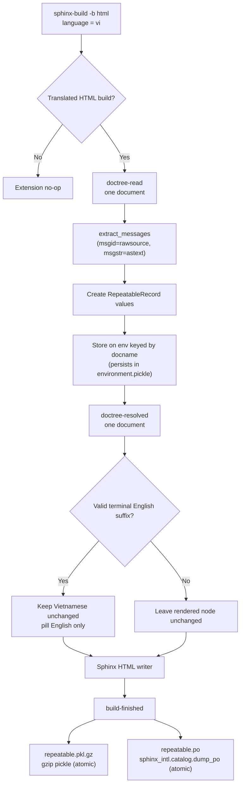
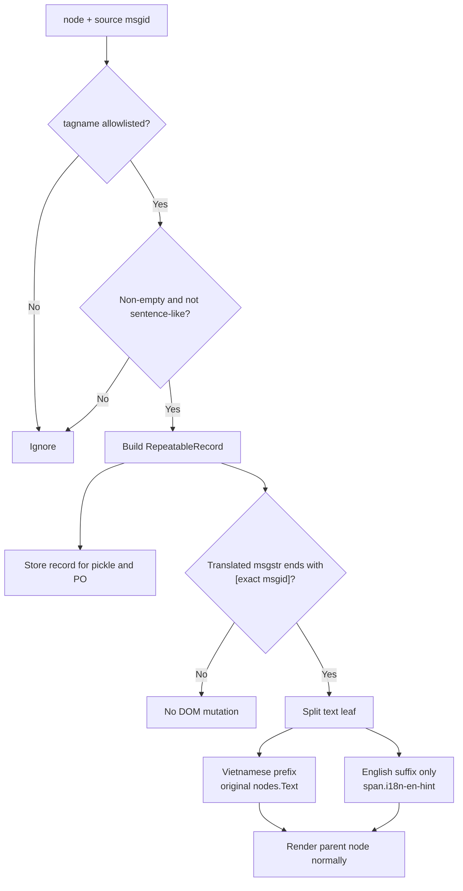
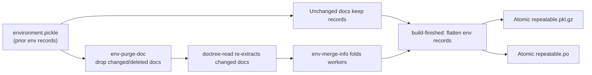

# Repeatable records, PO export, and English-hint pills — design plan

**Written:** `20260622_141959`
**Skill refs:** `project-management`, `development-guidelines`, `translation-workflow`
**Supersedes:** `tests/20260621_091708_en-hint-pill-styling-plan.md`

## TL;DR

- New Sphinx extension; translated HTML builds only.
- **Extract** records at `doctree-read` (read phase); persists in `environment.pickle` for free, exactly like the sibling `search_index_builder.py`.
- **Render** the pill at `doctree-resolved` (write phase): a stateless per-doc DOM mutation, no shared state.
- Capture allowlisted nodes as immutable `RepeatableRecord` values.
- Write `build/<lang>/repeatable.pkl.gz` and `build/<lang>/repeatable.po`.
- PO output via `sphinx_intl.catalog.dump_po()`; never `polib`.
- Convert validated `msgstr == "<translation> [<msgid>]"` suffix to `<span class="i18n-en-hint">` before HTML write.
- Reuse current pill styling for every repeatable node type; no heading-only styling.
- Reuse shared doctree helpers from `search_index_builder.py` (`nearest_section_id`, rel-source mapper, gzip-pickle, atomic write); do not re-implement.
- Keep narrow JS fallback for toctrees; Sphinx replaces `addnodes.toctree` during resolve, so resolved toctree links are not available to a doctree handler for in-place pilling.

## Architecture rationale (why read-phase extraction)

Sphinx pickles the build environment **after the read phase and before the write
phase** (`sphinx/builders/__init__.py`: "save the environment" precedes
`self.write(...)`). The i18n `Locale` transform is a **read-phase**
`SphinxTransform` (`sphinx/transforms/i18n.py`, `default_priority = 20`), so by
`doctree-read`:

- Translated text is already applied; `node['translated']` is already set.
- `node.rawsource` still holds the **source msgid** (the transform replaces
  children in place but never rewrites `rawsource`), so `extract_messages()`
  yields the English msgid while `node.astext()` yields the translated msgstr.
- `addnodes.toctree` nodes still carry `rawentries`/`entries`/`rawcaption`
  (they are replaced only during the later resolve phase).

Extracting here means per-document records persist in `environment.pickle` and
survive incremental rebuilds automatically — no external snapshot, no
bootstrap-on-`builder-inited`, no app-local merge. This mirrors the established,
tested pattern in `build_files/extensions/search_index_builder.py` (which does
the same for the English source language at `doctree-read`). The external
`repeatable.pkl.gz`/`repeatable.po` become pure **output artifacts** flushed at
`build-finished` from the env-stored records.

The pill DOM mutation is the only part that wants the write phase: `reference`
display text for internal xrefs is filled during resolve, so the mutation runs
at `doctree-resolved`. It is per-document and stateless, so the build stays
`parallel_read_safe=True` **and** `parallel_write_safe=True`.

## Acceptance checklist

- [ ] Vietnamese HTML build creates both repeatable artifacts.
- [ ] English/non-HTML builds create neither artifact.
- [ ] Pickle contains every eligible occurrence as `RepeatableRecord`.
- [ ] PO contains every eligible unique msgid; merged locations/node comments.
- [ ] Valid English suffix rendered as small pill; brackets removed visually.
- [ ] Vietnamese translation remains unchanged/unwrapped; only bracketed repeatable English is pilled.
- [ ] `<h4>... [English]</h4>` and `<dt>... [English]</dt>` use identical pill class/style.
- [ ] `scene_gltf2.html`: definition term `Màn Chắn Lọc [Mask]` renders `Mask` as pill.
- [ ] Ordinary square-bracket text unchanged.
- [ ] Incremental rebuild retains unchanged docs (from `environment.pickle`); replaces changed docs; removes deleted docs.
- [ ] `env_version` bump / removed env triggers full repeatable refresh.
- [ ] Parallel build (`-j 2`) produces artifacts identical to a serial build.
- [ ] Failed build leaves previous artifacts intact (serialization-failure path).

## Repeatable definition

Allowlisted `node.tagname` values:

```python
REPEATABLE_NODE_TAGNAMES = frozenset({
    "inline",
    "emphasis",
    "title",
    "term",
    "rubric",
    "field_name",
    "reference",
    "strong",
    "caption",
    "toctree",
})
```

Additional rules:

- Non-empty message from `sphinx.util.nodes.extract_messages(doctree)`.
- Skip sentence-like msgid ending `.`; retain ellipsis ending `...`.
- No remote/DB lookup. Build must stay deterministic/offline.
- Record eligible entries even when untranslated or lacking `[English]`; PO is full repeatable inventory.
- `toctree`: one record per `rawentries`/`entries` pair plus `rawcaption`/`caption`. Extract at `doctree-read`, where `addnodes.toctree` still exists; the node is replaced during resolve and is gone by `doctree-resolved`.

## Data model

New `build_files/extensions/repeatable_record.py`:

```python
@dataclass(frozen=True, slots=True)
class RepeatableRecord:
    docname: str
    source_path: str
    source_line: int
    node_tagname: str
    msgid: str
    msgstr: str
    html_page: str
    section_id: str
    ordinal: int
```

Semantics:

- One record per occurrence; no pickle-level dedup.
- `msgid`: source message returned by `extract_messages()`.
- `msgstr`: resolved translated text; `""` when untranslated/identical source.
- `ordinal`: deterministic same-document traversal index; disambiguates missing/equal line numbers.
- Stable identity: `(docname, source_line, node_tagname, ordinal)`.
- No node objects in record; portable, small, safely pickleable.

Pickle envelope:

```python
{
    "schema_version": 1,
    "language": "vi",
    "records_by_doc": {
        "addons/node_wrangler": tuple[RepeatableRecord, ...],
    },
}
```

- Gzip + `pickle.HIGHEST_PROTOCOL`.
- Filename: `repeatable.pkl.gz` (compressed form of `repeatable.pkl`).
- Trusted local build artifact only; never unpickle uploaded/untrusted files.
- Sort docnames/records before serialization; deterministic payload ordering.

## Sphinx lifecycle

| Event | Work |
|---|---|
| `doctree-read` | Gate translated HTML build; extract this doc's `RepeatableRecord`s (incl. toctree); store on `env` keyed by docname. |
| `env-purge-doc` | Drop a doc's records before it is re-read (clears stale entries on change/delete). |
| `env-merge-info` | Fold per-worker records back into the main `env` under `-j auto`. |
| `doctree-resolved` | Wrap validated direct-node hints as `i18n-en-hint` (stateless per-doc DOM mutation only; no record extraction). |
| `build-finished` | On success (HTML, translated lang): flatten env records, dedup, atomically write pickle + PO. |

State lives on the Sphinx `env` (read-phase), not on the app object:

- The i18n `Locale` transform is read-phase, so translated text, `node['translated']`, and source `rawsource` (msgid) are all present at `doctree-read`.
- Sphinx pickles `environment.pickle` after read / before write, so env-stored records persist across incremental rebuilds — unchanged docs keep their records with no external snapshot.
- `env-purge-doc` clears a changed/deleted doc; only re-read docs re-extract.
- `parallel_read_safe=True`; record extraction reads the doctree and writes to `env` (folded via `env-merge-info`), with **no read-phase doctree mutation**.
- `parallel_write_safe=True`; the `doctree-resolved` pill mutation is per-document and shares no state, so write-phase workers need no merge. (Removing the former app-local write-phase state is what lets this stay `True`.)

## Process diagrams

### Full translated HTML build



### Per-node identification and rendering



### Incremental rebuild



Snapshot invalidation is handled by Sphinx's own env versioning, not a custom
schema check: bump the extension's `env_version` (as `search_index_builder.py`
does) to force a full re-read when the record shape changes. `i18n_shards.py`
already marks docs outdated when generated `.mo` shards change, so updated
translations re-trigger `doctree-read` for those docs automatically — the
repeatable builder needs no `env-get-outdated` hook of its own.

## Extraction

Pure helpers; framework boundary only in event handlers:

- `is_repeatable_message(node, msgid) -> bool`
- `extract_node_msgstr(node, msgid) -> str`
- `extract_toctree_records(node, context) -> list[RepeatableRecord]`
- `extract_repeatable_records(doctree, context) -> list[RepeatableRecord]`
- `group_records_by_doc(records) -> dict[str, tuple[RepeatableRecord, ...]]`

Reuse from `search_index_builder.py` rather than re-implementing — factor the
shared pieces into a small common module (e.g.
`build_files/extensions/_doctree_extract.py`) imported by both:

- `nearest_section_id(node) -> str` — identical deep-link anchor logic.
- the abs-source → `manual/<docname>.rst` rel-source mapper (`_rel_source_factory`).
- the gzip + `pickle.HIGHEST_PROTOCOL` envelope writer and the atomic
  temp-sibling + `os.replace()` helper.
- the no-op gating shape (`format == "html"`, language check) and the
  `env` store / `env-purge-doc` / `env-merge-info` plumbing.

The two extensions are a deliberate pair: `search_index_builder` covers the
**source** language (English), `repeatable_builder` covers **translated**
languages; they never run together (source vs translated gate).

Direct-node translation:

- Use post-locale `node.astext()`.
- Treat `node["translated"] is not True` or normalized `msgstr == msgid` as untranslated (`msgstr=""`).
- Preserve source path/line from node; fallback to `manual/<docname>.rst`, line `-1`.

Toctree translation:

- Pair `rawentries` with current `entries` by position/doc target.
- Pair `rawcaption` with current `caption`.
- Never use `toctree.astext()`; it does not represent entry strings.

## Current gap / required visual contract

Observed in `build/vi/addons/scene_gltf2.html`:

- Styled: `<h4>Hai Mặt ... [Double-sided / Backface Culling]</h4>`.
- Missed: `<dt>Màn Chắn Lọc [Mask]</dt>`.
- Cause: current `en_hint.js` selector covers `h1`–`h6`, not `dt`/Sphinx `term` nodes.

Required result:

```html
<h4>
  Hai Mặt / Loại Bỏ Mặt Trái
  <span class="i18n-en-hint">Double-sided / Backface Culling</span>
</h4>

<dt>
  Màn Chắn Lọc
  <span class="i18n-en-hint">Mask</span>
</dt>
```

- One class: `.i18n-en-hint` for `inline`, `emphasis`, `title`, `term`, `rubric`, `field_name`, `reference`, `strong`, `caption`, and `toctree` output.
- Vietnamese prefix stays exactly as rendered by Sphinx; no wrapper/class/style applied to it.
- Only English content formerly inside terminal `[...]` receives `.i18n-en-hint`.
- Same pill appearance everywhere in main content: size, weight, spacing, border, background, radius, baseline.
- No `h1`–`h6`-specific or `dt`-specific visual variants.
- Only existing `.sidebar-tree .i18n-en-hint` compact override retained.
- Print remains plain bracketed English via existing `::before`/`::after` rules.

## Pill rendering

Validation before mutation:

- Translated direct node only.
- Terminal shape: `<non-empty translation> [<English>]`.
- No nested/empty brackets.
- Whitespace-normalized, case-sensitive `<English> == msgid`.
- Hint must exist inside one `nodes.Text` leaf; otherwise record only + Sphinx debug log.

Mutation:

- Split target `nodes.Text` leaf.
- Keep Vietnamese prefix as the original `nodes.Text`, byte-for-byte.
- Replace only `[<English>]` suffix with custom inline node containing `<English>`, class `i18n-en-hint`.
- Do not wrap/rewrite the parent title, term, reference, emphasis, or other translated node.
- Run the mutation at `doctree-resolved`, not `doctree-read`: internal `:ref:`/`:doc:` reference display text is filled during the resolve phase, and resolved text must be present before splitting the leaf. (Record extraction still happens at `doctree-read`; only the DOM split is deferred.)
- Apply same wrapper to every eligible direct node; never gate by rendered HTML tag/selector.
- Register HTML visitors with `app.add_node()`; emit escaped text through writer, no raw `innerHTML`.
- Preserve link target, title IDs, emphasis/strong semantics, headerlink, accessibility text.
- Existing CSS pill class and values retained as canonical visual style.

Canonical main-content style:

- `font-size: 0.72em`; `font-weight: 400`; `line-height: 1`.
- `margin-inline-start: 0.35em`; `padding: 0.15em 0.5em`.
- `border-radius: 999px`; theme secondary foreground/background/border variables.
- `white-space: nowrap`; existing baseline nudge retained.

Toctree exception:

- `doctree-resolved` fires before Sphinx converts `addnodes.toctree` to rendered links.
- Keep `build_files/theme/js/en_hint.js` only for `.toctree-wrapper a` and `.sidebar-tree a`.
- Remove generic heading/related-page selectors after direct-node renderer lands.
- JS-created fallback span uses the same `i18n-en-hint` class; therefore identical styling.
- JS remains translated-build gated; creates DOM nodes with `textContent`.

Examples:

- `Trình Thao Tác Nút [Node Wrangler]`, msgid `Node Wrangler` -> pill `Node Wrangler`.
- `<dt>Màn Chắn Lọc [Mask]</dt>`, msgid `Mask` -> same pill style as heading hints.
- `Màn Chắn Lọc` remains ordinary bold term text; only `Mask` is inside the pill.
- `Mới [New]`, msgid `New` -> pill `New`.
- `array[index]` -> unchanged: no exact repeatable-record suffix.
- `Giao Cắt [Dao] (Intersect [Knife])`, msgid `Intersect (Knife)` -> unchanged in v1; ambiguous/non-terminal exact match.

## `repeatable.po`

Path: `build/<lang>/repeatable.po`.

Build from final merged snapshot, not only docs visited this run:

- Babel `Catalog(locale=lang, domain="repeatable", project=app.config.project, version=app.config.version, fuzzy=False)`.
- Group by `(msgid, msgctxt)`; v1 `msgctxt=None`.
- `string`: record `msgstr`; empty when untranslated.
- Merge/sort locations; PO location form `../../manual/<docname>.rst:<line>`. Note this intentionally differs from `searchindex`'s `manual/<docname>.rst` form: `../../manual/...` matches the real `locale/<lang>/LC_MESSAGES/*.po` location prefix so `repeatable.po` lines up with the existing catalogs.
- Add sorted automatic comments: `repeatable-node: <tagname>`.
- Conflicting non-empty msgstr for same msgid: deterministic first value + Sphinx warning; unit test.
- Write temporary sibling, then `sphinx_intl.catalog.dump_po(str(tmp), catalog, width=4096, sort_output=True)` and `os.replace()`.
- Do not load/write with `polib.POEntry`.

## Atomicity/failure policy

- Build both payloads in memory first.
- Write each to temporary sibling.
- Replace final files only after both serialize successfully: `os.replace(pkl)` then `os.replace(po)`.
- If either serialization fails: remove temps; preserve previous finals; raise build error.
- Caveat: `os.replace` is atomic per file, not across the pair. A crash *between* the two replaces can leave a new `.pkl.gz` with an old `.po`. Acceptable for a regenerated build artifact (the next successful build reconciles them); the "previous artifacts intact" guarantee applies to serialization failure, not to a hard crash mid-swap. Replace `.pkl.gz` first so the slower-to-parse PO is the last to flip.
- `build-finished(exception is not None)`: no artifact writes.
- Log through `sphinx.util.logging`; no `print()`.

## Files

- `build_files/extensions/repeatable_record.py` — immutable model.
- `build_files/extensions/repeatable_builder.py` — `doctree-read` extraction, `doctree-resolved` pill mutation, lifecycle, PO catalog, node visitor.
- `build_files/extensions/_doctree_extract.py` — shared helpers (`nearest_section_id`, rel-source mapper, gzip-pickle envelope, atomic writer) extracted from `search_index_builder.py` and imported by both builders.
- `build_files/extensions/search_index_builder.py` — refactor to import the shared helpers (no behaviour change).
- `manual/conf.py` — enable `repeatable_builder` after i18n extension setup (line 64 `extensions` list, near `search_index_builder`).
- `build_files/theme/js/en_hint.js` — narrow to toctree fallback.
- `build_files/theme/css/theme_overrides.css` — one canonical `.i18n-en-hint`; sidebar/print overrides only.
- `tests/repeatable/test_repeatable_builder.py` — pure extraction/filter/model/serialization tests.
- `tests/repeatable/test_repeatable_sphinx_build.py` — temporary multilingual Sphinx integration fixture.

## Tests

Unit:

- Every allowlisted tag accepted; non-allowlisted paragraph rejected.
- Period sentence rejected; ellipsis retained.
- Translated/untranslated record values.
- Toctree entry + caption pairing.
- Multiple identical occurrences retain distinct ordinal.
- Exact suffix wraps; malformed/nested/mismatched brackets do not.
- Vietnamese prefix text/markup is identical before and after transformation.
- Only English suffix span receives pill class; parent/Vietnamese prefix receives none.
- All direct allowlisted node types emit the same `i18n-en-hint` class.
- `nodes.term` renders `<dt>...<span class="i18n-en-hint">Mask</span></dt>`.
- Link/emphasis/title structure preserved after wrapping.
- Pickle gzip round-trip returns `RepeatableRecord` values + schema/language.
- PO dedup merges locations/tags; untranslated has empty msgstr.
- Conflicting msgstr warning and deterministic winner.
- Atomic writer preserves old final on injected dump failure.

Integration:

- Minimal `en` + `vi` project; real `sphinx-build -b html`.
- vi: both artifacts exist; load pickle; load PO with `sphinx_intl.catalog.load_po()`.
- vi HTML: expected `<span class="i18n-en-hint">Node Wrangler</span>`.
- vi glTF fixture: heading and definition term pills have the same class; no literal `[Mask]` remains.
- en: no artifacts/no span.
- Incremental: edit one doc; unchanged records retained from `environment.pickle`; changed records replaced.
- Delete doc; stale records and PO location removed (`env-purge-doc` + absent from `env.found_docs`).
- `env_version` bump (or removed `environment.pickle`); next run re-reads all docs and refreshes both artifacts.
- Parallel build (`sphinx-build -j 2`): records from all workers merged via `env-merge-info`; artifacts identical to the serial build.
- After a `.mo` shard change, `i18n_shards` marks the doc outdated; next run re-extracts that doc's records (no extra `env-get-outdated` hook in the repeatable builder).
- Build exception; previous pickle/PO hashes unchanged.

## Verify

```sh
$PYENV/bin/python3 -m pytest tests/repeatable/ -q
make html BF_LANG=vi
$PYENV/bin/python3 -c 'import gzip, pickle; print(len(pickle.load(gzip.open("build/vi/repeatable.pkl.gz", "rb"))["records_by_doc"]))'
$PYENV/bin/python3 -c 'from sphinx_intl.catalog import load_po; print(len(load_po("build/vi/repeatable.po")))'
```

Manual:

- Open `build/vi/addons/node_wrangler.html` and `build/vi/addons/scene_gltf2.html`.
- Check title, section heading, field name, definition term, reference, toctree/sidebar.
- Compare glTF `Double-sided / Backface Culling` heading pill with `Mask` term pill; same main-content appearance.
- Check light/dark/print styles.
- Confirm ordinary body brackets unchanged.

## Implementation notes (as built)

Branch `feature/repeatable-record-extension`. Files:
`build_files/extensions/repeatable_record.py` (model),
`repeatable_extract.py` (pure core), `repeatable_builder.py` (Sphinx wiring +
pill node), `_doctree_extract.py` (shared with `search_index_builder.py`).
Constants/enums live in `tools/common/constants.py`
(`RepeatableTag`, `PickleEnvelopeKey`, filenames, brackets); output filenames
are configured in `manual/conf.py` (`repeatable_pickle_filename` /
`repeatable_po_filename`) and registered with `env` scope.

Deviations from the draft, all verified against Sphinx 9.1.0 source:

- **Captured node types are the TextElements `extract_messages` actually
  yields**: `title`, `term`, `rubric`, `field_name`, `caption`, plus `toctree`.
  `inline`/`emphasis`/`strong`/`reference` are `nodes.Inline`; Sphinx's
  `is_translatable` returns False for them unless individually marked, so they
  are part of their parent paragraph's msgid and not captured standalone. The
  allowlist still lists them (harmless) for the rare marked case. The two real
  gap cases — heading `title` and definition `term` — work (integration-tested).
- **`en_hint.js` keeps `.related-pages a`** alongside `.toctree-wrapper a` /
  `.sidebar-tree a`; only `h1`–`h6` were removed. Prev/next links are assembled
  by the HTML builder from *other* docs' titles after `doctree-resolved`, so the
  server-side renderer cannot reach them — dropping the selector would regress
  those pills. Both sources share the one `i18n-en-hint` class.
- **Toctree extraction reads `rawcaption`/`rawentries`** (unambiguous source)
  paired with `caption`/`entries` (translated); records are emitted only when a
  raw source string exists, so no translated text is ever mis-stored as a msgid.

### Glossary support (schema v2)

`.. glossary::` terms keep the **English first** and the translation in
brackets — `Materials [Nguyên Vật Liệu]` — the reverse of body content. Handled
with one unified rule instead of a special case:

- **Pill class is content-driven.** `classify_terminal_hint` checks which side
  of `<lead> [<bracket>]` equals the source msgid; the bracket is always pilled.
  - bracket == msgid → `HintSide.ENGLISH_BRACKET` → `i18n_en_hint`
    (`.i18n-en-hint`), the body case.
  - lead == msgid → `HintSide.ENGLISH_LEAD` → `i18n_vi_hint` (`.i18n-vi-hint`),
    the glossary case (the Vietnamese is pilled).
- **`is_glossary` is structure-driven.** `is_in_glossary(node)` walks ancestors
  for `addnodes.glossary`; the flag rides on `RepeatableRecord` so a glossary
  view filters the **shared** `repeatable.pkl.gz` — no separate file.
- `.i18n-vi-hint` shares the pill base CSS with `.i18n-en-hint` (identical look,
  independently targetable/toggleable). `RepeatableRecord` gained
  `is_glossary: bool`; pickle `schema_version`→2 and extension `env_version`→2.

Verified: `pytest tests/repeatable/ -q` (34 tests, incl. glossary unit +
integration) green; existing `tests/search/` suite still green after the
shared-helper refactor.

## Follow-ups

- [ ] Decide whether compound hints (`Intersect [Knife]`) need explicit segment metadata.
- [ ] Consider browser-readable manifest only if toctree false positives appear.
- [ ] Remove JS fallback if Sphinx adds a post-toctree doctree event or custom resolver adopted.
