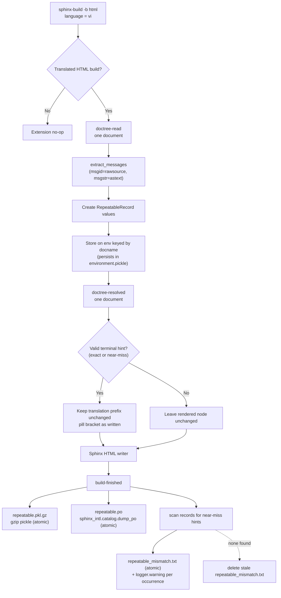
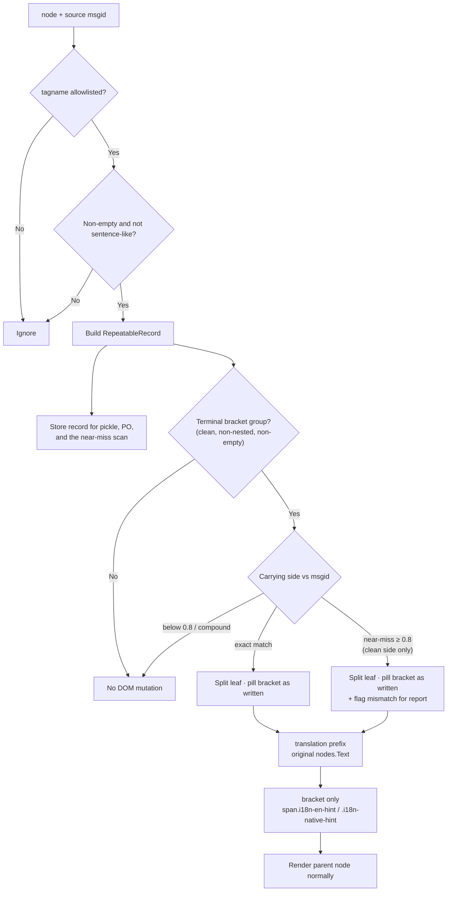
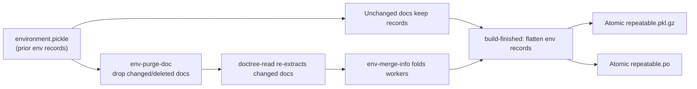
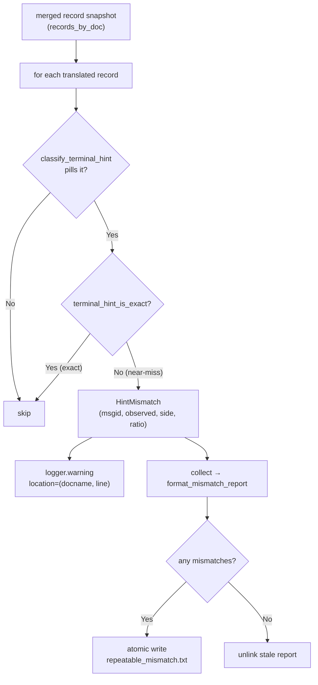

# Repeatable records, PO export, and English-hint pills — design plan

**Written:** `20260622_141959`
**Skill refs:** `project-management`, `development-guidelines`, `translation-workflow`
**Supersedes:** `tests/20260621_091708_en-hint-pill-styling-plan.md`

## TL;DR

- New Sphinx extension; translated HTML builds only.
- **Extract** records at `doctree-read` (read phase); persists in `environment.pickle` for free, exactly like the sibling `search_index_builder.py`.
- **Render** fixed pill HTML at `doctree-resolved` for direct nodes and
  `html-page-context` for generated navigation; no browser-time mutation.
- Capture allowlisted nodes as immutable `RepeatableRecord` values.
- Write `build/<lang>/repeatable.pkl.gz` and `build/<lang>/repeatable.po`.
- PO output via `sphinx_intl.catalog.dump_po()`; never `polib`.
- Convert validated terminal `[...]` or `(...)` English `msgid` suffixes to
  `<span class="i18n-en-hint" data-repeatable="true" data-msgid="...">`
  before HTML write.
- Pill a terminal hint when its bracket is an **exact** match for the source
  msgid **or** a **near-miss** (similarity ≥ `HINT_NEAR_MISS_RATIO` = 0.8 via
  `difflib.SequenceMatcher` on whitespace-normalised, case-folded text); the
  pill always shows the translator's text **as written** (never auto-corrected).
- Warn (one `logger.warning` per occurrence) and write
  `build/<lang>/repeatable_mismatch.txt` for every near-miss, so a translator
  can align the bracket with the source. A clean run removes any stale report.
- Reuse current pill styling for every repeatable node type; no heading-only styling.
- All pill styling is driven by `--i18n-hint-*` CSS custom properties on `:root`,
  so appearance is adjustable **at run time** (devtools / user stylesheet / JS),
  no rebuild needed.
- Reuse shared doctree helpers from `search_index_builder.py` (`nearest_section_id`, rel-source mapper, gzip-pickle, atomic write); do not re-implement.
- Rewrite rendered toctrees, Furo navigation, local TOC, and previous/next
  titles at `html-page-context` after Furo prepares its context. The HTML
  rewriter's regexes live (named-group, verbose) in `tools/common/constants.py`.

## Architecture rationale (why read-phase extraction)

Sphinx pickles the build environment **after the read phase and before the write
phase** (`sphinx/builders/__init__.py`: "save the environment" precedes
`self.write(...)`). The i18n `Locale` transform is a **read-phase**
`SphinxTransform` (`sphinx/transforms/i18n.py`, `default_priority = 20`), so by
`doctree-read`:

- Translated text is already applied; `node['translated']` is already set.
- `node.rawsource` still holds the **source msgid** (the transform replaces
  children in place but never rewrites `rawsource`), so `extract_messages()`
  yields the English msgid while `node.astext()` yields the translated msgstr.
- `addnodes.toctree` nodes still carry `rawentries`/`entries`/`rawcaption`
  (they are replaced only during the later resolve phase).

Extracting here means per-document records persist in `environment.pickle` and
survive incremental rebuilds automatically — no external snapshot, no
bootstrap-on-`builder-inited`, no app-local merge. This mirrors the established,
tested pattern in `build_files/extensions/search_index_builder.py` (which does
the same for the English source language at `doctree-read`). The external
`repeatable.pkl.gz`/`repeatable.po` become pure **output artifacts** flushed at
`build-finished` from the env-stored records.

The pill DOM mutation is the only part that wants the write phase: `reference`
display text for internal xrefs is filled during resolve, so the mutation runs
at `doctree-resolved`. It is per-document and stateless, so the build stays
`parallel_read_safe=True` **and** `parallel_write_safe=True`.

## Acceptance checklist

- [ ] Vietnamese HTML build creates both repeatable artifacts.
- [ ] English/non-HTML builds create neither artifact.
- [ ] Pickle contains every eligible occurrence as `RepeatableRecord`.
- [ ] PO contains every eligible unique msgid; merged locations/node comments.
- [ ] Valid English suffix rendered as small pill; brackets removed visually.
- [ ] Vietnamese translation remains unchanged/unwrapped; only bracketed repeatable English is pilled.
- [ ] `<h4>... [English]</h4>` and `<dt>... [English]</dt>` use identical pill class/style.
- [ ] `scene_gltf2.html`: definition term `Màn Chắn Lọc [Mask]` renders `Mask` as pill.
- [ ] Ordinary square-bracket text unchanged.
- [ ] Incremental rebuild retains unchanged docs (from `environment.pickle`); replaces changed docs; removes deleted docs.
- [ ] `env_version` bump / removed env triggers full repeatable refresh.
- [ ] Parallel build (`-j 2`) produces artifacts identical to a serial build.
- [ ] Failed build leaves previous artifacts intact (serialization-failure path).
- [ ] Near-miss bracket (e.g. dropped article: `(Install from Package Manager)` vs source `Install from a Package Manager`) is pilled **as written** and listed in `repeatable_mismatch.txt` with a build warning.
- [ ] Exact-match hint produces **no** mismatch entry.
- [ ] Far-off bracket (`Bar` vs `Baz`, ratio ≈ 0.67) and nested-compound hint (`… (Intersect [Knife])`) stay unpilled and unreported.
- [ ] A clean build (no near-misses) deletes any stale `repeatable_mismatch.txt`.
- [ ] Pill appearance is restylable at run time by overriding a `--i18n-hint-*` variable on `:root` (no rebuild).

## Repeatable definition

Allowlisted `node.tagname` values:

```python
REPEATABLE_NODE_TAGNAMES = frozenset({
    "inline",
    "emphasis",
    "title",
    "term",
    "rubric",
    "field_name",
    "reference",
    "strong",
    "caption",
    "toctree",
})
```

Additional rules:

- Non-empty message from `sphinx.util.nodes.extract_messages(doctree)`.
- Skip sentence-like msgid ending `.`; retain ellipsis ending `...`.
- No remote/DB lookup. Build must stay deterministic/offline.
- Record eligible entries even when untranslated or lacking `[English]`; PO is full repeatable inventory.
- `toctree`: one record per `rawentries`/`entries` pair plus `rawcaption`/`caption`. Extract at `doctree-read`, where `addnodes.toctree` still exists; the node is replaced during resolve and is gone by `doctree-resolved`.

## Data model

New `build_files/extensions/repeatable_record.py`:

```python
@dataclass(frozen=True, slots=True)
class RepeatableRecord:
    docname: str
    source_path: str
    source_line: int
    node_tagname: str
    msgid: str
    msgstr: str
    html_page: str
    section_id: str
    ordinal: int
```

Semantics:

- One record per occurrence; no pickle-level dedup.
- `msgid`: source message returned by `extract_messages()`.
- `msgstr`: resolved translated text; `""` when untranslated/identical source.
- `ordinal`: deterministic same-document traversal index; disambiguates missing/equal line numbers.
- Stable identity: `(docname, source_line, node_tagname, ordinal)`.
- No node objects in record; portable, small, safely pickleable.

Pickle envelope:

```python
{
    "schema_version": 1,
    "language": "vi",
    "records_by_doc": {
        "addons/node_wrangler": tuple[RepeatableRecord, ...],
    },
}
```

- Gzip + `pickle.HIGHEST_PROTOCOL`.
- Filename: `repeatable.pkl.gz` (compressed form of `repeatable.pkl`).
- Trusted local build artifact only; never unpickle uploaded/untrusted files.
- Sort docnames/records before serialization; deterministic payload ordering.

## Sphinx lifecycle

| Event | Work |
|---|---|
| `doctree-read` | Gate translated HTML build; extract this doc's `RepeatableRecord`s (incl. toctree); store on `env` keyed by docname. |
| `env-purge-doc` | Drop a doc's records before it is re-read (clears stale entries on change/delete). |
| `env-merge-info` | Fold per-worker records back into the main `env` under `-j auto`. |
| `doctree-resolved` | Wrap validated direct-node hints (exact or near-miss) as `i18n-en-hint`/`i18n-native-hint` (stateless per-doc DOM mutation only; no record extraction). |
| `html-page-context` | (priority 700, after Furo) rewrite generated navigation HTML fragments to pill validated repeatable titles/toctrees. |
| `build-finished` | On success (HTML, translated lang): flatten env records, dedup, atomically write pickle + PO; scan records for near-miss hints → warn per occurrence + atomically write `repeatable_mismatch.txt` (or delete a stale one). |

State lives on the Sphinx `env` (read-phase), not on the app object:

- The i18n `Locale` transform is read-phase, so translated text, `node['translated']`, and source `rawsource` (msgid) are all present at `doctree-read`.
- Sphinx pickles `environment.pickle` after read / before write, so env-stored records persist across incremental rebuilds — unchanged docs keep their records with no external snapshot.
- `env-purge-doc` clears a changed/deleted doc; only re-read docs re-extract.
- `parallel_read_safe=True`; record extraction reads the doctree and writes to `env` (folded via `env-merge-info`), with **no read-phase doctree mutation**.
- `parallel_write_safe=True`; the `doctree-resolved` pill mutation is per-document and shares no state, so write-phase workers need no merge. (Removing the former app-local write-phase state is what lets this stay `True`.)

## Process diagrams

### Full translated HTML build



### Per-node identification and rendering



### Incremental rebuild



Snapshot invalidation is handled by Sphinx's own env versioning, not a custom
schema check: bump the extension's `env_version` (as `search_index_builder.py`
does) to force a full re-read when the record shape changes. `i18n_shards.py`
already marks docs outdated when generated `.mo` shards change, so updated
translations re-trigger `doctree-read` for those docs automatically — the
repeatable builder needs no `env-get-outdated` hook of its own.

## Extraction

Pure helpers; framework boundary only in event handlers:

- `is_repeatable_message(node, msgid) -> bool`
- `extract_node_msgstr(node, msgid) -> str`
- `extract_toctree_records(node, context) -> list[RepeatableRecord]`
- `extract_repeatable_records(doctree, context) -> list[RepeatableRecord]`
- `group_records_by_doc(records) -> dict[str, tuple[RepeatableRecord, ...]]`

Reuse from `search_index_builder.py` rather than re-implementing — factor the
shared pieces into a small common module (e.g.
`build_files/extensions/_doctree_extract.py`) imported by both:

- `nearest_section_id(node) -> str` — identical deep-link anchor logic.
- the abs-source → `manual/<docname>.rst` rel-source mapper (`_rel_source_factory`).
- the gzip + `pickle.HIGHEST_PROTOCOL` envelope writer and the atomic
  temp-sibling + `os.replace()` helper.
- the no-op gating shape (`format == "html"`, language check) and the
  `env` store / `env-purge-doc` / `env-merge-info` plumbing.

The two extensions are a deliberate pair: `search_index_builder` covers the
**source** language (English), `repeatable_builder` covers **translated**
languages; they never run together (source vs translated gate).

Direct-node translation:

- Use post-locale `node.astext()`.
- Treat `node["translated"] is not True` or normalized `msgstr == msgid` as untranslated (`msgstr=""`).
- Preserve source path/line from node; fallback to `manual/<docname>.rst`, line `-1`.

Toctree translation:

- Pair `rawentries` with current `entries` by position/doc target.
- Pair `rawcaption` with current `caption`.
- Never use `toctree.astext()`; it does not represent entry strings.

## Current gap / required visual contract

Observed in `build/vi/addons/scene_gltf2.html`:

- Styled: `<h4>Hai Mặt ... [Double-sided / Backface Culling]</h4>`.
- Missed: `<dt>Màn Chắn Lọc [Mask]</dt>`.
- Historical cause: the former runtime selector covered `h1`–`h6`, not
  `dt`/Sphinx `term` nodes.

Required result:

```html
<h4>
  Hai Mặt / Loại Bỏ Mặt Trái
  <span class="i18n-en-hint">Double-sided / Backface Culling</span>
</h4>

<dt>
  Màn Chắn Lọc
  <span class="i18n-en-hint">Mask</span>
</dt>
```

- Two classes sharing one base: `.i18n-en-hint` (bracket is English, body) and
  `.i18n-native-hint` (bracket is the translation, glossary), for `inline`,
  `emphasis`, `title`, `term`, `rubric`, `field_name`, `reference`, `strong`,
  `caption`, and `toctree` output.
- Vietnamese prefix stays exactly as rendered by Sphinx; no wrapper/class/style applied to it.
- Only content inside the terminal bracket receives the pill class.
- Same pill appearance everywhere in main content: size, weight, spacing, border, background, radius, baseline.
- No `h1`–`h6`-specific or `dt`-specific visual variants.
- Context overrides only: `.sidebar-tree` (compact), `.card` (homepage cards
  force `1.3em` bold on title spans, so the pill is pulled back to ~half size),
  and `@media print`.
- Print remains plain bracketed text via the `::before`/`::after` rules.

## Pill rendering

Validation before mutation:

- Translated direct node only.
- Terminal shape: `<non-empty translation> [<English>]` (or `(...)`).
- No nested/empty brackets; both lead and bracket non-empty.
- Carrying side accepted when **exact** (whitespace-normalised, case-insensitive
  `matches_msgid`) **or** a **near-miss**: `similarity()` (difflib
  `SequenceMatcher` on normalised casefold) ≥ `HINT_NEAR_MISS_RATIO` (0.8). The
  side closest to the msgid wins. Near-miss is gated to **clean** sides only
  (no other bracket delimiter chars), so compound `… (Intersect [Knife])` is
  rejected. Exact always beats near-miss.
- The pill renders the **translator's bracket text as written** in both cases;
  near-misses are never auto-corrected, only reported (see below).
- Hint must exist inside one `nodes.Text` leaf; otherwise record only + Sphinx debug log.

Mutation:

- Split target `nodes.Text` leaf.
- Keep Vietnamese prefix as the original `nodes.Text`, byte-for-byte.
- Replace only `[<English>]` suffix with custom inline node containing `<English>`, class `i18n-en-hint`.
- Do not wrap/rewrite the parent title, term, reference, emphasis, or other translated node.
- Run the mutation at `doctree-resolved`, not `doctree-read`: internal `:ref:`/`:doc:` reference display text is filled during the resolve phase, and resolved text must be present before splitting the leaf. (Record extraction still happens at `doctree-read`; only the DOM split is deferred.)
- Apply same wrapper to every eligible direct node; never gate by rendered HTML tag/selector.
- Register HTML visitors with `app.add_node()`; emit escaped text through writer, no raw `innerHTML`.
- Preserve link target, title IDs, emphasis/strong semantics, headerlink, accessibility text.
- Existing CSS pill class and values retained as canonical visual style.

Canonical main-content style — every value is a `--i18n-hint-*` custom property
on `:root` so it is overridable at run time without rebuilding:

- `--i18n-hint-font-size: 0.72em`; `--i18n-hint-font-weight: 400`;
  `--i18n-hint-line-height: 1`; `--i18n-hint-vertical-align: 0.12em` (baseline nudge).
- `--i18n-hint-margin-start: 0.35em`; `--i18n-hint-padding: 0.15em 0.5em`.
- `--i18n-hint-radius: 999px`; theme secondary foreground/background/border via
  `--i18n-hint-color` / `--i18n-hint-bg` / `--i18n-hint-border-color`.
- `white-space: nowrap`.
- Context groups: `--i18n-hint-sidebar-*`, `--i18n-hint-card-*` (e.g.
  `--i18n-hint-card-font-size: 0.65em`), `--i18n-hint-print-font-size`.

Toctree exception:

- `doctree-resolved` fires before Sphinx converts `addnodes.toctree` to rendered links.
- At `html-page-context` (priority 700, after Furo), rewrite only text validated
  by a captured repeatable title/toctree record and its original English msgid.
- Cover in-page toctrees, Furo's sidebar/caption, local TOC, and related-page
  titles before Jinja writes the HTML file.
- Emit the same `i18n-en-hint` class plus `data-repeatable="true"` and
  `data-msgid="<English original>"`; no runtime JavaScript is involved.

Examples:

- `Trình Thao Tác Nút [Node Wrangler]`, msgid `Node Wrangler` -> pill `Node Wrangler`.
- `<dt>Màn Chắn Lọc [Mask]</dt>`, msgid `Mask` -> same pill style as heading hints.
- `Màn Chắn Lọc` remains ordinary bold term text; only `Mask` is inside the pill.
- `Mới [New]`, msgid `New` -> pill `New`.
- `array[index]` -> unchanged: no exact repeatable-record suffix.
- `Giao Cắt [Dao] (Intersect [Knife])`, msgid `Intersect (Knife)` -> unchanged in v1; near-miss gate rejects it (bracket carries another delimiter pair).
- `Cài Đặt từ Trình Quản Lý Gói Phần Mềm (Install from Package Manager)`, msgid `Install from a Package Manager` -> **near-miss** (ratio ≈ 0.97): pilled as written (`Install from Package Manager`) **and** reported in `repeatable_mismatch.txt`.
- `Foo [Bar]`, msgid `Baz` -> unchanged (ratio ≈ 0.67 < 0.8); not reported.

## `repeatable.po`

Path: `build/<lang>/repeatable.po`.

Build from final merged snapshot, not only docs visited this run:

- Babel `Catalog(locale=lang, domain="repeatable", project=app.config.project, version=app.config.version, fuzzy=False)`.
- Group by `(msgid, msgctxt)`; v1 `msgctxt=None`.
- `string`: record `msgstr`; empty when untranslated.
- Merge/sort locations; PO location form `../../manual/<docname>.rst:<line>`. Note this intentionally differs from `searchindex`'s `manual/<docname>.rst` form: `../../manual/...` matches the real `locale/<lang>/LC_MESSAGES/*.po` location prefix so `repeatable.po` lines up with the existing catalogs.
- Add sorted automatic comments: `repeatable-node: <tagname>`.
- Conflicting non-empty msgstr for same msgid: deterministic first value + Sphinx warning; unit test.
- Write temporary sibling, then `sphinx_intl.catalog.dump_po(str(tmp), catalog, width=4096, sort_output=True)` and `os.replace()`.
- Do not load/write with `polib.POEntry`.

## Misaligned reading-hint report (`repeatable_mismatch.txt`)

Path: `build/<lang>/repeatable_mismatch.txt` (configurable via
`repeatable_mismatch_filename` in `manual/conf.py`).

A *misaligned* (near-miss) hint is one that pilled only because of the near-miss
fallback — its bracket is close to but not an exact match for the source msgid,
almost always a translator typo (a dropped article, stray space, punctuation
drift). These are pilled **as written** (the page still looks right) but flagged
so the translator can fix the source; the build does **not** auto-correct.

Detection mirrors the pill logic so the report lists exactly what got pilled as a
near-miss:

- `classify_hint_mismatch(text, msgid)` returns a `HintMismatch` only when
  `classify_terminal_hint` succeeds **and** `terminal_hint_is_exact` is False.
- `collect_hint_mismatches(records_by_doc)` scans the merged record snapshot
  (translated records only) in deterministic order, returning `(record,
  HintMismatch)` pairs.

`HintMismatch` carries `msgid` (faithful source), `observed` (the translator's
text on the carrying side), `side`, and `ratio`.

Output at `build-finished` (success only):

- One `logger.warning` per occurrence with `location=(docname, source_line)`,
  the observed text, and the source msgid.
- A grouped human-readable text report via `format_mismatch_report()` — by source
  msgid, with the distinct bracket text written and merged `source_path:line`
  locations — written atomically (temp sibling + `os.replace`).
- When there are **no** near-misses, any stale report file is removed
  (`unlink(missing_ok=True)`), so the file's absence means "all clean".

The near-miss bar is one constant: `HINT_NEAR_MISS_RATIO = 0.8` in
`tools/common/constants.py`. It is high enough to ignore unrelated brackets
(`Bar`/`Baz` ≈ 0.67) and low enough to catch real typos (`Install from Package
Manager` vs `Install from a Package Manager` ≈ 0.97).



## Atomicity/failure policy

- Build both payloads in memory first.
- Write each to temporary sibling.
- Replace final files only after both serialize successfully: `os.replace(pkl)` then `os.replace(po)`.
- If either serialization fails: remove temps; preserve previous finals; raise build error.
- Caveat: `os.replace` is atomic per file, not across the pair. A crash *between* the two replaces can leave a new `.pkl.gz` with an old `.po`. Acceptable for a regenerated build artifact (the next successful build reconciles them); the "previous artifacts intact" guarantee applies to serialization failure, not to a hard crash mid-swap. Replace `.pkl.gz` first so the slower-to-parse PO is the last to flip.
- `build-finished(exception is not None)`: no artifact writes.
- Log through `sphinx.util.logging`; no `print()`.

## Files

- `build_files/extensions/repeatable_record.py` — immutable model (`RepeatableRecord`, incl. `is_glossary`).
- `build_files/extensions/repeatable_extract.py` — framework-free core: message
  filtering, hint classification (`classify_terminal_hint` exact + near-miss,
  `similarity`, `terminal_hint_is_exact`), `HintMismatch`/`classify_hint_mismatch`/
  `collect_hint_mismatches`/`format_mismatch_report`, record construction, and
  pickle/PO assembly.
- `build_files/extensions/repeatable_builder.py` — Sphinx wiring: `doctree-read`
  extraction, `doctree-resolved` pill mutation, `html-page-context` navigation
  rewrite, lifecycle, pill node + HTML visitors, artifact writers (pickle, PO,
  and `_report_hint_mismatches`/`_write_text_atomic`).
- `build_files/extensions/repeatable_html.py` — pure build-time rewriting for
  generated navigation fragments (regexes imported from `common.constants`).
- `build_files/extensions/_doctree_extract.py` — shared helpers (`nearest_section_id`, rel-source mapper, gzip-pickle envelope, atomic writer) extracted from `search_index_builder.py` and imported by both builders.
- `build_files/extensions/search_index_builder.py` — refactor to import the shared helpers (no behaviour change).
- `tools/common/constants.py` — single source of truth: `RepeatableTag`,
  `PickleEnvelopeKey`, `HintSide`, pill CSS classes, bracket pairs,
  `HINT_NEAR_MISS_RATIO`, filenames + conf-key names, and the named-group/verbose
  navigation-rewrite regexes (`HTML_TAG_RE`, `NAV_*_RE`).
- `manual/conf.py` — enable `repeatable_builder` in the `extensions` list (near
  `search_index_builder`); set `repeatable_pickle_filename`,
  `repeatable_po_filename`, `repeatable_mismatch_filename`.
- `build_files/theme/css/theme_overrides.css` — all pill values exposed as
  `--i18n-hint-*` custom properties on `:root`; `.i18n-en-hint`/`.i18n-native-hint`
  share the base; sidebar, homepage-card, and print context overrides only.
- `tests/repeatable/test_repeatable_builder.py` — pure extraction/filter/model/serialization + near-miss/mismatch tests.
- `tests/repeatable/test_repeatable_sphinx_build.py` — temporary multilingual Sphinx integration fixture.
- `tests/repeatable/test_repeatable_html.py` — navigation-fragment rewrite tests.

## Tests

Unit:

- Every allowlisted tag accepted; non-allowlisted paragraph rejected.
- Period sentence rejected; ellipsis retained.
- Translated/untranslated record values.
- Toctree entry + caption pairing.
- Multiple identical occurrences retain distinct ordinal.
- Exact suffix wraps; malformed/nested/mismatched brackets do not.
- Vietnamese prefix text/markup is identical before and after transformation.
- Only English suffix span receives pill class; parent/Vietnamese prefix receives none.
- All direct allowlisted node types emit the same `i18n-en-hint` class.
- `nodes.term` renders `<dt>...<span class="i18n-en-hint">Mask</span></dt>`.
- Link/emphasis/title structure preserved after wrapping.
- Pickle gzip round-trip returns `RepeatableRecord` values + schema/language.
- PO dedup merges locations/tags; untranslated has empty msgstr.
- Conflicting msgstr warning and deterministic winner.
- Atomic writer preserves old final on injected dump failure.
- Near-miss bracket pills as written (translator's text, not the source).
- `classify_hint_mismatch` flags near-miss, ignores exact match and far-off bracket.
- Nested-compound hint stays unpilled (near-miss gate rejects non-clean sides).
- `collect_hint_mismatches` excludes exact matches; `format_mismatch_report`
  groups by msgid with the written text and `path:line` locations.

Integration:

- Minimal `en` + `vi` project; real `sphinx-build -b html`.
- vi: both artifacts exist; load pickle; load PO with `sphinx_intl.catalog.load_po()`.
- vi HTML: expected `<span class="i18n-en-hint">Node Wrangler</span>`.
- vi glTF fixture: heading and definition term pills have the same class; no literal `[Mask]` remains.
- en: no artifacts/no span.
- Incremental: edit one doc; unchanged records retained from `environment.pickle`; changed records replaced.
- Delete doc; stale records and PO location removed (`env-purge-doc` + absent from `env.found_docs`).
- `env_version` bump (or removed `environment.pickle`); next run re-reads all docs and refreshes both artifacts.
- Parallel build (`sphinx-build -j 2`): records from all workers merged via `env-merge-info`; artifacts identical to the serial build.
- After a `.mo` shard change, `i18n_shards` marks the doc outdated; next run re-extracts that doc's records (no extra `env-get-outdated` hook in the repeatable builder).
- Build exception; previous pickle/PO hashes unchanged.

## Verify

```sh
$PYENV/bin/python3 -m pytest tests/repeatable/ -q
make build BF_LANGS="vi ru"   # or: make html-direct BF_LANG=vi
$PYENV/bin/python3 -c 'import gzip, pickle; print(len(pickle.load(gzip.open("build/vi/repeatable.pkl.gz", "rb"))["records_by_doc"]))'
$PYENV/bin/python3 -c 'from sphinx_intl.catalog import load_po; print(len(load_po("build/vi/repeatable.po")))'
# Near-miss report (present only when there are near-misses):
cat build/vi/repeatable_mismatch.txt
```

Manual:

- Open `build/vi/addons/node_wrangler.html` and `build/vi/addons/scene_gltf2.html`.
- Check title, section heading, field name, definition term, reference, toctree/sidebar.
- Compare glTF `Double-sided / Backface Culling` heading pill with `Mask` term pill; same main-content appearance.
- Check light/dark/print styles, and the smaller homepage-card pill.
- Confirm ordinary body brackets unchanged.
- Confirm a known near-miss (`Install from a Package Manager`) is pilled and
  appears in `repeatable_mismatch.txt` with a build-log warning.
- Live-restyle check: in devtools run
  `document.documentElement.style.setProperty('--i18n-hint-font-size','0.6em')`
  and confirm every pill resizes without a rebuild.

## Implementation notes (as built)

Branch `feature/repeatable-record-extension`. Files:
`build_files/extensions/repeatable_record.py` (model),
`repeatable_extract.py` (pure core), `repeatable_builder.py` (Sphinx wiring +
pill node), `_doctree_extract.py` (shared with `search_index_builder.py`).
Constants/enums live in `tools/common/constants.py`
(`RepeatableTag`, `PickleEnvelopeKey`, filenames, brackets); output filenames
are configured in `manual/conf.py` (`repeatable_pickle_filename` /
`repeatable_po_filename`) and registered with `env` scope.

Deviations from the draft, all verified against Sphinx 9.1.0 source:

- **Captured node types are the TextElements `extract_messages` actually
  yields**: `title`, `term`, `rubric`, `field_name`, `caption`, plus `toctree`.
  `inline`/`emphasis`/`strong`/`reference` are `nodes.Inline`; Sphinx's
  `is_translatable` returns False for them unless individually marked, so they
  are part of their parent paragraph's msgid and not captured standalone. The
  allowlist still lists them (harmless) for the rare marked case. The two real
  gap cases — heading `title` and definition `term` — work (integration-tested).
- **Generated navigation is fixed during the build.** The priority-700
  `html-page-context` handler runs after Furo computes its navigation tree and
  rewrites only validated repeatable `msgstr`/`msgid` pairs. The emitted HTML
  contains provenance attributes and needs no browser-time fallback.
- **Homepage `toc-cards` use the same generated-navigation path.** Bare
  `:doc:` links are validated against repeatable title records, then rewritten
  inside `.card` containers before HTML output; matching prose outside those
  navigation containers remains unchanged.
- **Explicit RST links resolve their visible source label once.** A repeatable
  source such as `` `Stable Release <URL>`__ `` keeps the full markup as its PO
  `msgid`, while `doctree-resolved` derives `Stable Release` as the visible
  source segment and pills only a matching terminal translated repetition.
  Link targets and surrounding node structure are preserved.
- **Toctree extraction reads `rawcaption`/`rawentries`** (unambiguous source)
  paired with `caption`/`entries` (translated); records are emitted only when a
  raw source string exists, so no translated text is ever mis-stored as a msgid.

### Glossary support (schema v2)

`.. glossary::` terms keep the **English first** and the translation in
brackets — `Materials [Nguyên Vật Liệu]` — the reverse of body content. Handled
with one unified rule instead of a special case:

- **Pill class is content-driven.** `classify_terminal_hint` checks which side
  of `<lead> [<bracket>]` equals the source msgid; the bracket is always pilled.
  - bracket == msgid → `HintSide.ENGLISH_BRACKET` → `i18n_en_hint`
    (`.i18n-en-hint`), the body case.
  - lead == msgid → `HintSide.ENGLISH_LEAD` → `i18n_native_hint` (`.i18n-native-hint`),
    the glossary case (the Vietnamese is pilled).
- **`is_glossary` is structure-driven.** `is_in_glossary(node)` walks ancestors
  for `addnodes.glossary`; the flag rides on `RepeatableRecord` so a glossary
  view filters the **shared** `repeatable.pkl.gz` — no separate file.
- `.i18n-native-hint` shares the pill base CSS with `.i18n-en-hint` (identical look,
  independently targetable/toggleable). `RepeatableRecord` gained
  `is_glossary: bool`; pickle `schema_version`→2 and extension `env_version`→2.

Verified: `pytest tests/repeatable/ -q` (51 tests, incl. glossary, navigation
HTML, and near-miss/mismatch unit + integration) green; existing `tests/search/`
suite still green after the shared-helper refactor.

### Near-miss hints, mismatch report, and run-time styling

- **Near-miss pilling (`HINT_NEAR_MISS_RATIO = 0.8`).** `classify_terminal_hint`
  accepts a side that is an exact match, or whose `difflib.SequenceMatcher`
  similarity to the msgid clears the bar; the closer side wins. Near-miss only
  applies to **clean** sides (no other delimiter characters via
  `_contains_delimiter`), so the ambiguous compound case stays rejected. The
  pill always renders the translator's text as written — nothing is
  auto-corrected. Both direct nodes and generated navigation inherit this
  because both go through `classify_terminal_hint`.
- **Misalignment surfaced, not fixed.** `build-finished` scans the merged
  records (`collect_hint_mismatches`), emits one `logger.warning` per occurrence,
  and atomically writes `repeatable_mismatch.txt` (`format_mismatch_report`);
  a clean run deletes any stale report. Filename is the configurable
  `repeatable_mismatch_filename`. No `env_version` bump was needed — record shape
  is unchanged; this is render/report logic only.
- **Run-time-adjustable pill CSS.** All pill values are `--i18n-hint-*` custom
  properties on `:root`; `.i18n-en-hint` and `.i18n-native-hint` share the base.
  Added a `.card .i18n-en-hint, .card .i18n-native-hint` override because the
  homepage card-title rule (`.card dl dt a span { font-size: 1.3em; bold }`) was
  inflating the pill.
- **Navigation-rewrite regexes centralised.** `repeatable_html.py`'s three
  regexes moved to `tools/common/constants.py` as named-group, `re.VERBOSE`
  patterns (`HTML_TAG_RE`, `NAV_TOCTREE_WRAPPER_RE`, `NAV_TOC_CARD_RE`), with the
  group names exported so call sites reference groups by name.

## Update 2026-06-23 — pill-chrome fix, language-neutral class, ru/vi parity

Centralising the theme CSS (`shared_assets`, every language links one
`build/shared/_static/css/theme_overrides.css`) surfaced a latent styling bug and
prompted a naming cleanup. The pill **extraction/render logic was not touched** —
these are CSS + class-name changes only.

### Pill chrome was invisible (the `:root` vs `<body>` variable-scope bug)

Symptom: on a translated build the hints rendered as muted plain text with **no
background, border, or pill shape** (verified in Chrome on `ru` and `vi`). Root
cause: the colour tokens were declared on `:root` as references to Furo's theme
variables —

```css
:root { --i18n-hint-bg: var(--color-background-secondary); /* + color, border-color */ }
```

— but **Furo declares `--color-*` on `<body>` (and `body[data-theme=dark]`), not on
`:root`**. Evaluated at `:root`, `var(--color-background-secondary)` is undefined,
so `--i18n-hint-bg` computed to the *guaranteed-invalid value* and inherited down
empty; `background-color`/`border` fell back to transparent/0. Only the
literal-valued tokens (radius, font-size) survived, which is why the text was
muted but un-chromed.

Fix (in `theme_overrides.css`): stop indirecting the colours through `:root`.
The literal tokens stay on `:root` (still runtime-overridable). The three colour
tokens are resolved **in the pill rule itself**, where the element sits inside
`<body>` and the Furo vars are in scope, via a `var()` fallback that still honours
a runtime `:root` override:

```css
color:            var(--i18n-hint-color,        var(--color-foreground-secondary));
background-color: var(--i18n-hint-bg,           var(--color-background-secondary));
border: var(--i18n-hint-border-width) solid var(--i18n-hint-border-color, var(--color-background-border));
```

Light **and** dark both work (the fallback resolves against the cascaded body
value). The fix is language-agnostic; it was equally invisible/equally fixed for
every translated language. `_sync_shared_theme_static` propagates the edited
source to `build/shared` on the next build, so all languages pick it up via their
symlink.

### `i18n-vi-hint` → `i18n-native-hint` (language-neutral)

The translation-side pill class was Vietnamese-named but is produced for **every**
target language (the bracket holds the native translation — `ru`, `vi`, …). It is
now `i18n-native-hint` / `PILL_NATIVE_CSS_CLASS` / node `i18n_native_hint`.
`i18n-en-hint` is unchanged — the English side is genuinely always English.
Updated across `tools/common/constants.py`, `build_files/extensions/repeatable_builder.py`,
the CSS, and the two test files; `pytest tests/repeatable/ -q` green.

### ru and vi are handled identically (confirmed)

There is **no per-language branching** anywhere in the pipeline
(`repeatable_builder` / `repeatable_extract` / `repeatable_html`). The only
language check is the binary `is_translated_language()` ("English source or not?")
— ru and vi take the same path. Delimiter choice is **content-driven, not
language-driven**: `HINT_BRACKET_PAIRS` tries `[…]` then `(…)` for every
translated build, so vi's `Mask [Mask]` and ru's `Аддоны (add-ons)` are recognised
the same way. Pill class is decided by which side equals the English msgid
(`HintSide`), never by language.

### Known gap left intentionally: `:doc:` reference labels

Explicit cross-reference labels — an RST source of the form
`:doc:` + `` `Mesh </modeling/meshes/introduction>` `` rendering as
`<dt><a …><span class="doc">Меш (mesh)</span></a></dt>` — are **not
pilled**. The visible text is the reference label rendered through the
cross-reference machinery, so it falls outside both pill paths (the direct-node
`doctree-resolved` pass and the toctree/card navigation rewrite). This is the same
in every language (not ru-specific) and is **left as-is by decision** — do not
pill `:doc:` reference labels.

## Follow-ups

- [ ] Decide whether compound hints (`Intersect [Knife]`) need explicit segment metadata.
- [ ] Consider whether `HINT_NEAR_MISS_RATIO` should be per-language or configurable in `conf.py`.
- [ ] Optionally surface the near-miss count/report path in the build summary line.
