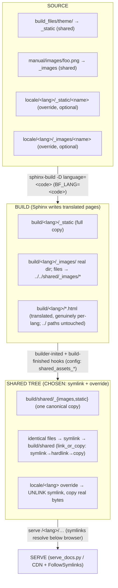
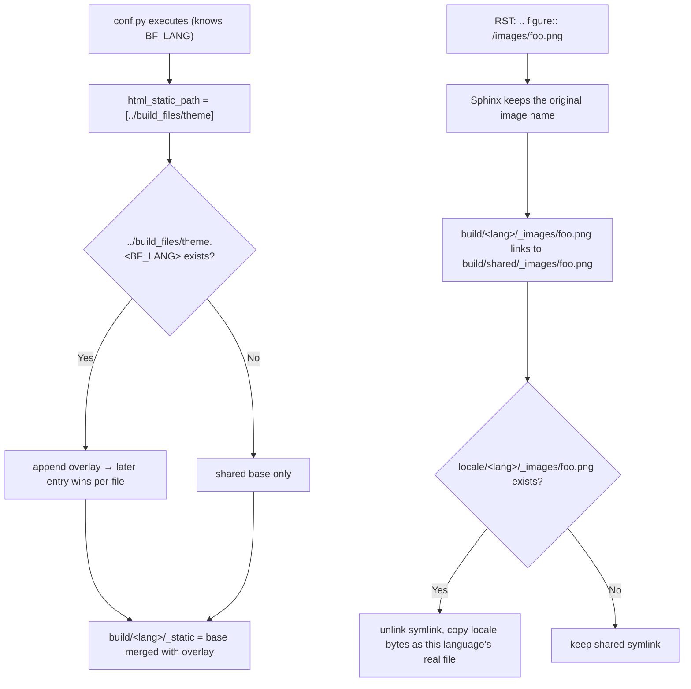
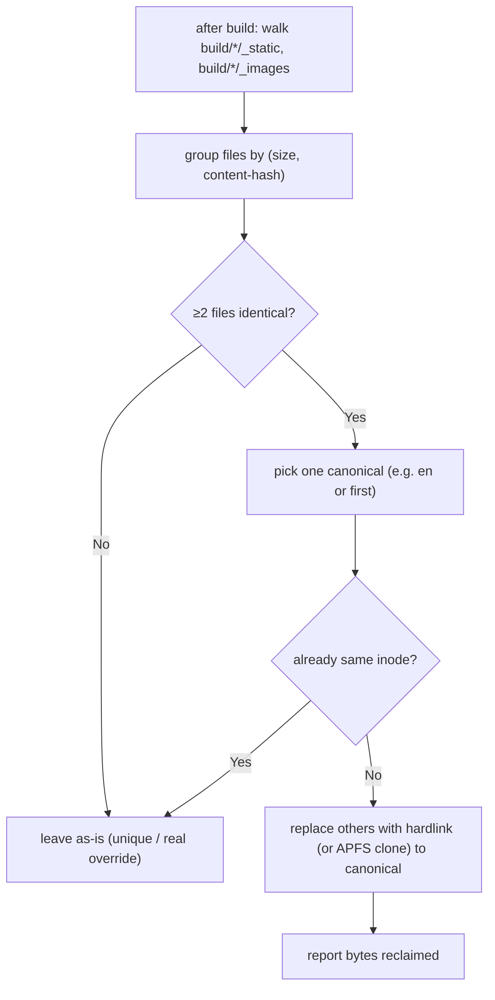
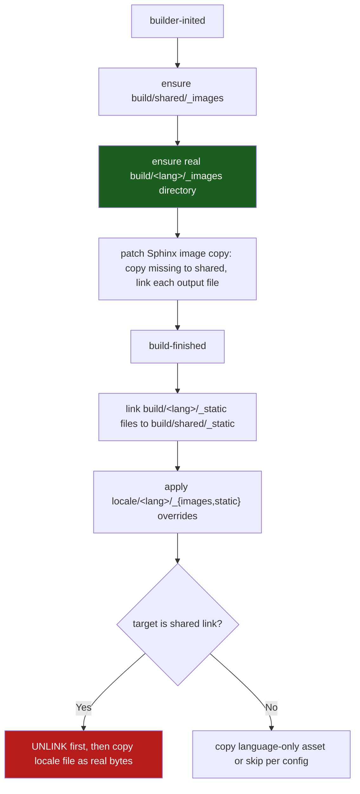
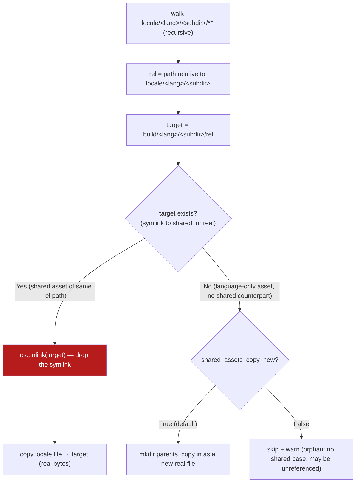
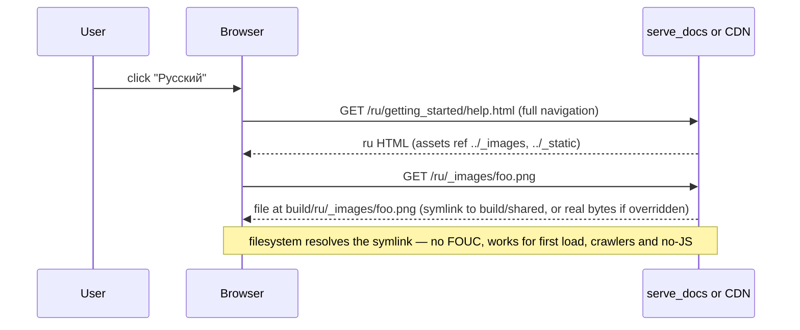

# 2026-06-23 00:19:12 — Shared static/images with per-language override (asset deduplication) design

**Author:** Hoang Duy Tran
**Skill refs:** `project_management`, `development-guidelines`, `translation-workflow`
**Status:** IMPLEMENTED — Phase 3 shipped as `build_files/extensions/shared_assets.py` (per-file symlink to a shared tree + `locale/<lang>` override copy-over), now hardened for **incremental / live (`sphinx-autobuild`) rebuilds**. See **[Update 2026-06-23 — As-built + live-rebuild support](#update-2026-06-23--as-built--live-rebuild-support-)** for everything added beyond the original design.

## Summary

Each translated build (`sphinx-build -D language=<code>`) writes a **complete, self-contained** copy of `_static/` (~9.8 MB) and `_images/` (~247 MB) into `build/<lang>/`. Across the 5 currently-built languages that is ~1.28 GB, of which **~1 GB is byte-for-byte duplication** — the same theme CSS/JS/fonts and the same English screenshots, copied once per language for no functional reason. The duplication exists only because Sphinx rewrites RST image references (`/images/foo.png`) into per-page-relative HTML paths (`../_images/foo.png`) and physically copies every referenced asset into that language's output tree.

This document proposes a **centralised "shared base + sparse per-language override"** model: store each asset **once**, let a language override **only** the files it actually changes, and have everything else resolve to the shared copy — with the resolution living **below the browser** (filesystem, build, or server), never in page-level JavaScript.

The goal properties:

- **Centralised sharing** — one canonical copy of every shared asset.
- **Dynamic per-language separation** — a language can override any asset (CSS, JS, theme image, or content screenshot) without touching others.
- **Economy** — disk holds one shared set plus only the genuine deltas.
- **Transparency** — no FOUC, no first-load 404s, works for no-JS / crawlers / print.

---

## Update 2026-06-23 — As-built + live-rebuild support ✅

Phase 3 is implemented in `build_files/extensions/shared_assets.py` and wired into `manual/conf.py`.
The original design assumed **sequential full builds** (`make build` builds languages one at a time, so
"there is no write race on the shared tree"). Real use surfaced two things the draft did not cover:

1. **`make liveall` runs the per-language `sphinx-autobuild` processes in PARALLEL**, not sequentially.
2. **`sphinx-autobuild` does incremental rebuilds in a fresh subprocess**, re-reading only changed docs.

These drove the following refinements (all covered by `tests/assets/test_shared_assets.py`, 31 tests).

### `_images` — incremental-safe + self-healing + content-aware

- **No destructive wipe at `builder-inited`.** The draft recreated `build/<lang>/_images` each build,
  which is fine for a full build (the patched copy re-links all images right after) but **breaks
  incremental/live rebuilds**: those re-read only changed docs, so the patched `copy_image_files`
  re-links only *those* images — wiping the dir first drops every link for unchanged docs and leaves
  images broken until a full rebuild. Now we **only collapse a legacy whole-dir symlink**; a real
  `_images` directory is preserved and reconciled per file.
- **Self-heal (`_link_missing_shared_images`).** At `builder-inited`, after the shared tree is seeded,
  any file present in `build/shared/_images` but missing from `build/<lang>/_images` is re-linked. This
  repopulates an emptied dir and pre-populates later languages from the shared tree, so a live rebuild
  that touches one doc never leaves the rest of the image set unlinked.
- **Content-aware seeding (live edits).** The patched copy now compares the **source** image bytes
  against the shared copy and re-copies when they differ (instead of skipping whenever the shared file
  merely exists). An added *or edited* image propagates to `build/shared/_images` and, through the
  per-file links + self-heal, to **every** language. Images are the same English source across
  languages, so a later language re-copying identical bytes is idempotent.

### `_static` — theme assets stay in sync with source (`_sync_shared_theme_static`)

A live edit to a theme asset (e.g. `build_files/theme/css/theme_overrides.css`) must reach all
languages. After the first build the per-language `_static` theme files are symlinks into the shared
tree, and `_dedup_subdir` skips symlinks — so the draft's per-file reconcile alone could not refresh
them. At `build-finished` we now **refresh the shared `_static` copy directly from the
`html_static_path` source** whenever it differs. Every language links to the shared tree, so the edit
reaches them through their links **without rebuilding each language** (verified: editing the CSS and
rebuilding only `en` updated `shared`, and `ru`+`vi` reflected it immediately via their symlinks).

> **Scope guard — only language-independent theme assets are refreshed.** The sync touches only files
> that live under `html_static_path` (`build_files/theme`). Sphinx-generated, **genuinely per-language**
> `_static` files are left to the per-language dedup. This matters: `build/<lang>/_static/
> documentation_options.js` legitimately differs per language (it carries `LANGUAGE: 'vi'` vs
> `'en'`); a blanket "refresh shared from output" would corrupt other languages. Confirmed empirically
> that `vi` keeps a real `documentation_options.js` with `LANGUAGE: 'vi'`.

### Live-rebuild plumbing (`Makefile`)

- **`LIVE_WATCH_DIRS = --watch build_files`** added to `livehtml`, `livehtml-direct`, `liveall`.
  `sphinx-autobuild` watches only the source dir (`manual/`); the theme/`_static` (`html_static_path`),
  templates and **the extensions themselves** all live under `build_files/`, so their edits were
  previously ignored by the live server. Watching `build_files` makes those edits trigger a rebuild.
  Because each rebuild runs as a fresh `python -m sphinx build` subprocess, **edited extension/`conf.py`
  code is re-imported automatically — no need to restart the live server.**
- **`make stop` now tears down the whole live-rebuild tree.** It previously killed only the HTTP
  listeners (`serve_docs.py --kill`). `sphinx-autobuild` and its `-j auto` worker pool
  (`python -m sphinx build …`) survived and, once the autobuild parent was killed, **reparented to PID 1
  as orphans** that kept writing into `build/` (this caused a later `clean` to fail with
  "Directory not empty"). `stop` now `pkill`s the autobuild and its `sphinx build` workers (SIGTERM then
  SIGKILL). The pattern is scoped to the `python -m sphinx build` form so it never hits a one-shot
  `make build` (`sphinx-build`), uses the `[s]phinx` trick to avoid matching its own recipe shell, and
  is keyed to this project's `SOURCEDIR`/`BUILDDIR`.

### Logging (quiet by default, full detail on `-vv`)

- **Build-phase markers** (`READING` / `WRITING`) log document and image counts plus elapsed timing, so
  the previously silent gap (parallel `-j auto` workers reading sources) is visible and the per-language
  cost is attributable (reading dominates; the shared copy/link phase is seconds).
- **Per-file asset lines are gated behind `-vv` (verbosity ≥ 2).** The Makefile always passes `-v`
  (verbosity 1) for Sphinx's own progress, so per-file logging is keyed one level higher to keep the
  default build quiet and fast — the 3107-image copy emitted ~6.2k INFO lines per language otherwise.
  Summary counts (`copied/already-shared/linked`, `@timing done …`) are always shown.

### Parallel-write note (supersedes the draft's "sequential, no race")

`make build` is still sequential, but `make liveall` rebuilds languages **concurrently**. The shared-tree
writes during live rebuilds are idempotent — image and theme bytes are identical across languages — so
concurrent writes of identical bytes are safe. Per-language divergent `_static` files are never written
to the shared tree (see scope guard above).

---

## Background (current arrangement — facts)

How Sphinx is told where things are (see `20260622_141959_*` and `conf.py`):

- Command line sets the **source root**: `sphinx-build -b html ./manual build/<lang>` → `srcdir = confdir = manual/`.
- `conf.py` paths are relative to `manual/`:
  - `templates_path = ["../build_files/templates"]`
  - `html_static_path = ["../build_files/theme"]` → copied into `build/<lang>/_static/`
  - `locale_dirs = ["../build/.i18n_shards/locale", "../locale/"]`
- **Images have no path setting**: RST uses `.. figure:: /images/foo.png`; a leading `/` is "relative to `srcdir`", so it resolves to `manual/images/foo.png`. Sphinx's image collector copies referenced images into `build/<lang>/_images/`.
- `conf.py` learns the real per-build language from `os.environ.get("BF_LANG", language)` (not the `language` variable, because `-D language=` is applied *after* `conf.py` runs).
- Serving: `tools/serve_docs.py` `_url_to_fs` maps `/<lang>/<sub>` → `build/<lang>/<sub>`. Language switching is a **full navigation** to `/<code>/<same-path>` (`serve_docs.py` builds plain `<a href>` links), not an in-page swap.

Measured duplication (5 languages built):

| Tree | Per language | Notes |
|---|---|---|
| `_images/` | ~247 MB | English screenshots, identical across languages (sampled 60/60 identical) |
| `_static/` | ~9.8 MB | theme CSS/JS/fonts + Furo bundle, identical across languages |
| **Sphinx-generated `_static` that may differ** | small | `documentation_options.js`, `language_data.js`, `*-stemmer.js`, `translations.js`, `opensearch.xml`; the chosen shared-assets rule still links these to shared unless `locale/<lang>/_static` overrides them |

Filesystem: **APFS** (`/Volumes/1TB_BK`) — supports hardlinks and copy-on-write clones (`clonefile`/`cp -c`).

Upstream check: `docs.blender.org` ships **per-language self-contained** trees (`/manual/<lang>/<version>/_static/…`), no shared `/_static/`; theme assets are byte-identical across languages (same `?v=` hash). Git history confirms no language ever customises its own theme — there is a single shared `build_files/theme/` source, and a 2018 commit deliberately *removed* per-language theme files. So divergent per-language assets are not a current requirement; the duplication is incidental.

---

## Techniques surveyed (and verdicts)

Resolution can happen at four layers. The guiding rule: **it must run before the browser commits to a URL**, so page-level JS is structurally too late.

| Layer | Technique | Verdict for "share one set + override" |
|---|---|---|
| Build | Asset manifest + content hashing | already used (`?v=`); no cross-language dedup |
| Build/Storage | **Content-addressed store / hardlink dedup** (pnpm/Nix/Bazel-style; `rdfind`/`jdupes -L`; APFS clone) | ✅ simple, transparent, works today on APFS |
| Storage | **OverlayFS / union mount** (Docker-layer style) | ✅ closest to the mental model; Linux-native, macOS needs FUSE |
| Storage | FS block dedup (ZFS/btrfs/APFS clone) | ✅ but build still writes full copies first |
| Server/Edge | **`try_files` / CDN rewrite / edge middleware** | ✅ production-grade resolver; needs host config |
| Server/Edge | **`Accept-Language` content negotiation** (one URL, `Vary`) | ✅ elegant for i18n; needs negotiating server/CDN |
| Browser | **Service Worker** (network proxy) | ⚠️ misses first-load + no-JS/crawlers; can't be primary |
| Browser | Page DOM-rewrite JS (`src`/`href`) | ❌ FOUC + pre-JS fetch; rejected |
| Browser | Import maps / `<base href>` | partial (modules only / blunt) |

Why **not** page JS (incl. Service Worker) as the *primary* resolver:

- DOM-rewrite JS runs **after** the browser has already started fetching ``/`<link>` → FOUC and 404/double-fetch.
- A Service Worker can intercept correctly, **but** only after it is active (not on first load) and never for crawlers / no-JS / print → the original `/<lang>/…` URL must still resolve server-side, which makes the SW redundant for the disk goal.

---

## Design decisions ✅

1. **Resolution lives below the browser.** Filesystem (dedup/overlay) and/or server (`serve_docs.py` + prod rewrite). No page-level JS asset remapping. (Service Worker stays available for offline caching only, out of scope here.)
2. **Three explicit, separable mechanisms** — source override, store dedup, serve resolve — so each can be adopted independently.
3. **Override is content-driven.** A file a language genuinely changes has different bytes → it is *not* a duplicate → it is *not* shared. No manifest of "what is overridden" is required; the filesystem/content hash is the source of truth.
4. **Phase 1 (recommended first):** content-based **hardlink/clone dedup** as a post-build step — reclaims ~1 GB now, zero changes to Sphinx, HTML, serving, or relative paths. Keeps Blender's self-contained per-language layout.
5. **Phase 2 (opt-in source override):** `BF_LANG`-keyed overlay in `conf.py` for theme assets only. Content screenshots do **not** use Sphinx's `foo.<lang>.png` convention; all languages, including English, resolve images through `build/shared/_images` unless `locale/<lang>/_images/<same-path>` overrides a file.
6. **Phase 3 (CHOSEN single-physical-tree):** one `build/shared/_{images,static}` base. Each language's
   `build/<lang>/_images` is a **real directory** whose files are per-file symlinks to
   `build/shared/_images`, created at **`builder-inited`** so later languages skip image copying while
   still allowing one image to be overridden locally. `_static` is linked to
   `build/shared/_static` at **`build-finished`** even when Sphinx generated different bytes.
   `locale/<lang>/_{images,static}` files are copied **over** shared links
   (`unlink`-then-copy) as explicit per-language overrides. HTML/`../` paths are left untouched.
7. **Deploy parity is explicit.** Symlinks must be preserved in transfer (`rsync -a` / `tar`) and the
   serving host must follow them (nginx `disable_symlinks off`, Apache `+FollowSymlinks`); edge
   `try_files`/`Accept-Language` is the no-symlink alternative.

---

## Proposed architecture



### Layer 1 — Source override (where a language stores its own assets)



- Theme CSS/JS/`_static` images: optional sibling dir `build_files/theme.<lang>/` (mirrors the `_static` layout, e.g. `css/theme_overrides.css`). `conf.py` appends it to `html_static_path` only when present; Sphinx merges later-entry-wins.
- Content screenshots: no `manual/images/foo.<lang>.png` lookup. `manual/conf.py` sets `figure_language_filename = "{root}{ext}"` so Sphinx keeps `foo.png`; per-language image changes live under `locale/<lang>/_images/foo.png` with the same relative path as the shared asset. English is treated the same way (`locale/en/_images` may override if needed).

### Layer 2 — Store dedup (Phase 1, recommended first)



- Idempotent; only links files with identical size **and** content; skips already-linked.
- Hardlink (one inode, 0 extra bytes) or APFS clone (`clonefile`, COW). Same-filesystem requirement satisfied (`build/` is one FS).
- Per-language search/doc-option files differ → never linked → stay correct.

### Layer 3 — Single shared tree via symlink + `locale/<lang>` override (CHOSEN)

**Goal:** store each shared asset **once** under `build/shared/_{images,static}`; every language's
`build/<lang>/_images` is a **real directory** whose files are per-file links back to the shared image
tree, and `_static` files are per-file links back to `build/shared/_static`. Files a language genuinely
overrides become real copies sourced from `locale/<lang>/_{images,static}`.

**Guiding principle — the shared tree is *only a base*; each language opts in to diverge.** A language
gets everything for free by reference (symlink), and may, at its own discretion, either **override** an
existing asset (drop a same-path file under `locale/<lang>/`) **or add** a brand-new language-only asset
(`shared_assets_copy_new=True`, default). Nothing is forced per-language; the base carries the common
case and languages layer only their genuine deltas on top.

**Resolution stays below the browser.** The HTML is **not** touched — pages keep their existing
per-page-relative `../_images/foo.png` / `../_static/…` references. Because `build/<lang>/_images/foo.png`
*is* a symlink, that relative URL resolves through the filesystem to the shared file. No `../`-prefix
rewriting, no page JS, no FOUC, works for crawlers / no-JS / print.

**Hooks: `builder-inited` for `_images`, `build-finished` for `_static` and overrides.** `doctree-resolved`
fires per-document during the *write* phase and is the wrong layer for output-tree asset setup. `_images`
is set up at `builder-inited` so Sphinx's image-copy step writes missing files into
`build/shared/_images` and creates per-file links inside `build/<lang>/_images`; later languages skip
all already-shared image copies. `_static` is copied by Sphinx, then linked back to
`build/shared/_static` at `build-finished`; same-path locale overrides are also applied there.



**Order (per language), exactly as specified:**

1. At `builder-inited`, ensure `build/shared/_images` exists and create a real
   `build/<lang>/_images` directory.
2. Patch Sphinx's image copy step so the first language seeds shared images, every language gets
   per-file links inside `build/<lang>/_images`, and later languages skip already-shared copies
   (`copied=0, already-shared=N, linked=N`).
3. At `build-finished`, link `_static` files to `build/shared/_static` even when Sphinx generated
   different bytes. To keep a language-specific `_static` file, put that file under
   `locale/<lang>/_static/<same-path>`.
4. **Then apply `locale/<lang>` overrides** — for every file under `locale/<lang>/_{images,static}/`,
   **unlink the shared link first** and copy the local file as a real per-language file. This applies to
   English too (`locale/en/...`).

> ⚠️ **Critical footgun — `unlink` before copy.** In step 3 the target is currently a *symlink into
> `build/shared`*. A plain `cp locale/<lang>/_images/foo.png build/<lang>/_images/foo.png` (or
> `shutil.copy`) **follows the symlink and overwrites the shared file**, corrupting the base for *every*
> language. The override step MUST `os.unlink(target)` first, then copy the real bytes in. Same rule
> for `_static`.

#### How `locale/<lang>` overrides work (mechanics) 🔍



- **Matching is by relative path, not just basename.** An override at
  `locale/vi/_images/render/cycles/foo.png` replaces `build/vi/_images/render/cycles/foo.png` — the
  sub-tree under `<subdir>` is mirrored exactly. This is why the walk is recursive and keys on `rel`,
  not on a flat filename (which would be ambiguous when the same basename exists in two folders).
- **Override of an existing shared asset** (the common case, "same name as original"): the target is a
  symlink to `build/shared/<rel>`; we `unlink` it and drop the language's real bytes in its place. Other
  languages keep pointing at the untouched shared file → only this language diverges.
- **Language-only asset** (a file present under `locale/<lang>` with *no* shared counterpart): governed by
  a new config flag `shared_assets_copy_new` (default **True**) — copy it in as a fresh real file so a
  language can ship an extra screenshot. Set **False** to be strict and warn instead (catches typos /
  orphans that no page references). *(This is the one behaviour your original "same names or original"
  spec left open — calling it out as an explicit, configurable decision.)*
- **No HTML/`.po` interaction.** These override files are raw assets copied into the output tree at
  `build-finished`; they are **not** RST, not gettext, and not processed by Sphinx. A page only shows an
  overridden image if its existing `../_images/<rel>` reference already points at that `rel` (true for
  same-name overrides; a language-only asset must be referenced by translated RST to appear).
- **Coexists with gettext `locale/`.** Today `locale/<lang>/LC_MESSAGES/*.po` holds translations
  (`locale_dirs`). The asset overrides live in **sibling** dirs `locale/<lang>/_images/`,
  `locale/<lang>/_static/` — different sub-dirs, no collision with `LC_MESSAGES`. (If you'd rather keep
  assets out of the gettext tree entirely, point `shared_assets_override_root` elsewhere — it's config.)
- **Idempotent.** Re-running sees a real file already in place (bytes equal to the locale source) and
  leaves it; only a changed locale file triggers a re-copy.

**Serving / production.** Locally, `tools/serve_docs.py` already maps `/<lang>/…` → `build/<lang>/…`;
symlinks resolve transparently when the server follows them. For production, the deploy must (a)
preserve symlinks in transfer and (b) allow the server to follow them:

- Transfer: `rsync -a` (preserves symlinks; add `--copy-unsafe-links`/`-L` only if you deliberately want
  to re-expand) or `tar` (preserves by default).
- Server: nginx `disable_symlinks off`, Apache `Options +FollowSymlinks`.
- Alternative (no on-disk symlinks): keep the shared tree and resolve at the edge —
  `nginx try_files $uri /shared/$uri =404`, or `Accept-Language` negotiation (`Vary: Accept-Language`).

### Configuration (`conf.py`) ⚙️

The shared root, the override source, and the set of shared sub-dirs are **not hard-coded** in the
extension — they are config values declared with `app.add_config_value` in `setup(app)` and given
project defaults in `conf.py` (mirroring the existing `BF_LANG`/`BF_LANGS` env-override convention so CI
can override without editing source). The "etc.." sub-dirs (`_images`, `_static`, and any future ones)
are a single configurable list, so adding another shared dir is a one-line change.

```python
# build_files/extensions/shared_assets.py  — defaults registered in setup()
def setup(app):
    app.add_config_value("shared_assets_enabled",       True,                     "env")
    app.add_config_value("shared_assets_root",          "../build/shared",        "env")  # the share dir
    app.add_config_value("shared_assets_subdirs",       ["_images", "_static"],   "env")  # the "etc.." list
    app.add_config_value("shared_assets_override_root", "../locale",              "env")  # locale/<lang>/_images, …
    app.add_config_value("shared_assets_link_mode",     "auto",                   "env")  # auto|symlink|hardlink|copy
    app.add_config_value("shared_assets_copy_new",      True,                     "env")  # copy language-only assets
    app.connect("builder-inited", on_builder_inited)
    app.connect("build-finished", on_build_finished)
    return {"parallel_read_safe": True, "parallel_write_safe": True}
```

```python
# manual/conf.py — project defaults + env override (consistent with BF_LANG handling)
shared_assets_enabled       = os.environ.get("BF_SHARED_ASSETS", "1") != "0"
shared_assets_root          = os.environ.get("BF_SHARED_ROOT", "../build/shared")
shared_assets_subdirs       = os.environ.get("BF_SHARED_SUBDIRS", "_images _static").split()
shared_assets_override_root = os.environ.get("BF_SHARED_OVERRIDE_ROOT", "../locale")
shared_assets_link_mode     = os.environ.get("BF_SHARED_LINK_MODE", "auto")
shared_assets_copy_new      = os.environ.get("BF_SHARED_COPY_NEW", "1") != "0"
```

Resolution rules for the extension at `build-finished`:

- All paths are resolved **relative to `app.confdir`** (i.e. `manual/`), exactly like `html_static_path`
  / `locale_dirs` already are, and normalised with `pathlib` (cross-platform).
- The per-language override dir is `<shared_assets_override_root>/<BF_LANG>/<subdir>` (e.g.
  `locale/vi/_images`); the current language comes from `os.environ.get("BF_LANG", app.config.language)`.
- `shared_assets_link_mode = "auto"` runs the `link_or_copy` fallback chain (below); the explicit values
  force a single mechanism (useful for tests and for hosts with known capabilities).
- `shared_assets_enabled = False` makes the pass a complete no-op (keeps the current self-contained
  per-language trees) — the kill-switch for debugging or for builds that must stay copy-only.

### Cross-platform behaviour (Windows / Linux / macOS) 🖥️

Per-file symlinks are **not** equally cheap on every OS. The link step must degrade gracefully.

| Concern | Linux | macOS | Windows |
|---|---|---|---|
| `os.symlink(file)` works unprivileged | ✅ always | ✅ always | ⚠️ **needs Admin or Developer Mode** (`SeCreateSymbolicLinkPrivilege`); otherwise `OSError`/`WinError 1314` |
| `os.link` (hardlink, same volume) unprivileged | ✅ ext4/xfs | ✅ APFS/HFS+ | ✅ NTFS (no special privilege) |
| Directory junction (no privilege) | n/a | n/a | ✅ but **directories only**, not per-file |
| FS case sensitivity (name matching) | case-**sensitive** | case-**insensitive** (default APFS) | case-**insensitive** |
| Web server follows symlinks | config | config | config |

**Resolution strategy — one helper, OS-aware fallback chain** (driven by `shared_assets_link_mode`;
`"auto"` tries the whole chain, an explicit value forces one mechanism):

```text
link_or_copy(src_shared, dst, mode="auto"):
    if mode in ("auto", "symlink"):
        try:    return os.symlink(src_shared, dst)   # Linux/macOS, Windows w/ Dev Mode → cheapest
        except (OSError, NotImplementedError):
            if mode == "symlink": raise              # forced mode surfaces the failure
    if mode in ("auto", "hardlink"):
        try:    return os.link(src_shared, dst)       # Windows NTFS / any same-volume FS → 0 extra bytes
        except OSError:                               # EXDEV / cross-device / unsupported
            if mode == "hardlink": raise
    return shutil.copy2(src_shared, dst)              # mode == "copy" or last-resort → correct, not deduped
```

- **Windows is the reason for the fallback.** Default Windows (no Admin, Dev Mode off) cannot create
  file symlinks → fall back to **hardlinks** on NTFS (same volume, no privilege, identical disk saving)
  → fall back to **copy** if even that fails (e.g. cross-volume). The build stays correct everywhere; it
  only loses dedup in the worst case. Detect once and log which mode is active.
- **Use `pathlib` / `os.path`, never hard-coded `/`** so paths are correct on Windows.
- **Case sensitivity matters for name matching.** Matching `locale/<lang>/_images/<name>` against shared
  assets must use the **exact** stored casing; do not assume `Foo.PNG` and `foo.png` are the same on Linux
  (they are two files) nor different on macOS/Windows (they collide). Normalise lookups by exact name and
  warn on case-only collisions.
- **`os.symlink` on Windows needs the right `target_is_directory`** flag for dir links; we only link
  files, so this is moot — but never symlink whole `_images`/`_static` *directories* (would hit the
  Windows directory-symlink privilege/junction split). Link **per file**.
- **Reproducibility across OSes:** the *output* (`build/<lang>/_images/foo.png` resolving to the right
  bytes) is identical on all three; only the *mechanism* (symlink vs hardlink vs copy) and the *disk
  saving* differ. Tests assert resolved-bytes + "is not a plain independent copy where dedup is possible",
  skipping the symlink-specific assertion when the platform fell back to copy.

### Language switch (works the same under every layer)



---

## Files to change (high-level) 🔧

Phase 1 (dedup only):

- `tools/dedupe_build_assets.py` — new, dependency-free: hash + hardlink/clone duplicates under `build/*/{_static,_images}`; `--dry-run`, prints reclaimed bytes.
- `Makefile` — new `dedupe-assets` target; optionally chain after `build`.

Phase 2 (source override):

- `manual/conf.py` — after `html_static_path = ["../build_files/theme"]`, append `../build_files/theme.<BF_LANG>` when the dir exists (keyed off `os.environ.get("BF_LANG", language)`). Set `figure_language_filename = "{root}{ext}"` so image localization uses the shared-assets same-path override model, not `foo.<lang>.png`.
- `build_files/theme.<lang>/…` — created only by a language that overrides.

Phase 3 (CHOSEN — symlink to shared tree + `locale/<lang>` override):

- `build_files/extensions/shared_assets.py` — new Sphinx extension. `setup(app)` declares the config
  values (`shared_assets_enabled` / `_root` / `_subdirs` / `_override_root` / `_link_mode` / `_copy_new`, see
  **Configuration** above) and registers `builder-inited` + `build-finished`. On `builder-inited`, it
  creates a real `build/<lang>/_images` directory and patches Sphinx's image copy step to copy missing
  files into `build/shared/_images` while linking each output image file back to shared. On
  `build-finished`, it links `_static` against shared and applies
  `<override_root>/<lang>/<subdir>` overrides with `os.unlink()` before copying. Idempotent; guards
  against `cp`-through-symlink.
- `manual/conf.py` — add `shared_assets` to `extensions`, and set the project defaults +
  `BF_SHARED_*` env overrides for the five config values (see **Configuration (`conf.py`)** above).
  Current language read from `BF_LANG` for the per-language pass; English (`BF_LANG=en`) follows the
  same shared-assets path as every other language.
- `tools/serve_docs.py` — no logic change needed (symlinks resolve transparently); confirm it follows
  symlinks. Document prod requirements (symlink-preserving transfer + `FollowSymlinks`, or edge `try_files`).

---

## Tests to add / extend 🧪

- `tests/assets/test_dedupe_build_assets.py`
  - identical files across two fake `build/<lang>` trees → linked to one inode; byte content preserved.
  - differing (override) file → left untouched.
  - already-linked → no-op (idempotent).
  - `--dry-run` → reports, changes nothing.
  - reclaimed-bytes accounting correct.
- `conf.py` overlay (Phase 2): fixture build with `build_files/theme.vi/css/theme_overrides.css` → vi `_static` gets overlay; ru unaffected.
- **Phase 3 symlink + override** (`tests/assets/test_shared_assets.py`):
  - identical `build/<lang>/_images/foo.png` → becomes a symlink pointing into `build/shared`; `os.path.realpath` lands in `build/shared`.
  - `locale/<lang>/_images/foo.png` present → after the override pass, `build/<lang>/_images/foo.png` is a **real file** (not a symlink) with the *local* bytes.
  - **relative-path matching**: `locale/vi/_images/render/foo.png` overrides `build/vi/_images/render/foo.png` (nested), and does **not** touch a same-basename `_images/ui/foo.png` elsewhere.
  - **language-only asset** (`locale/vi/_images/extra.png`, no shared counterpart): with `shared_assets_copy_new=True` → copied in as a new real file (parents created); with `False` → skipped + warning, nothing written.
  - **shared base is NOT mutated** by the override (regression test for the `cp`-through-symlink footgun): write a sentinel into `build/shared/_images/foo.png`, run override for one lang, assert shared bytes unchanged and other langs still point at shared.
  - `_static` file with differing generated bytes and no `locale` override → still links to shared; a
    same-path `locale/<lang>/_static` override materializes a real per-language file.
  - idempotent: second run on an already-linked tree is a no-op.
  - `_static` covered by the same cases as `_images`.
  - serving: request `/<lang>/_images/foo.png` through `serve_docs.py` resolves the symlink (shared) and the override (local) correctly.
  - **cross-platform fallback**: when `os.symlink` is monkeypatched to raise (simulating Windows w/o Dev Mode), `link_or_copy` falls back to hardlink, then to copy; resolved bytes correct in every mode. Symlink-specific assertion is skipped on fallback (assert "shared-resolving" via inode/realpath OR content-equality, not link type).
  - **case sensitivity**: a case-only-differing override name warns and does not silently overwrite the wrong shared file.
  - **config-driven**: `shared_assets_enabled=False` → pass is a no-op (trees stay self-contained); custom `shared_assets_subdirs` (e.g. add a third dir) is honoured; `shared_assets_link_mode="copy"` forces copies; `shared_assets_root`/`_override_root` resolve relative to `confdir`. Overridable via `BF_SHARED_*` env vars.

Added with the As-built update (live-rebuild hardening):

- **incremental preserve**: `on_builder_inited` does NOT wipe an existing real `_images` dir of links.
- **self-heal**: an emptied `build/<lang>/_images` is repopulated from the shared tree; overrides (real files) are not clobbered.
- **content-aware image**: a changed image (same name, new bytes) re-copies to shared; identical bytes reuse the cheap path.
- **theme `_static` source sync**: an edited `html_static_path` asset refreshes the shared copy and reaches all languages via their symlinks; unchanged assets are skipped; **generated per-language `_static` files are not touched**.
- **verbosity gate**: per-file asset lines suppressed by default, emitted at `-vv`; `on_builder_inited` propagates `config.verbosity`.

---

## Edge cases & mitigations ⚠️

- **Hardlink + in-place edit** — editing one link edits all. Mitigation: builds regenerate fresh files; dedup re-runs after each build; never hand-edit files under `build/`.
- **Cross-filesystem** — hardlinks need one FS. `build/` is single-FS; guard in the script (fall back to copy/clone if `EXDEV`).
- **Deploy transfer drops hardlinks** — `rsync -H` / `tar` preserve them; a naïve copy re-expands (re-duplicates only on the published artifact). Document the publish command.
- **Phase 3 first-load / crawlers / no-JS** — covered because resolution is filesystem-level (symlink), below the browser; HTML/`../` paths are unchanged.
- **`cp`-through-symlink corrupts the shared base** — overwriting a file that is currently a symlink into `build/shared` writes through to the shared target. Mitigation: the override step MUST `os.unlink()` the symlink before copying; covered by an explicit regression test.
- **Wrong hook (`doctree-resolved`)** — fires per-doc during write and is too late/too frequent for output-tree asset setup. Mitigation: use `builder-inited` for `_images` sharing and `build-finished` for `_static` linking + overrides.
- **Symlinks at deploy** — naïve copy / web server with symlink-following disabled breaks assets. Mitigation: `rsync -a` / `tar` preserve symlinks; require nginx `disable_symlinks off` / Apache `+FollowSymlinks`; document edge `try_files` as the no-symlink fallback.
- **Symlink dangling if `build/shared` is pruned** — never delete `build/shared` while per-language trees reference it; treat it as the canonical base.
- **Windows can't make file symlinks without Admin/Dev Mode** — `os.symlink` raises `WinError 1314`. Mitigation: `link_or_copy` falls back symlink → hardlink (NTFS, unprivileged) → copy; log the active mode. Same-volume requirement for the hardlink step guarded with `EXDEV`/cross-device handling.
- **FS case sensitivity differs** (Linux sensitive; macOS/Windows insensitive) — name matching against shared assets uses exact stored casing; warn on case-only collisions rather than silently linking the wrong file.
- **Path separators** — use `pathlib`/`os.path`, never literal `/`, so the extension runs on Windows build hosts.
- **Sphinx localized-figure convention disabled** — `figure_language_filename = "{root}{ext}"` prevents `foo.<lang>.png` variants from bypassing the shared `_images` tree. Same-path locale overrides are the only image localization path for this design.
- **macOS overlayfs absence** — OverlayFS noted as an alternative but not chosen for Phase 1 (needs FUSE on macOS); hardlink/clone is the portable choice.
- **`?v=` cache-bust** — identical content → identical hash across languages → one shared file resolves consistently (also prevents the stale-hash drift seen previously).

---

## Verification steps ✅

- Automated: `$PYENV/bin/python3 -m pytest tests/assets/ -q` (and existing `tests/repeatable/`, `tests/search/`).
- Manual (Phase 1):
  - `du -sh build` before/after `make dedupe-assets`; expect ~1 GB reclaimed across 5 languages.
  - `ls -li build/vi/_static/css/theme_overrides.css build/ru/_static/css/theme_overrides.css` → same inode.
  - Serve and load `vi` + `ru` pages; styles, fonts, screenshots intact; switch language; no FOUC.
- Manual (Phase 2): add a `build_files/theme.vi/css/theme_overrides.css`, rebuild vi + ru; only vi changes.
- Manual (Phase 3, CHOSEN): build base + vi; confirm `build/vi/_images` is a real directory and
  `build/vi/_images/foo.png` is a symlink to `build/shared/_images/foo.png` (`ls -ld`, `ls -l`,
  `readlink`); confirm the second language reports `copied=0, already-shared=N, linked=N`; drop
  `locale/vi/_images/foo.png`, re-run, confirm that one target becomes a real per-language file with
  local bytes **and** `build/shared/_images/foo.png` is unchanged (footgun check). On Windows, confirm
  graceful fallback to hardlink/copy and that pages still render.
- Manual Sphinx log trace: run `make remake local`; each shared asset step logs the same percentage
  style per file, e.g. `_images shared-copy [1/3107 0.03%] ...` and
  `_static build-link [42/96 43.75%] ... via=symlink`, so copy/reuse/link/override progress is visible.
  The image phase also emits `@timing done: shared_assets: _images copy/link phase elapsed=... images=N
  copied=N already-shared=N linked=N`. Per-file lines appear only at `-vv`; the default `-v` build shows
  phase markers + summary counts.
- Manual (live rebuild): start `make liveall`; edit `build_files/theme/css/theme_overrides.css`; confirm
  the change appears for **every** language (the build-finished log shows
  `_static refreshed N theme asset(s) from source`). Add/replace an image under `manual/images/` and
  confirm it copies to `build/shared/_images` and links into every `build/<lang>/_images`. Edit an
  extension under `build_files/extensions/` and confirm the next rebuild picks up the new code without
  restarting the live server. Run `make stop`; confirm no `sphinx-autobuild` / `python -m sphinx build`
  processes survive (`pgrep -f "sphinx build ./manual"` → empty).

---

## Recommendation

**Chosen approach: Phase 3 — single `build/shared` tree + `_images` real dirs with per-file links + `_static`
per-file shared links + `locale/<lang>` override copy-over**, implemented as a Sphinx extension. It gives a true single-physical-set
(not just dedup), keeps the HTML/`../` paths untouched (resolution is filesystem-level), and lets any
language override any asset by simply dropping it under `locale/<lang>/_{images,static}`.

Two hard rules carry the design:

1. **`unlink`-before-copy** on every override (or `cp` writes through the symlink and corrupts the
   shared base for all languages).
2. **OS-aware `link_or_copy`** — symlink → hardlink → copy — so default Windows (no Dev Mode) and
   cross-volume cases stay correct, only losing the disk saving in the worst case.

Phase 1 (hardlink/clone dedup) remains a valid *lighter* alternative if the symlink/deploy requirements
prove inconvenient — same ~1 GB saving, no serving changes — but it does not give the single canonical
tree. Phase 2 (theme overlay) remains complementary and can be added independently; image localization
stays in the Phase 3 same-path `locale/<lang>/_images` override model.

---

## Follow-ups / future work 📈

Done (this implementation):

- [x] Implement `link_or_copy` (symlink → hardlink → copy) with mode logged per file.
- [x] `serve_docs.py` follows symlinks as-is (verified: `GET /en/_images/index_interface.jpg` → 200, served through the symlink).
- [x] `build/shared` is seeded by the first language's build; later languages reuse it. Self-heal repopulates per-language links from it on every build. (Lifecycle rule below still stands: never prune while per-lang trees reference it.)
- [x] Wire the shared-assets pass into `make build` (extension enabled in `conf.py`; runs every build).
- [x] Incremental/live-rebuild safety (no-wipe + self-heal), content-aware image seeding, theme-`_static` source sync, `--watch build_files`, `make stop` orphan cleanup, `-vv`-gated per-file logging. (See the **As-built** update section.)

Still open:

- [ ] Verify the extension on a Windows build host (Dev Mode on vs off) — assert correct render in both, hardlink fallback when symlinks unavailable.
- [ ] Choose production deploy story (symlink-preserving `rsync -a`/`tar` + `FollowSymlinks`, vs edge `try_files`/`Accept-Language`).
- [ ] Never prune `build/shared` while per-language trees reference it (canonical base).
- [ ] If `furo`'s own bundled `_static` (not under `html_static_path`) is ever upgraded, the shared copy can go stale on an incremental build; a full rebuild refreshes it. Consider extending the source-sync to the theme package's static dir if this bites.
